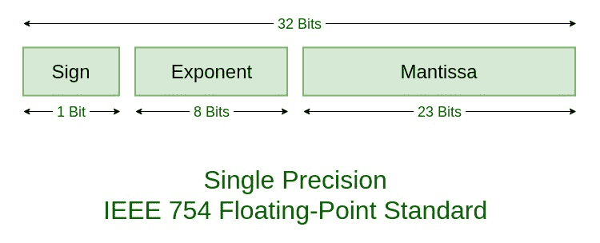

# 按照 IEEE 754 标准将浮点数表示为十六进制的 Python 程序

> 原文:[https://www . geesforgeks . org/python-program-to-presentation-floating-number-as-十六进制 by-ieee-754-standard/](https://www.geeksforgeeks.org/python-program-to-represent-floating-number-as-hexadecimal-by-ieee-754-standard/)

先决条件: [IEEE 标准 754 浮点数](https://www.geeksforgeeks.org/ieee-standard-754-floating-point-numbers/)
给定一个浮点数，任务是通过 IEEE 754 标准找到该数的十六进制表示。
IEEE 浮点运算标准(IEEE 754)是电气和电子工程师协会(IEEE)于 1985 年制定的浮点计算技术标准。该标准解决了各种浮点实现中发现的许多问题，这些问题使它们难以可靠地使用，并降低了它们的可移植性。IEEE 标准 754 浮点是当今计算机上最常见的实数表示，包括基于英特尔的个人电脑、苹果电脑和大多数 Unix 平台。



**例:**

```
Input :  -6744.90
Output :  C5D2C733

Input :  -263.3
Output :  C383A666
```

**进场:**

*   检查数字是正数还是负数。将正号保存为 0，负号保存为 1，如果是负数，则将数字转换为正数。
*   将[浮点数转换为二进制](https://www.geeksforgeeks.org/python-program-to-convert-floating-to-binary/)。
*   分开小数部分和整数部分。
*   计算指数(E)并将其转换为二进制。
*   求尾数。
*   连接尾数、指数和尾数的符号。
*   将其转换为十六进制。

让我们编写一个 Python 程序，按照 IEEE 754 标准将浮点数表示为十六进制。

## 蟒蛇 3

```
# Function for converting decimal to binary
def float_bin(my_number, places = 3):
    my_whole, my_dec = str(my_number).split(".")
    my_whole = int(my_whole)
    res = (str(bin(my_whole))+".").replace('0b','')

    for x in range(places):
        my_dec = str('0.')+str(my_dec)
        temp = '%1.20f' %(float(my_dec)*2)
        my_whole, my_dec = temp.split(".")
        res += my_whole
    return res

def IEEE754(n) :
    # identifying whether the number
    # is positive or negative
    sign = 0
    if n < 0 :
        sign = 1
        n = n * (-1)
    p = 30
    # convert float to binary
    dec = float_bin (n, places = p)

    dotPlace = dec.find('.')
    onePlace = dec.find('1')
    # finding the mantissa
    if onePlace > dotPlace:
        dec = dec.replace(".","")
        onePlace -= 1
        dotPlace -= 1
    elif onePlace < dotPlace:
        dec = dec.replace(".","")
        dotPlace -= 1
    mantissa = dec[onePlace+1:]

    # calculating the exponent(E)
    exponent = dotPlace - onePlace
    exponent_bits = exponent + 127

    # converting the exponent from
    # decimal to binary
    exponent_bits = bin(exponent_bits).replace("0b",'')

    mantissa = mantissa[0:23]

    # the IEEE754 notation in binary    
    final = str(sign) + exponent_bits.zfill(8) + mantissa

    # convert the binary to hexadecimal
    hstr = '0x%0*X' %((len(final) + 3) // 4, int(final, 2))
    return (hstr, final)

# Driver Code
if __name__ == "__main__" :
    print (IEEE754(263.3))
    print (IEEE754(-263.3))
```

**Output:** 

```
4383A666
C383A666
```