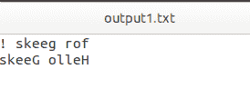
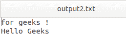

# Python 程序将一个文件的内容反转后存储到另一个文件中

> 原文:[https://www . geesforgeks . org/python-program-to-reverse-a-file-content-of-a-file-store-in-other-file/](https://www.geeksforgeeks.org/python-program-to-reverse-the-content-of-a-file-and-store-it-in-another-file/)

给定一个文本文件。任务是将内容从输入文件反转并存储到输出文件中。
这种换向可以分两种方式进行。

*   **完全反转:**在这种反转类型中，所有内容都会反转。

*   **字对字颠倒:**在这种颠倒中，最后一个字先来，第一个字走到最后一个位置。

**例 1:** 全倒车

```py
Input: Hello Geeks
       for geeks!

Output:!skeeg rof
        skeeG olleH

```

**例 2:** 字对字颠倒

```py
Input: 
        Hello Geeks
        for geeks!

Output:
         geeks! for
         Geeks Hello

```

**例 1:** 全倒车
T3】文本文件:T5】


## 计算机编程语言

```py
# Open the file in write mode
f1 = open("output1.txt", "w")

# Open the input file and get 
# the content into a variable data
with open("file.txt", "r") as myfile:
    data = myfile.read()

# For Full Reversing we will store the 
# value of data into new variable data_1 
# in a reverse order using [start: end: step],
# where step when passed -1 will reverse 
# the string
data_1 = data[::-1]

# Now we will write the fully reverse 
# data in the output1 file using 
# following command
f1.write(data_1)

f1.close()
```

**输出:**



**例 2:** 颠倒行的顺序。我们将使用上面的文本文件作为输入。

## 蟒蛇 3

```py
# Open the file in write mode
f2 = open("output2.txt", "w")

# Open the input file again and get 
# the content as list to a variable data
with open("file.txt", "r") as myfile:
    data = myfile.readlines()

# We will just reverse the 
# array using following code
data_2 = data[::-1]

# Now we will write the fully reverse 
# list in the output2 file using 
# following command
f2.writelines(data_2)

f2.close()
```

**输出:**

