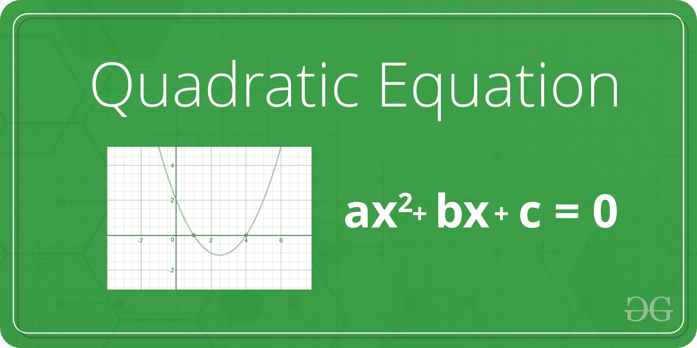

# Python 程序解二次方程

> 原文:[https://www . geesforgeks . org/python-求解二次方程的程序/](https://www.geeksforgeeks.org/python-program-to-solve-quadratic-equation/)

给定一个二次方程，任务是求解方程或找出方程的根。[二次方程](https://www.geeksforgeeks.org/program-to-find-the-roots-of-quadratic-equation/)的标准形式是–

```
ax2 + bx + c
where,
a, b, and c are coefficient and real numbers and also a ≠ 0.
If a is equal to 0 that equation is not valid quadratic equation.

```



**示例:**

```
Input :a = 1, b = 2, c = 1 
Output : 
Roots are real and same
-1.0

Input :a = 2, b = 2, c = 1
Output :
Roots are complex
-0.5  + i 2.0
-0.5  - i 2.0

Input :a = 1, b = 10, c = -24 
Output : 
Roots are real and different
2.0
-12.0

```

**方法 1:** 使用直接公式

使用下面的二次公式，我们可以找到[二次方程](https://www.geeksforgeeks.org/program-to-find-the-roots-of-quadratic-equation/)的根。


有以下重要案例。

```
If b*b < 4*a*c, then roots are complex
(not real).
For example roots of x2 + x + 1, roots are
-0.5 + i1.73205 and -0.5 - i1.73205

If b*b == 4*a*c, then roots are real 
and both roots are same.
For example, roots of x2 - 2x + 1 are 1 and 1

If b*b > 4*a*c, then roots are real 
and different.
For example, roots of x2 - 7x - 12 are 3 and 4
```

```
# Python program to find roots of quadratic equation
import math 

# function for finding roots
def equationroots( a, b, c): 

    # calculating discriminant using formula
    dis = b * b - 4 * a * c 
    sqrt_val = math.sqrt(abs(dis)) 

    # checking condition for discriminant
    if dis > 0: 
        print(" real and different roots ") 
        print((-b + sqrt_val)/(2 * a)) 
        print((-b - sqrt_val)/(2 * a)) 

    elif dis == 0: 
        print(" real and same roots") 
        print(-b / (2 * a)) 

    # when discriminant is less than 0
    else:
        print("Complex Roots") 
        print(- b / (2 * a), " + i", sqrt_val) 
        print(- b / (2 * a), " - i", sqrt_val) 

# Driver Program 
a = 1
b = 10
c = -24

# If a is 0, then incorrect equation
if a == 0: 
        print("Input correct quadratic equation") 

else:
    equationroots(a, b, c)
```

**输出:**

```
real and different roots
2.0
-12.0

```

**方法 2:** 使用复数数学模块

首先要计算判别式，然后用 [cmath](https://www.geeksforgeeks.org/complex-numbers-in-python-set-1-introduction/) 模块求二次方程的两个解。

```
# import complex math module
import cmath

a = 1
b = 4
c = 2

# calculating  the discriminant
dis = (b**2) - (4 * a*c)

# find two results
ans1 = (-b-cmath.sqrt(dis))/(2 * a)
ans2 = (-b + cmath.sqrt(dis))/(2 * a)

# printing the results
print('The roots are')
print(ans1)
print(ans2)
```

**输出:**

```
The roots are
(-3.414213562373095+0j)
(-0.5857864376269049+0j)

```