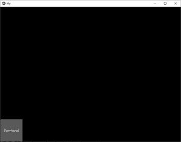
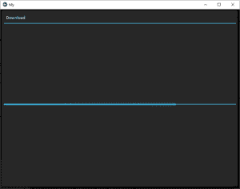

# Python | kivy 中的进度条小部件

> 原文:[https://www . geesforgeks . org/python-进度条-widget-in-kivy/](https://www.geeksforgeeks.org/python-progress-bar-widget-in-kivy/)

Kivy 是 Python 中独立于平台的 GUI 工具。因为它可以在安卓、IOS、linux 和 Windows 等平台上运行。它基本上是用来开发安卓应用程序的，但并不意味着它不能在桌面应用程序上使用。

> ？？？？？？？？ [Kivy 教程–通过示例学习 Kivy](https://www.geeksforgeeks.org/kivy-tutorial/)。

### Progressbar 小部件:

ProgressBar 小部件用于可视化某些任务的进度。目前仅支持水平模式:垂直模式尚不可用。
进度条没有交互元素，是一个只显示的小部件。
要使用它，只需指定一个值来指示当前进度:

## 蟒蛇 3

```
from kivy.uix.progressbar import ProgressBar
pb = ProgressBar(max = 1000)

# this will update the graphics automatically (75 % done)
pb.value = 750
```

> 要使用 progressbar 小部件，您必须通过命令
> 从 kivy.uix.progressbar 导入 progressbar 来导入它

进度条采用两个参数:
1) **最大值:**值允许的最大值。它是一个数字属性，默认为 100。
2) **值:**滑块的当前值

```
Basic Approach:

1) import kivy
2) import kivyApp
3) import progressbar
4) import Boxlayout(according to need)
5) Set minimum version(optional)
6) Create Layout class:
7) Create App class
8) return Layout/widget/Class(according to requirement)
9) Run an instance of the class
```

**注意:**这个代码是针对一个完整的工作进度条的，你只需要专注于进度条的创建和工作，不需要对其他属性施加压力，我将在未来介绍它们。
你首先要点击文件中的按钮，然后进度条就会显示出来。
**实施办法:**

## 蟒蛇 3

```
# Program to Show how to create a Progressbar in .kv file

# import kivy module   
import kivy 

# base Class of your App inherits from the App class.   
# app:always refers to the instance of your application  
from kivy.app import App

# this restrict the kivy version i.e 
# below this kivy version you cannot 
# use the app or software 
kivy.require('1.9.0')

# The ProgressBar widget is used to
# visualize the progress of some task
from kivy.uix.progressbar import ProgressBar

# BoxLayout arranges children in a vertical or horizontal box.
# or help to put the children at the desired location.
from kivy.uix.boxlayout import BoxLayout

# The Clock object allows you to schedule a
# function call in the future
from kivy.clock import Clock

# The Button is a Label with associated actions
# that is triggered when the button
# is pressed (or released after a click / touch). 
from kivy.uix.button import Button

# Popup widget is used to create popups.
# By default, the popup will cover
# the whole “parent” window.
# When you are creating a popup,
# you must at least set a Popup.title and Popup.content.
from kivy.uix.popup import Popup

# A Widget is the base building block
# of GUI interfaces in Kivy.
# It provides a Canvas that
# can be used to draw on screen.
from kivy.uix.widget import Widget

# ObjectProperty is a specialised sub-class
# of the Property class, so it has the same
# initialisation parameters as it:
# By default, a Property always takes a default
# value[.] The default value must be a value
# that agrees with the Property type.
from kivy.properties import ObjectProperty

# Create the widget class
class MyWidget(Widget):

    progress_bar = ObjectProperty()

    def __init__(self, **kwa):
        super(MyWidget, self).__init__(**kwa)

        self.progress_bar = ProgressBar()
        self.popup = Popup(
            title ='Download',
            content = self.progress_bar
        )
        self.popup.bind(on_open = self.puopen)
        self.add_widget(Button(text ='Download', on_release = self.pop))

    # the function which works when you click = k the button
    def pop(self, instance):
        self.progress_bar.value = 1
        self.popup.open()

    # To continuesly increasing the value of pb.
    def next(self, dt):
        if self.progress_bar.value>= 100:
            return False
        self.progress_bar.value += 1

    def puopen(self, instance):
        Clock.schedule_interval(self.next, 1 / 25)

# Create the App class
class MyApp(App):
    def build(self):
        return MyWidget()

# run the App
if __name__ in ("__main__"):
    MyApp().run()
```

**输出:**
**图像 1:**



**图像 2:**

