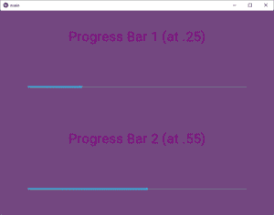

# Python | Progressbar 小部件在 kivy 中使用。kv 文件

> 原文:[https://www . geesforgeks . org/python-progress bar-widget-in-kivy-using-kv-file/](https://www.geeksforgeeks.org/python-progressbar-widget-in-kivy-using-kv-file/)

Kivy 是 Python 中独立于平台的 GUI 工具。因为它可以在安卓、IOS、linux 和 Windows 等平台上运行。它基本上是用来开发安卓应用程序的，但并不意味着它不能在桌面应用程序上使用。

> 👉🏽 [Kivy 教程–通过示例学习 Kivy](https://www.geeksforgeeks.org/kivy-tutorial/)。

### Progressbar 小部件:

ProgressBar 小部件用于可视化某些任务的进度。目前仅支持水平模式:垂直模式尚不可用。进度条没有交互元素，是一个只显示的小部件。

> 要使用 progressbar 小部件，您必须通过以下命令导入它:
> 
> 来自 kivy.uix.progressbar 导入 progressbar

进度条采用两个参数:
1)最大值:值允许的最大值。它是一个数字属性，默认为 100。
2)值:滑块的当前值

```
Basic Approach:

1) import kivy
2) import kivyApp
3) import progressbar
4) import Boxlayout(according to need)
5) Set minimum version(optional)
6) Create Layout class:
7) Create App class
8) Create .kv file:
         1) Add progress bar
         2) Add label
         3) Add canvas if you want as i did
8) return Layout/widget/Class(according to requirement)
9) Run an instance of the class
```

**实施方法:**

**。py 文件**

```
# Program to Show how to create a Progressbar in .kv file

# import kivy module    
import kivy  

# base Class of your App inherits from the App class.    
# app:always refers to the instance of your application   
from kivy.app import App 

# this restrict the kivy version i.e  
# below this kivy version you cannot  
# use the app or software  
kivy.require('1.9.0') 

# The Label widget is for rendering text.  
from kivy.uix.label import Label 

# The ProgressBar widget is used to
# visualize the progress of some task
from kivy.uix.progressbar import ProgressBar 

# BoxLayout arranges children in a vertical or horizontal box. 
# or help to put the children at the desired location. 
from kivy.uix.boxlayout import BoxLayout

# The class whose internal work is in  kv file
class ProgBar(BoxLayout):
    pass

# Create the App Class   
class mainApp(App):
    def build(self):
        return ProgBar()

# Create the run
if __name__=='__main__':
    mainApp().run()
```

**。kv 文件**

```
# .kv file

# Extension of ProgBar class in .kv file
<ProgBar>:

    orientation: 'vertical'
    # Creating the background of the App
    canvas:
        Color:
            rgb: .45, .28, .5
        Rectangle:
            pos: self.pos
            size: self.size

    # Providing label to the pg bar
    Label:
        text: '[size = 40px]Progress Bar 1 (at .25)'
        color: .5, 0, .5, 1
        markup: True

    # Creating thepg bar of specific value
    ProgressBar:
        value: .25
        min: 0
        max: 1
        pos_hint: {'x':.1}
        size_hint_x: .8

    # Providing label to the pg bar
    Label:
        text: '[size = 40px]Progress Bar 2 (at .55)'
        color: .5, 0, .5, 1
        markup: True

    # Creating thepg bar of specific value
    ProgressBar:
        value: .55
        min: 0
        max: 1
        pos_hint: {'x':.1}
        size_hint_x: .8

```

**输出:**

