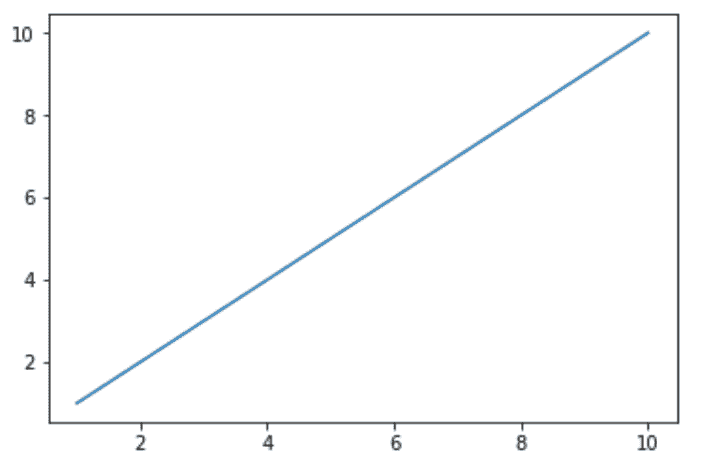

# Python Pyforest 库

> 原文:[https://www.geeksforgeeks.org/python-pyforest-library/](https://www.geeksforgeeks.org/python-pyforest-library/)

有时，我们会花费大量时间导入一些常见的库，如`NumPy`、`pandas`、`matplotlib`、`seaborn`、`nltk`等。为了消除手动导入这种库的头痛，我们有`pyforest`库。

正是这个库帮助您直接工作，而无需单独导入其他库。
当我们在使用它的时候，它本身把一些在**数据科学**中使用的高可用性库加起来。

**py forest 的功能:**

*   **active_imports():** 它将返回程序中已经使用过的所有库。
*   **lazy_imports():** 它将返回 pyforest 中所有可用的库。

**安装库:**

```
pip install pyforest
```

**来看看`pyforest`和各种库的用法。**

*   **Numpy: [NumPy](https://www.geeksforgeeks.org/numpy-in-python-set-1-introduction/) is a general-purpose array-processing package. It provides a high-performance multidimensional array object, and tools for working with these arrays.

    **示例:**

    ```
    # here we have not import  
    # 'numpy as np' by explicitly 
    a = np.array([[1, 2, 3], [4, 5, 6], [7, 8, 9]]) 

    print(a)
    ```

    **输出:**

    ```
    [[1 2 3]
     [4 5 6]
     [7 8 9]]

    ```

    **注意:**更多信息请参考 Python 中的[NumPy](https://www.geeksforgeeks.org/numpy-in-python-set-1-introduction/)** *   ****Pandas: [Pandas](https://www.geeksforgeeks.org/python-pandas-dataframe/) DataFrame is two-dimensional size-mutable, potentially heterogeneous tabular data structure with labeled axes (rows and columns). A Data frame is a two-dimensional data structure, i.e., data is aligned in a tabular fashion in rows and columns. Pandas DataFrame consists of three principal components, the data, rows, and columns.

    **示例:**

    ```
    d = {'A':[1, 2, 3], 'B':[4, 5, 6], 'C':[7, 8, 9]}

    # here we have not import
    # 'pandas as pd' by ourself .
    df = pd.DataFrame(d)  

    print(df)
    ```

    **输出:**

    ```
       A  B  C
    0  1  4  7
    1  2  5  8
    2  3  6  9

    ```

    **注:**更多信息请参考 [Python |熊猫数据框](https://www.geeksforgeeks.org/python-pandas-dataframe/)**** *   ******NLTK: The [NLTK](https://www.geeksforgeeks.org/tokenize-text-using-nltk-python/) module is a massive tool kit, aimed at helping you with the entire Natural Language Processing (NLP) methodology.

    **示例:**

    ```
    # here we do not import
    # ' Nltk library' by ourself
    # but only the class of nltk .
    from nltk.tokenize import word_tokenize

    data = "All apples are red in colour"

    print(word_tokenize(data))
    ```

    **输出:**

    ```
    ['All', 'apples', 'are', 'red', 'in', 'colour']
    ```

    **注意:**更多信息请参考[使用 python 中的 NLTK 对文本进行标记](https://www.geeksforgeeks.org/tokenize-text-using-nltk-python/)****** *   ******Matplotlib: [Matplotlib](https://www.geeksforgeeks.org/python-introduction-matplotlib/) is an amazing visualization library in Python for 2D plots of arrays. Matplotlib is a multi-platform data visualization library built on NumPy arrays and designed to work with the broader SciPy stack.

    **示例:**

    ```
    # here we have not imported 
    # 'matplotlib.pyplot as plt' by ourself.

    x = [1, 2, 3, 4, 5, 6, 7, 8, 9, 10]
    y = [1, 2, 3, 4, 5, 6, 7, 8, 9, 10] 

    plt.plot(x, y)  
    plt.show()
    ```

    **输出:**
    

    **注:**更多信息，请参考[Matplotlib 简介](https://www.geeksforgeeks.org/python-introduction-matplotlib/)******