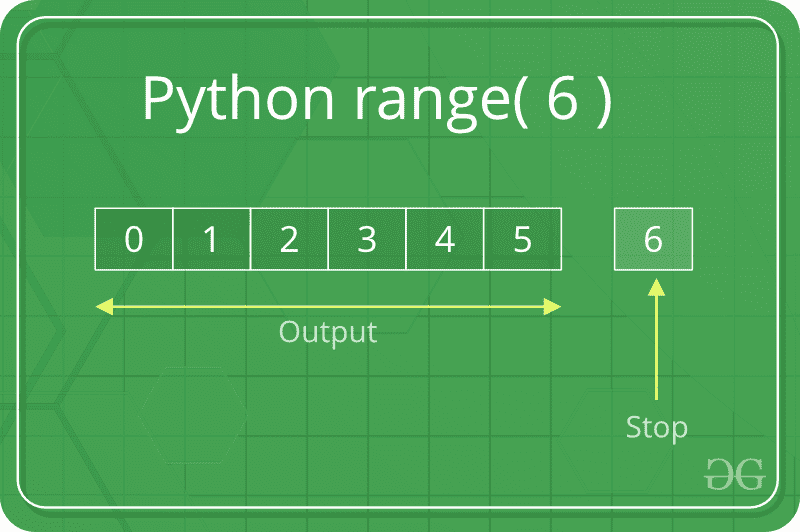
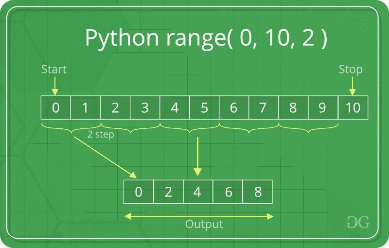

# Python range()函数

> 原文:[https://www.geeksforgeeks.org/python-range-function/](https://www.geeksforgeeks.org/python-range-function/)

**Python range()函数**返回给定范围之间给定数字的序列。

range()是 Python 的内置函数。当用户需要执行特定次数的操作时，使用它。Python(3.x)中的 range()只是 Python(2.x)中一个名为 [xrange](https://www.geeksforgeeks.org/range-vs-xrange-python/) 的函数的重命名版本。**范围()**功能用于生成数字序列。

**Python range()函数 for loop** 是常用的，因此，在处理任何类型的 Python 代码时，相同的知识都是关键的方面。Python 中 range()函数最常见的用法是迭代序列类型( **Python range() List** )字符串等。)带有 for 和 while 循环。

### Python 范围语法

> 范围(停止)
> 
> 范围(开始，停止[，步骤])

### **Python 范围()基础知识**

简单来说，range()允许用户在给定的范围内生成一系列数字。根据用户传递给函数的参数数量，用户可以决定该系列数字的开始和结束位置，以及一个数字和下一个数字之间的差异有多大。

*   **开始**:从整数开始返回整数序列
*   **停止:**整数，在此之前返回整数序列。整数范围在 stop–1 处结束。
*   **步骤:**确定序列中每个整数之间增量的整数值

## Python range()方法示例

### 示例 Python 范围的演示()

## 蟒蛇 3

```
# Python Program to
# show range() basics

# printing a number
for i in range(10):
    print(i, end=" ")
print()

# using range for iteration
l = [10, 20, 30, 40]
for i in range(len(l)):
    print(l[i], end=" ")
print()

# performing sum of natural
# number
sum = 0
for i in range(1, 11):
    sum = sum + i
print("Sum of first 10 natural number :", sum)
```

**输出:**

```
0 1 2 3 4 5 6 7 8 9 
10 20 30 40 
Sum of first 10 natural number : 55
```

### 有三种方法可以调用 range():

*   range(stop)接受一个参数。
*   range(start，stop)接受两个参数。
*   range(开始、停止、步进)有三个参数。

## 范围(停止)

当用户用一个参数调用 range()时，用户将得到一系列从 0 开始的数字，包括直到但不包括用户提供的停止数字的所有整数。例如–



### **例 2:**Python 范围演示(停止)

## 蟒蛇 3

```
# Python program to
# print whole number
# using range()

# printing first 10
# whole number
for i in range(10):
    print(i, end=" ")
print()

# printing first 20
# whole number
for i in range(20):
    print(i, end=" ")
```

**输出:**

```
0 1 2 3 4 5 6 7 8 9 
0 1 2 3 4 5 6 7 8 9 10 11 12 13 14 15 16 17 18 19 
```

## 范围(开始、停止)

当用户用两个参数调用 **range()** 时，用户不仅可以决定数列的停止位置，还可以决定数列的开始位置，因此用户不必一直从 0 开始。用户可以使用 range()使用范围(X，Y)生成一系列从 X 到 Y 的数字。例如-参数


### 示例 Python 范围的演示(开始、停止)

## 蟒蛇 3

```
# Python program to
# print natural number
# using range

# printing a natural
# number upto 20
for i in range(1, 20):
    print(i, end=" ")
print()

# printing a natural
# number from 5 t0 20
for i in range(5, 20):
    print(i, end=" ")
```

**输出:**

```
1 2 3 4 5 6 7 8 9 10 11 12 13 14 15 16 17 18 19 
5 6 7 8 9 10 11 12 13 14 15 16 17 18 19 
```

## 范围(开始、停止、步进)

当用户用三个参数调用 range()时，用户不仅可以选择数列的开始和结束位置，还可以选择一个数字和下一个数字之间的差异有多大。如果用户没有提供步骤，那么 range()将自动表现为步骤为 1。

### **示例 4:**Python 范围演示(开始、停止、步进)

## 蟒蛇 3

```
# Python program to
# print all number
# divisible by 3 and 5

# using range to print number
# divisible by 3
for i in range(0, 30, 3):
    print(i, end=" ")
print()

# using range to print number
# divisible by 5
for i in range(0, 50, 5):
    print(i, end=" ")
```

**输出:**

```
0 3 6 9 12 15 18 21 24 27 
0 5 10 15 20 25 30 35 40 45 
```



在这个例子中，我们打印了一个 0 到 10 之间的偶数，所以我们从 0(开始= 0)开始选择我们的起点，并在 10(停止= 10)停止序列。为了打印偶数，一个数字和下一个数字之间的差必须是 2(步长= 2)。在提供一个步长后，我们得到以下输出(0，2，4，8)。

### **示例 5:使用正步长**以递增**范围**

如果用户想要递增，那么用户需要步长为正数。例如:

## 蟒蛇 3

```
# Python program to
# increment with
# range()

# incremented by 2
for i in range(2, 25, 2):
    print(i, end=" ")
print()

# incremented by 4
for i in range(0, 30, 4):
    print(i, end=" ")
print()

# incremented by 3
for i in range(15, 25, 3):
    print(i, end=" ")
```

**输出:**

```
2 4 6 8 10 12 14 16 18 20 22 24 
0 4 8 12 16 20 24 28 
15 18 21 24 
```

### **示例 6:Python range()back ords**

如果用户想要递减，那么用户需要步长为负数。例如:

## 蟒蛇 3

```
# Python program to
# decrement with
# range()

# incremented by -2
for i in range(25, 2, -2):
    print(i, end=" ")
print()

# incremented by -4
for i in range(30, 1, -4):
    print(i, end=" ")
print()

# incremented by -3
for i in range(25, -6, -3):
    print(i, end=" ")
```