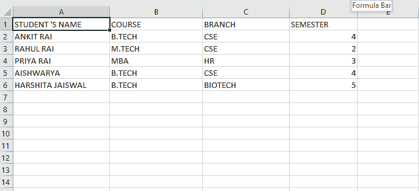

# 使用 Python openpyxl 模块读取 excel 文件

> 原文:[https://www . geesforgeks . org/python-reading-excel-file-use-openpyxl-module/](https://www.geeksforgeeks.org/python-reading-excel-file-using-openpyxl-module/)

**Openpyxl** 是一个读写 Excel(扩展名为 xlsx/xlsm/xltx/xltm)文件的 Python 库。openpyxl 模块允许 Python 程序读取和修改 Excel 文件。
例如，用户可能不得不遍历数千行，挑选出少数信息，根据某些标准进行小的修改。使用 Openpyxl 模块，这些任务可以非常高效和容易地完成。
使用此命令安装 openpyxl 模块:

```py
sudo pip3 install openpyxl 
```

**输入文件:**



**代码#1 :** 打印特定单元格值的程序

## 蟒蛇 3

```py
# Python program to read an excel file

# import openpyxl module
import openpyxl

# Give the location of the file
path = "C:\\Users\\Admin\\Desktop\\demo.xlsx"

# To open the workbook
# workbook object is created
wb_obj = openpyxl.load_workbook(path)

# Get workbook active sheet object
# from the active attribute
sheet_obj = wb_obj.active

# Cell objects also have a row, column,
# and coordinate attributes that provide
# location information for the cell.

# Note: The first row or
# column integer is 1, not 0.

# Cell object is created by using
# sheet object's cell() method.
cell_obj = sheet_obj.cell(row = 1, column = 1)

# Print value of cell object
# using the value attribute
print(cell_obj.value)
```

**输出:**

```py
STUDENT 'S NAME
```

**代码#2 :** 确定总行数

## 蟒蛇 3

```py
# import openpyxl module
import openpyxl

# Give the location of the file
path = "C:\\Users\\Admin\\Desktop\\demo.xlsx"

# to open the workbook
# workbook object is created
wb_obj = openpyxl.load_workbook(path)
sheet_obj = wb_obj.active

# print the total number of rows
print(sheet_obj.max_row)
```

**输出:**

```py
6
```

**代码#3 :** 确定总列数

## 蟒蛇 3

```py
# importing openpyxl module
import openpyxl

# Give the location of the file
path = "C:\\Users\\Admin\\Desktop\\demo.xlsx"

# workbook object is created
wb_obj = openpyxl.load_workbook(path)

sheet_obj = wb_obj.active

# print total number of column
print(sheet_obj.max_column)
```

**输出:**

```py
4
```

**代码#4 :** 打印所有列名

## 蟒蛇 3

```py
# importing openpyxl module
import openpyxl

# Give the location of the file
path = "C:\\Users\\Admin\\Desktop\\demo.xlsx"

# workbook object is created
wb_obj = openpyxl.load_workbook(path)

sheet_obj = wb_obj.active
max_col = sheet_obj.max_column

# Loop will print all columns name
for i in range(1, max_col + 1):
    cell_obj = sheet_obj.cell(row = 1, column = i)
    print(cell_obj.value)
```

**输出:**

```py
STUDENT 'S NAME
COURSE
BRANCH
SEMESTER
```

**代码#5 :** 打印第一列值

## 蟒蛇 3

```py
# importing openpyxl module
import openpyxl

# Give the location of the file
path = "C:\\Users\\Admin\\Desktop\\demo.xlsx"

# workbook object is created
wb_obj = openpyxl.load_workbook(path)

sheet_obj = wb_obj.active
m_row = sheet_obj.max_row

# Loop will print all values
# of first column
for i in range(1, m_row + 1):
    cell_obj = sheet_obj.cell(row = i, column = 1)
    print(cell_obj.value)
```

**输出:**

```py
STUDENT 'S NAME
ANKIT RAI
RAHUL RAI
PRIYA RAI
AISHWARYA
HARSHITA JAISWAL
```

**代码#6 :** 打印特定的行值

## 蟒蛇 3

```py
# importing openpyxl module
import openpyxl

# Give the location of the file
path = "C:\\Users\\Admin\\Desktop\\demo.xlsx"

# workbook object is created
wb_obj = openpyxl.load_workbook(path)

sheet_obj = wb_obj.active

max_col = sheet_obj.max_column

# Will print a particular row value
for i in range(1, max_col + 1):
    cell_obj = sheet_obj.cell(row = 2, column = i)
    print(cell_obj.value, end = " ")
```

**输出:**

```py
ANKIT RAI B.TECH CSE 4
```