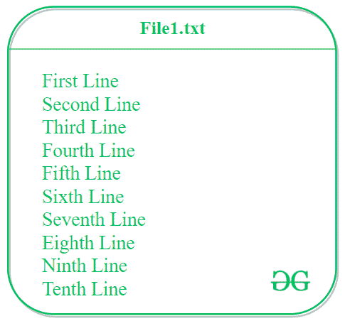

# Python–读取文件的最后 N 行

> 原文:[https://www . geesforgeks . org/python-reading-last-n-line-of-a-file/](https://www.geeksforgeeks.org/python-reading-last-n-lines-of-a-file/)

**先决条件:** [在 Python 中逐行读取文件](https://www.geeksforgeeks.org/read-a-file-line-by-line-in-python/)
给定一个文本文件 *fname* ，一个数字 *N* ，任务是读取文件的最后 N 行。
我们知道，Python 提供了多个内置的特性和模块来处理文件。让我们讨论使用 Python 读取文件最后 N 行的不同方法。
***文件:***



**方法 1:天真的方法**
在这种方法中，想法是使用带有 readlines()函数的负迭代器从文件末尾读取用户请求的所有行。

## 蟒蛇 3

```py
# Python implementation to
# read last N lines of a file

# Function to read
# last N lines of the file
def LastNlines(fname, N):
    # opening file using with() method
    # so that file get closed
    # after completing work
    with open(fname) as file:

        # loop to read iterate
        # last n lines and print it
        for line in (file.readlines() [-N:]):
            print(line, end ='')

# Driver Code:
if __name__ == '__main__':
    fname = 'File1.txt'
    N = 3
    try:
        LastNlines(fname, N)
    except:
        print('File not found'
```

**输出:**

```py
Eighth line
Ninth line
Tenth line
```

**方法 2:使用 OS 模块和缓冲策略**
在这种方法中，想法是在 python 中处理缓冲策略。缓冲区存储从操作系统的文件流接收到的一部分数据，并持续使用一段时间，然后会有更多的数据进入。
缓冲区大小决定了在使用之前一次可以存储的数据大小。我们可以选择将一个整数传递给缓冲，以便设置缓冲策略，如果我们没有指定任何策略，那么缓冲区的大小取决于设备的块大小。通常，缓冲区长度为 4096 或 8192 字节。在这种方法中，缓冲区的大小是 8192 字节。
此外，os 模块中 [os.stat()](https://www.geeksforgeeks.org/python-os-stat-method/) 方法的 **st_size** 属性用于以字节表示文件的大小。
以下是上述办法的实施情况。

## 蟒蛇 3

```py
# Python implementation to
# read last N lines of a file
# Using OS module and buffering policy

# importing os module
import os

# Function to read
# last N lines of the file
def LastNlines(fname, N):
    # taking buffer size of 8192 bytes
    bufsize = 8192

    # calculating size of
    # file in bytes
    fsize = os.stat(fname).st_size

    iter = 0

    # opening file using with() method
    # so that file get closed
    # after completing work
    with open(fname) as f:
        if bufsize > fsize:

            # adjusting buffer size
            # according to size
            # of file
            bufsize = fsize-1

            # list to store
            # last N lines
            fetched_lines = []

            # while loop to
            # fetch last N lines
            while True:
                iter += 1

                # moving cursor to
                # the last Nth line
                # of file
                f.seek(fsize-bufsize * iter)

                # storing each line
                # in list upto
                # end of file
                fetched_lines.extend(f.readlines())

                # halting the program
                # when size of list
                # is equal or greater to
                # the number of lines requested or
                # when we reach end of file
                if len(fetched_lines) >= N or f.tell() == 0:
                        print(''.join(fetched_lines[-N:]))
                        break

# Driver Code:
if __name__ == '__main__':

    fname = 'File1.txt'
    N = 3

    try:
        LastNlines(fname, N)
    except:
        print('File not found')
```

**输出:**

```py
Eighth line
Ninth line
Tenth line
```

**方法三:通过指数搜索**
该方法的思路是使用指数搜索算法，一般用于搜索排序的、无界的或无限的列表。要获取指数搜索的信息，请点击这里的。
这种方法使用 assert 语句作为调试工具来检查条件。如果给定的语句为真，程序将继续执行，否则，它将生成一个 **AssertionError 异常**。要获取断言语句的更多详细信息，请单击此处的。
点击此处熟悉 seek()方法的不同用法。
以下是上述办法的实施情况。

## 蟒蛇 3

```py
# Python implementation to
# read last N lines of a file
# through Exponential search

# Function to read
# last N lines of the file
def LastNlines(fname, N):

    # assert statement check
    # a condition
    assert N >= 0

    # declaring variable
    # to implement
    # exponential search
    pos = N + 1

    # list to store
    # last N lines
    lines = []

    # opening file using with() method
    # so that file get closed
    # after completing work
    with open(fname) as f:

        # loop which runs
        # until size of list
        # becomes equal to N
        while len(lines) <= N:

            # try block
            try:
                # moving cursor from
                # left side to
                # pos line from end
                f.seek(-pos, 2)

            # exception block
            # to handle any run
            # time error
            except IOError:
                f.seek(0)
                break

            # finally block
            # to add lines
            # to list after
            # each iteration
            finally:
                lines = list(f)

            # increasing value
            # of variable
            # exponentially
            pos *= 2

    # returning the
    # whole list
    # which stores last
    # N lines
    return lines[-N:]

# Driver Code:
if __name__ == '__main__':
    fname = 'File1.txt'
    N = 3
    try:
        lines = LastNlines(fname, N)
        for line in lines:
            print (line, end ='')
    except:
        print('File not found')
```

**输出:**

```py
Eighth line
Ninth line
Tenth line
```