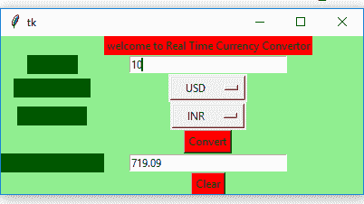

# Python |使用 Tkinter 的实时货币转换器

> 原文:[https://www . geesforgeks . org/python-实时-货币-转换器-使用-tkinter/](https://www.geeksforgeeks.org/python-real-time-currency-convertor-using-tkinter/)

**先决条件:**[tkinter 简介](https://www.geeksforgeeks.org/python-gui-tkinter/) | [获取实时货币汇率](https://www.geeksforgeeks.org/python-get-the-real-time-currency-exchange-rate/)
Python 为开发 GUI(图形用户界面)提供了多个选项。在所有的 GUI 方法中，tkinter 是最常用的方法。它是 Python 附带的 Tk 图形用户界面工具包的标准 Python 接口。带有 tkinter 输出的 Python 是创建图形用户界面应用程序最快最简单的方法。

**创建 tkinter :**

*   导入模块–tkinter
*   创建主窗口(容器)
*   向主窗口添加任意数量的小部件。
*   在小部件上应用事件触发器。

让我们创建一个基于图形用户界面的简单实时货币转换器(使用[阿尔法华帝应用编程接口](https://www.alphavantage.co/documentation/)，它可以将金额从一种货币转换为另一种货币。

**所需模块:**

```
tkinter
requests
json
```

下面是实现:

## 蟒蛇 3

```
# import all functions from the tkinter
from tkinter import *

# Create a GUI window
root = Tk()

# create a global variables
variable1 = StringVar(root)
variable2 = StringVar(root)

# initialise the variables
variable1.set("currency")
variable2.set("currency")

# Function to perform real time conversion
# from one currency to another currency
def RealTimeCurrencyConversion():

    # importing required libraries
    import requests, json

    # currency code
    from_currency = variable1.get()
    to_currency = variable2.get()

    # enter your api key here
    api_key = "Your_Api_Key"

    # base_url variable store base url
    base_url = r"https://www.alphavantage.co/query?function = CURRENCY_EXCHANGE_RATE"

    # main_url variable store complete url
    main_url = base_url + "&from_currency =" + from_currency +
        "&to_currency =" + to_currency + "&apikey =" + api_key

    # get method of requests module
    # return response object
    req_ob = requests.get(main_url)

    # json method return json format
    # data into python dictionary data type.

    # result contains list of nested dictionaries
    result = req_ob.json()

    # parsing the required information
    Exchange_Rate = float(result["Realtime Currency Exchange Rate"]
                                              ['5\. Exchange Rate'])

    # get method of Entry widget
    # returns current text  as a
    # string from text entry box.
    amount = float(Amount1_field.get())

    # calculation for the conversion
    new_amount = round(amount * Exchange_Rate, 3)

    # insert method inserting the
    # value in the text entry box.
    Amount2_field.insert(0, str(new_amount))

# Function for clearing the Entry field
def clear_all() :
    Amount1_field.delete(0, END)
    Amount2_field.delete(0, END)

# Driver code
if __name__ == "__main__" :

    # Set the background colour of GUI window
    root.configure(background = 'light green')

    # Set the configuration of GUI window (WidthxHeight)
    root.geometry("400x175")

    # Create welcome to Real Time Currency Convertor label
    headlabel = Label(root, text = 'welcome to Real Time Currency Convertor',
                      fg = 'black', bg = "red")

    # Create a "Amount :" label
    label1 = Label(root, text = "Amount :",
                 fg = 'black', bg = 'dark green')

    # Create a "From Currency :" label
    label2 = Label(root, text = "From Currency",
                   fg = 'black', bg = 'dark green')

    # Create a "To Currency: " label
    label3 = Label(root, text = "To Currency :",
                   fg = 'black', bg = 'dark green')

    # Create a "Converted Amount :" label
    label4 = Label(root, text = "Converted Amount :",
                   fg = 'black', bg = 'dark green')

    # grid method is used for placing
    # the widgets at respective positions
    # in table like structure . 
    headlabel.grid(row = 0, column = 1)
    label1.grid(row = 1, column = 0)
    label2.grid(row = 2, column = 0)
    label3.grid(row = 3, column = 0)
    label4.grid(row = 5, column = 0)

    # Create a text entry box
    # for filling or typing the information.
    Amount1_field = Entry(root)
    Amount2_field = Entry(root)

    # ipadx keyword argument set width of entry space.
    Amount1_field.grid(row = 1, column = 1, ipadx ="25")
    Amount2_field.grid(row = 5, column = 1, ipadx ="25")

    # list of currency codes
    CurrenyCode_list = ["INR", "USD", "CAD", "CNY", "DKK", "EUR"]

    # create a drop down menu using OptionMenu function
    # which takes window name, variable and choices as
    # an argument. use * before the name of the list,
    # to unpack the values
    FromCurrency_option = OptionMenu(root, variable1, *CurrenyCode_list)
    ToCurrency_option = OptionMenu(root, variable2, *CurrenyCode_list)

    FromCurrency_option.grid(row = 2, column = 1, ipadx = 10)
    ToCurrency_option.grid(row = 3, column = 1, ipadx = 10)

    # Create a Convert Button and attached
    # with RealTimeCurrencyExchangeRate function
    button1 = Button(root, text = "Convert", bg = "red", fg = "black",
                                command = RealTimeCurrencyConversion)

    button1.grid(row = 4, column = 1)

    # Create a Clear Button and attached
    # with delete function
    button2 = Button(root, text = "Clear", bg = "red",
                     fg = "black", command = clear_all)
    button2.grid(row = 6, column = 1)

    # Start the GUI
    root.mainloop()
```

**输出:**


