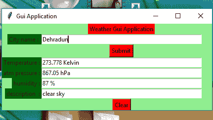
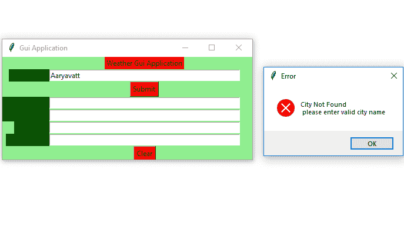

# Python |使用 Tkinter 进行实时天气检测

> 原文:[https://www . geesforgeks . org/python-实时-天气-检测-使用-tkinter/](https://www.geeksforgeeks.org/python-real-time-weather-detection-using-tkinter/)

**先决条件:**[tkinter 简介](https://www.geeksforgeeks.org/python-gui-tkinter/) | [查找任何城市的当前天气](https://www.geeksforgeeks.org/python-find-current-weather-of-any-city-using-openweathermap-api/)
Python 为开发 GUI(图形用户界面)提供了多个选项。在所有的 GUI 方法中，tkinter 是最常用的方法。它是 Python 附带的 Tk 图形用户界面工具包的标准 Python 接口。带有 tkinter 输出的 Python 是创建图形用户界面应用程序最快最简单的方法。现在，取决于开发人员的想象力或必要性，他/她想使用这个工具包开发什么。
**创建 tkinter :**

*   导入模块–tkinter
*   创建主窗口(容器)
*   向主窗口添加任意数量的小部件。
*   在小部件上应用事件触发器。

让我们创建一个基于图形用户界面的简单实时天气检测应用程序，它可以提供任何城市的天气细节。
**所需模块:**

```
tkinter
requests
json
```

下面是实现:

## 蟒蛇 3

```
# import all functions from the tkinter 
from tkinter import * from tkinter import messagebox

# function to find weather details
# of any city using openweathermap api
def tell_weather() :

    # import required modules
    import requests, json

    # enter your api key here
    api_key = "Your_API_key"

    # base_url variable to store url
    base_url = "http://api.openweathermap.org/data/2.5/weather?"

    # take a city name from city_field entry box
    city_name = city_field.get()

    # complete_url variable to store complete url address
    complete_url = base_url + "appid =" + api_key
                             + "&q =" + city_name

    # get method of requests module
    # return response object
    response = requests.get(complete_url)

    # json method of response object convert
    # json format data into python format data
    x = response.json()

    # now x contains list of  nested dictionaries
    # we know dictionary contains key value pair
    # check the value of "cod" key is equal to "404"
    # or not if not that means city is found
    # otherwise city is not found
    if x["cod"] != "404" :

        # store the value of "main" key in variable y
        y = x["main"]

        # store the value corresponding to the "temp" key of y
        current_temperature = y["temp"]

        # store the value corresponding to the "pressure" key of y
        current_pressure = y["pressure"]

        # store the value corresponding to the "humidity" key of y
        current_humidity = y["humidity"]

        # store the value of "weather" key in variable z
        z = x["weather"]

        # store the value corresponding to the "description" key
        # at the 0th index of z
        weather_description = z[0]["description"]

        # insert method inserting the
        # value in the text entry box.
        temp_field.insert(15, str(current_temperature) + " Kelvin")
        atm_field.insert(10, str(current_pressure) + " hPa")
        humid_field.insert(15, str(current_humidiy) + " %")
        desc_field.insert(10, str(weather_description) )

    # if city is not found                  
    else :

        # message dialog box appear which
        # shows given Error message
        messagebox.showerror("Error", "City Not Found \n"
                             "Please enter valid city name")

        # clear the content of city_field entry box
        city_field.delete(0, END)

# Function for clearing the
# contents of all text entry boxes 
def clear_all() :
    city_field.delete(0, END) 
    temp_field.delete(0, END)
    atm_field.delete(0, END)
    humid_field.delete(0, END)
    desc_field.delete(0, END)

    # set focus on the city_field entry box
    city_field.focus_set()

# Driver code
if __name__ == "__main__" :

    # Create a GUI window
    root = Tk()

    # set the name of tkinter GUI window
    root.title("Gui Application")

    # Set the background colour of GUI window
    root.configure(background = "light green")

    # Set the configuration of GUI window
    root.geometry("425x175")

    # Create a Weather Gui Application label
    headlabel = Label(root, text = "Weather Gui Application",
                      fg = 'black', bg = 'red')

    # Create a City name : label
    label1 = Label(root, text = "City name : ",
                   fg = 'black', bg = 'dark green')

    # Create a City name : label
    label2 = Label(root, text = "Temperature :",
                   fg = 'black', bg = 'dark green')

    # Create a atm pressure : label
    label3 = Label(root, text = "atm pressure :",
                   fg = 'black', bg = 'dark green')

    # Create a humidity : label
    label4 = Label(root, text = "humidity :",
                   fg = 'black', bg = 'dark green')

    # Create a description :label
    label5 = Label(root, text = "description  :",
                   fg = 'black', bg = 'dark green')

    # grid method is used for placing
    # the widgets at respective positions
    # in table like structure . 
    headlabel.grid(row = 0, column = 1)
    label1.grid(row = 1, column = 0, sticky ="E")
    label2.grid(row = 3, column = 0, sticky ="E")
    label3.grid(row = 4, column = 0, sticky ="E")
    label4.grid(row = 5, column = 0, sticky ="E")
    label5.grid(row = 6, column = 0, sticky ="E")

    # Create a text entry box
    # for filling or typing the information.
    city_field = Entry(root)
    temp_field = Entry(root)
    atm_field = Entry(root)
    humid_field = Entry(root)
    desc_field = Entry(root)

    # grid method is used for placing
    # the widgets at respective positions
    # in table like structure .
    # ipadx keyword argument set width of entry space .
    city_field.grid(row = 1, column = 1, ipadx ="100")
    temp_field.grid(row = 3, column = 1, ipadx ="100")
    atm_field.grid(row = 4, column = 1, ipadx ="100")
    humid_field.grid(row = 5, column = 1, ipadx ="100")
    desc_field.grid(row = 6, column = 1, ipadx ="100")

    # Create a Submit Button and attached
    # to tell_weather function
    button1 = Button(root, text = "Submit", bg = "red",
                     fg = "black", command = tell_weather)

    # Create a Clear Button and attached
    # to clear_all function
    button2 = Button(root, text = "Clear", bg = "red",
                     fg = "black", command = clear_all)

    # grid method is used for placing
    # the widgets at respective positions
    # in table like structure .
    button1.grid(row = 2, column = 1)
    button2.grid(row = 7, column = 1)

    # Start the GUI
    root.mainloop()
```

**输出:**



