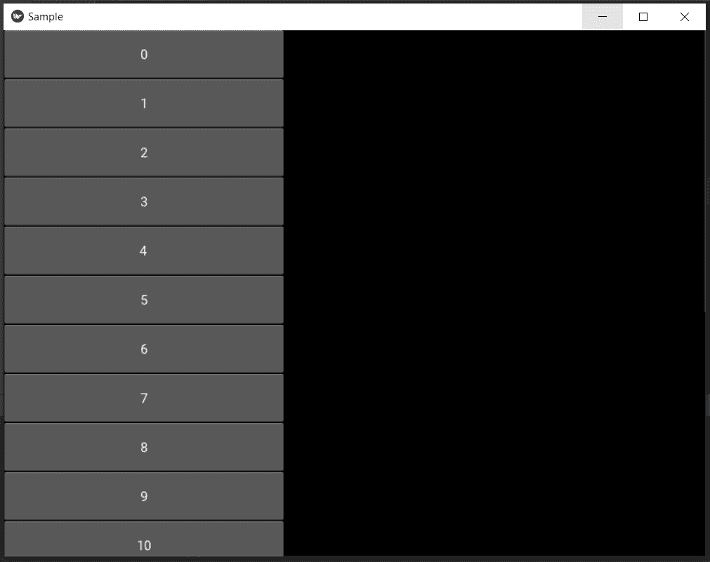

# Python | Kivy 中的 recycle view

> 原文:[https://www.geeksforgeeks.org/python-recycleview-in-kivy/](https://www.geeksforgeeks.org/python-recycleview-in-kivy/)

Kivy 是 Python 中独立于平台的 GUI 工具。因为它可以在安卓、IOS、Linux 和视窗等平台上运行。它基本上是用来开发安卓应用的，但并不意味着它不能在桌面应用上使用。

**recycle view:**
recycle view 帮助处理大量数据项。Recycleview 为用户提供了向下或向上滚动 kivy 应用程序中显示的数据的灵活性。您也可以一次选择多个数据项。与 Listview 相比，Recycleview 的内存效率更高。

> 要使用回收视图，您必须首先导入它。
> 
> ```
> from kivy.uix.recycleview import RecycleView
> ```

**实施**

```
# Program to explain how to use recycleview in kivy

# import the kivy module
from kivy.app import App

# The ScrollView widget provides a scrollable view 
from kivy.uix.recycleview import RecycleView

# Define the Recycleview class which is created in .kv file
class ExampleViewer(RecycleView):
    def __init__(self, **kwargs):
        super(ExampleViewer, self).__init__(**kwargs)
        self.data = [{'text': str(x)} for x in range(20)]

# Create the App class with name of your app.
class SampleApp(App):
    def build(self):
        return ExampleViewer()

# run the App
SampleApp().run()
```

**The。kv 文件为上述代码**

```
<ExampleViewer>:
    viewclass: 'Button'  # defines the viewtype for the data items.
    orientation: "vertical"
    spacing: 40
    padding:10, 10
    space_x: self.size[0]/3

    RecycleBoxLayout:
        color:(0, 0.7, 0.4, 0.8)
        default_size: None, dp(56)

        # defines the size of the widget in reference to width and height
        default_size_hint: 0.4, None 
        size_hint_y: None
        height: self.minimum_height
        orientation: 'vertical' # defines the orientation of data items
```

**输出:**

上面的代码生成了一个 0 到 20 范围内的数字列表，可以上下滚动查看。