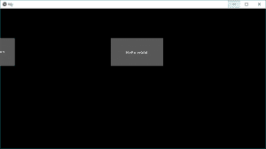
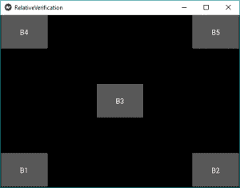

# Python | Kivy 中的相对布局

> 原文:[https://www . geesforgeks . org/python-relative-layout-in-kivy/](https://www.geeksforgeeks.org/python-relative-layout-in-kivy/)

Kivy 是 Python 中独立于平台的 GUI 工具。因为它可以在安卓、IOS、Linux 和视窗等平台上运行。它基本上是用来开发安卓应用的，但并不意味着它不能在桌面应用上使用。

> [Kivy 教程–通过示例学习 Kivy](https://www.geeksforgeeks.org/kivy-tutorial/)。

### 相对布局:

*   相对布局与[浮动布局](https://www.geeksforgeeks.org/python-float-layout-in-kivy/)相似，不同的是它的子部件相对于布局定位。
*   此布局的操作方式与浮动布局相同，但定位属性(x，y，center_x，right，y，center_y 和 top)是相对于布局大小而不是窗口大小的。
*   实际上，无论绝对和相对位置如何，当布局位置改变时，小部件都会移动。
*   当位置=(0，0)的小部件被添加到 RelativeLayout 时，现在如果 RelativeLayout 的位置被改变，子小部件也会移动。子部件坐标保持不变(即 0，0)，因为它们总是相对于父布局。
*   可用的 pos_hint 键(x、center_x、right、y、center_y 和 top)对于对齐边缘或居中非常有用。
    **例如:**
    pos_hint: {'center_x':.5，' center_y':.5}会在中间对齐一个 Widget，不管窗口大小是多少。

要使用 RelativeLayout，我们需要做的第一件事就是导入它。

```py
from kivy.uix.relativelayout import RelativeLayout
```

**注意:**
这个布局可以给孩子设置相对坐标。如果您想要绝对定位，请使用浮动布局。在 RelativeLayout 中，必须给出每个子小部件的大小和位置。这也实现了动态放置。

```py
We can do relative positioning by:
pos_hint: provide hint of position
We can define upto 8 keys i.e. it takes arguments in form of dictionary.
pos_hint = {“x”:1, “y”:1, “left”:1, “right”:1, "center_x":1, "center_y":1,
           “top”:1, “bottom”:1("top":0)}
```

**注意:**
浮动布局和相对布局都支持绝对和相对定位，具体取决于是使用 *pos_hint* 还是 pos。但是如果你想要绝对定位，使用浮动布局。

```py
Basic Approach to create Relative Layout:

1) import kivy
2) import kivyApp
3) import button
4) import Relativelayout
5) Set minimum version(optional)
6) create App class:
        - define build() function
7) return Layout/widget/Class(according to requirement)
8) Run an instance of the class
```

**使用 pos 实现方法:**
它简单地将位置分配给按钮。由于 Relativelayout 不依赖于窗口大小，它现在被固定在那个位置，如果你把窗口做小，它可能会消失，而不是自我调整。

## 蟒蛇 3

```py
# Sample Python application demonstrating the
# working of RelativeLayout in Kivy

# import modules
import kivy

# base Class of your App inherits from the App class.
# app:always refers to the instance of your application
from kivy.app import App

# creates the button in kivy
# if not imported shows the error
from kivy.uix.button import Button

# This layout allows you to set relative coordinates for children.
from kivy.uix.relativelayout import RelativeLayout

# To change the kivy default settings
# we use this module config
from kivy.config import Config

# 0 being off 1 being on as in true / false
# you can use 0 or 1 && True or False
Config.set('graphics', 'resizable', True)

# creating the App class
class MyApp(App):

    def build(self):

        # creating Relativelayout
        Rl = RelativeLayout()

        # creating button
        # a button 30 % of the width and 20 %
        # of the height of the layout and
        # positioned at (x, y), you can do
        # The position does not depend on window size
        # it just positioned at the given places:
        btn = Button(text ='Hello world',
                 size_hint =(.2, .2),
                 pos =(396.0, 298.0))
        btn1 = Button(text ='Hello world !!!!!!!!!',
                 size_hint =(.2, .2),
                 pos =(-137.33, 298.0))

        # adding widget i.e button
        Rl.add_widget(btn)
        Rl.add_widget(btn1)

        # return the layout
        return Rl

# run the App
if __name__ == "__main__":
    MyApp().run()
```

**输出:**



现在如果你想要按钮根据窗口*进行自我调整，就使用 pos_hint* 。

**使用 pos_hint** 的实现方法

## 蟒蛇 3

```py
# Sample Python application demonstrating the
# working of RelativeLayout in Kivy

# import modules
import kivy

# base Class of your App inherits from the App class.
# app:always refers to the instance of your application
from kivy.app import App

# creates the button in kivy
# if not imported shows the error
from kivy.uix.button import Button

# This layout allows you to set relative coordinates for children.
from kivy.uix.relativelayout import RelativeLayout

# To change the kivy default settings
# we use this module config
from kivy.config import Config

# 0 being off 1 being on as in true / false
# you can use 0 or 1 && True or False
Config.set('graphics', 'resizable', True)

# creating the App class
class Relative_Layout(App):

    def build(self):

        # creating Relativelayout
        rl = RelativeLayout()

        # creating button
        # size of button is 20 % by height and width of layout
        # position is bottom left i.e x = 0, y = 0
        b1 = Button(size_hint =(.2, .2),
                    pos_hint ={'x':0, 'y':0},
                    text ="B1")

        # position is bottom right i.e right = 1, y = 0
        b2 = Button(size_hint =(.2, .2),
                    pos_hint ={'right':1, 'y':0},
                    text ="B2")

        b3 = Button(size_hint =(.2, .2),
                    pos_hint ={'center_x':.5, 'center_y':.5},
                    text ="B3")

        b4 = Button(size_hint =(.2, .2),
                    pos_hint ={'x':0, 'top':1},
                    text ="B4")

        b5 = Button(size_hint =(.2, .2),
                    pos_hint ={'right':1, 'top':1},
                    text ="B5")

        # adding button to widget
        rl.add_widget(b1)
        rl.add_widget(b2)
        rl.add_widget(b3)
        rl.add_widget(b4)
        rl.add_widget(b5)

        # returning widget
        return rl
# run the App
if __name__  == "__main__":
    Relative_Layout().run()
```

**输出:**

