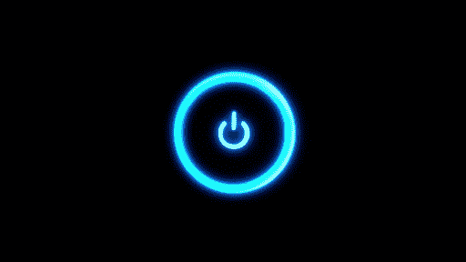
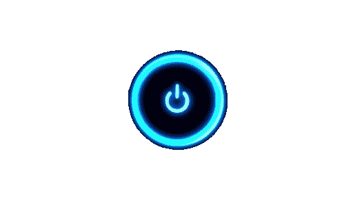

# Python–移除图像的一部分

> 原文:[https://www . geesforgeks . org/python-remove-part-of-a-image/](https://www.geeksforgeeks.org/python-remove-part-of-an-image/)

去除图像的一部分是指破坏图像的某些区域中的图像数据的过程。其中移除可以是动态的或硬编码的。在大多数去除过程中，图像的尺寸在合成图像中保持不变。从图像中删除部分会以无法解释的方式改变尺寸。在本文中，我们将看一下移除图像区域的方法，并了解不同的方法。

## **为什么要从图像中移除区域？**

有时，图像中包含某些不希望的伪像(不规则)或不需要的区域。一旦这些区域被识别，那么识别它们的类型是必要的，这将有助于想出最好的方法来摆脱它们。大多数图像处理软件包，如 Photoshop、Gimp 等。提供执行特定任务的工具。但是这也可以通过编程来实现，我们稍后会看到。下图将用于演示。


**例 1:**

从图像中移除零件(区域)需要预先提供感兴趣的区域。其中，每次进行流程时提供投资回报意味着投资回报是硬编码的。而感兴趣区域的计算本身(*随着不同的图像和条件*而相应地变化)意味着感兴趣区域是动态的。其中感兴趣区域通常是一个 4 元组大小，包含 Bbox 的左上角和右下角坐标。

删除一个区域意味着我们首先选择我们愿意删除的区域。其中选择可以基于区域或像素值。一旦区域被识别，我们将把该区域的像素值转换为背景的像素值。其中背景颜色不是恒定的，因此取决于要使用图像的上下文。最常见的背景不是白色就是黑色。在本文中，我们将假设背景颜色为黑色。为了演示这一点，我们将移除上述图像的区域(0，0)到(400，400)(左上角)中的像素。

**下面是实现:**

## 蟒蛇 3

```py
from PIL import Image
import numpy as np      

# Opening the image and converting 
# it to RGB color mode
# IMAGE_PATH => Path to the image
img = Image.open(r"IMAGE_PATH").convert('RGB')

# Extracting the image data &
# creating an numpy array out of it
img_arr = np.array(img)

# Turning the pixel values of the 400x400 pixels to black 
img_arr[0 : 400, 0 : 400] = (0, 0, 0)

# Creating an image out of the previously modified array
img = Image.fromarray(img_arr)

# Displaying the image
img.show()
```

**输出:**


移除图像的左上角区域

**说明:**

首先，我们导入了 PIL 图像库和 Numpy 模块，该模块允许我们将同类像素值存储为数组，这反过来又会加快对它们的操作。然后我们使用 *Image.open()* 函数打开图像(创建的图像对象)，稍后将图像转换为 RGB 颜色模式(最初是 RGBA)。之后我们使用 *np.array()* 函数从图像数据中创建了一个 Numpy 数组。后来，我们利用索引切片将区域(0，0)–(400，400)的像素值变成黑色(0，0，0)。最后，我们使用 *Image.fromarray()* 从修改后的像素数据创建了一个图像并显示出来。

**示例 2:** 去除具有 rgba 颜色模式的图像的区域

如果图像是 RGBA 颜色模式，那么移除的区域不需要使用颜色值来表示(如前一种情况)。我们可以使移除的区域看起来完全透明(具有 alpha 0)。这不仅有助于将该区域从最终图像中移除(或某种程度上消失)，而且给出了该区域中不存在像素的视觉提示。为了证明这一点，将使用以下图像:-



我们将删除图像中用黑色填充的区域。由于该区域不能被描述为一个形状，我们将使用[洪水填充](https://www.geeksforgeeks.org/floodfill-image-using-python-pillow/)功能用透明像素值填充该区域。在下面的例子中，我们将使用洋红色值作为[漫填](https://www.geeksforgeeks.org/floodfill-image-using-python-pillow/)算法的种子，并使用它来获得完全透明的像素值。

**下面是实现:**

## 蟒蛇 3

```py
# Importing ImageDraw for
# using floodfill function
from PIL import Image, ImageDraw

# Opening the image and
# converting its type to RGBA
img = Image.open(r"IMG_PATH").convert('RGBA')

# Location of seed
seed = (0, 0)

# Pixel Value which would
# be used for replacement
rep_value = (0, 0, 0, 0)

# Calling the floodfill() function and
# passing it image, seed, value and
# thresh as arguments
ImageDraw.floodfill(img, seed, rep_value, thresh = 100)

img.show()
```

**输出:**



图像中的黑色似乎被白色所取代。但是白色实际上是背景的颜色，该区域的像素是完全透明的(alpha = 0)。我们在上面的代码中所做的是:

1.  首先找出由黑色组成的最长连续区域(使用填充算法)
2.  将该区域的颜色值更改为(0，0，0，0)(完全透明)