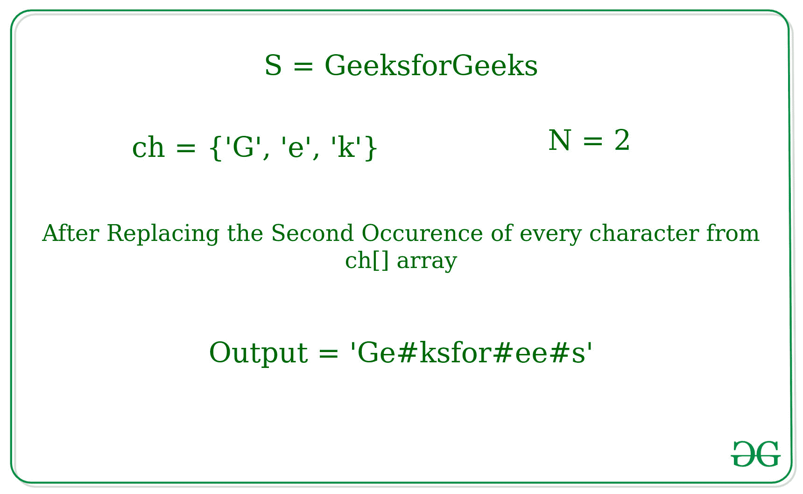

# Python |用给定字符替换字符串中第 n 次出现的多个字符

> 原文:[https://www . geesforgeks . org/python-用给定字符替换第 n 次出现的字符串中的多个字符/](https://www.geeksforgeeks.org/python-replacing-nth-occurrence-of-multiple-characters-in-a-string-with-the-given-character/)

给定一个字符串 **S** 、一个字符数组 **ch[]** 、一个数字 **N** 和一个替换字符，任务是用给定的替换字符替换字符串中字符数组 **ch[]** 中每个字符的每第 N 次出现。

> **输入:** S = "GeeksforGeeks "，ch[] = {'G '，' e '，' k'}，N = 2，replace _ character = ' # '
> **输出:** Ge#ksfor#ee#s
> **解释:**
> 在给定的字符串 S 中，第二次出现的' G '，' e '，' K '被替换为' #'
> 
> 
> 
> **输入:** S = abcdeahu，ch[] = {'a '，' d '，' u'}，N = 1，replacing_character = '#'
> **输出:** #bc#eah#
> **解释:**
> 在给定的字符串 S 中，第一个出现的' a '，' d '，' u '被替换为' #'

**方法 1:天真方法**
在这种方法中，一般的想法是将每个字符的每第 n 个出现索引存储在另一个数组中，并用给定的另一个字符替换它们。

下面是上述方法的实现。

## 计算机编程语言

```
# Python implementation to replace nth
# occurrence of the every character
# in a string

# Function to replace the Nth occurrence
# of the character of string
def replacer(initial_string, ch,
         replacing_character, occurrence):

    # breaking a string into it's
    # every single character in list
    lst1 = list(initial_string)
    lst2 = list(ch)

    # List to store the indexes in which
    # it is replaced with the
    # replacing_character
    lst3 = []

    # Loop to find the Nth occurrence of
    # given characters in the string
    for i in lst2:
        if(lst1.count(i)>= occurrence):
            count = 0
            for j in range(0, len(initial_string)):
                if(i == lst1[j]):
                    count+= 1
                    if(count == occurrence):
                        lst3.append(j)

    for i in lst3:
        # Replacing that particular index
        # with the requested character
        lst1[i] = replacing_character

    print(''.join(lst1))

# Driver Code:
if __name__ == '__main__':
    initial_string = 'GeeksforGeeks'
    ch = ['G', 'e', 'k']
    occurrence = 2
    replacing_character = '#'
    replacer(initial_string, ch,
    replacing_character, occurrence)
```

**Output:** 

```
Ge#ksfor#ee#s
```

**方法 2:使用 find()方法**
在这种方法中，想法是使用 [find()](https://www.geeksforgeeks.org/string-find-python/) 函数来查找给定字符串 S 中字符的第 n 次出现，并将其替换为另一个给予者字符。

下面是上述方法的实现。

## 计算机编程语言

```
# Python implementation to replace nth
# occurrence of the every character
# in a string using find() function

# Function to replace the Nth occurrence
# of the character of string
def replacer(initial_string, ch,
         replacing_character, occurrence):

    # breaking a string into
    # it's every single character
    lst1 = list(initial_string)
    lst2 = list(ch)

    # Loop to find the occurrence
    # of the character in the string
    # and replace it with the given
    # replacing_character
    for i in lst2:
        sub_string = i
        val = -1
        for i in range(0, occurrence):
            val = initial_string.find(sub_string,
                                      val + 1)
        lst1[val] = replacing_character

    print(''.join(lst1))

# Driver Code:
if __name__ == '__main__':
    initial_string = 'GeeksforGeeks'
    ch = ['G', 'e', 'k']
    occurrence = 2
    replacing_character = '#'
    replacer(initial_string, ch,
    replacing_character, occurrence)
```

**Output:** 

```
Ge#ksfor#ee#s
```

**方法 3:使用 startswith()方法**
在这种方法中，思想是使用 python 的 [startswith()](https://www.geeksforgeeks.org/python-startswith-endswidth-function/) 函数来找到字符出现次数等于给定第 n 次出现次数的字符的索引，然后用给定的替换字符进行替换。

下面是上述方法的实现。

## 计算机编程语言

```
# Python implementation to replace nth
# occurrence of the every character
# in a string

# Function to replace the Nth occurrence
# of the character of string
def replacer(initial_string, ch,
         replacing_character, occurrence):

    # breaking a string into
    # it's every single character
    lst1 = list(initial_string)
    lst2 = list(ch)

    # Loop to find the occurrence
    # of the character in the string
    # and replace it with the given
    # replacing_character   
    for j in lst2:
        sub_string = j
        checklist = [i for i in range(0, len(initial_string))
              if initial_string[i:].startswith(sub_string)]
        if len(checklist)>= occurrence:
            lst1[checklist[occurrence-1]] = replacing_character

    print(''.join(lst1))

# Driver Code:
if __name__ == '__main__':
    initial_string = 'GeeksforGeeks'
    ch = ['G', 'e', 'k']
    occurrence = 2
    replacing_character = '#'
    replacer(initial_string, ch,
    replacing_character, occurrence)
```

**Output:** 

```
Ge#ksfor#ee#s
```