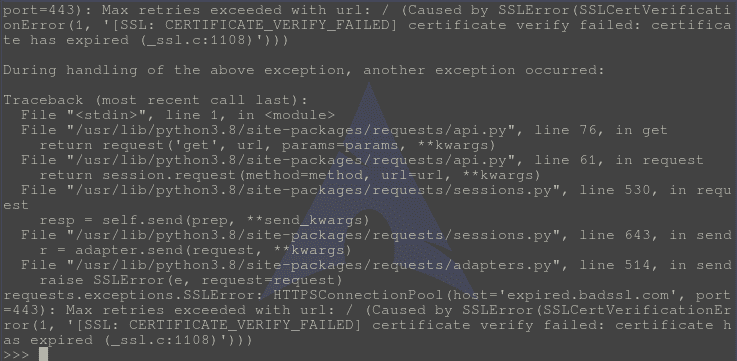

# Python 请求教程

> 原文:[https://www.geeksforgeeks.org/python-requests-tutorial/](https://www.geeksforgeeks.org/python-requests-tutorial/)

请求库是 Python 的一个组成部分，用于向指定的网址发出 HTTP 请求。无论是 REST APIs 还是 Web 报废，都必须了解请求，以便进一步使用这些技术。当一个人向 URI 提出请求时，它会返回一个响应。Python 请求提供了管理请求和响应的内置功能。


> #### 内容
> 
> *   [Why do you learn Python request module?](#why-learn)
> *   [Installation request](#install-requests)
> *   [Send out a request](#making-a-request)
> *   [http request method](#http-request-methods)
> *   [Response object](#response-object)
> *   [Response method](#response-methods)
> *   [Authentication using Python request](#authentication-using-python-requests)
> *   [SSL certificate verification](#ssl-certificate-verification)
> *   [Session object [T37 【T1]](#session-objects)

#### 为什么要学习 Python 请求模块？

*   Requests 是一个 Apache2 许可的 HTTP 库，允许使用 Python 发送 HTTP/1.1 请求。
*   要玩网络，Python 请求是必须的。无论是点击 API、下载整个 facebook 页面，还是其他更酷的东西，人们都必须向 URL 发出请求。
*   请求扮演主要角色的是处理[REST API](https://www.geeksforgeeks.org/rest-api-introduction/)和 [Web 报废](https://www.geeksforgeeks.org/introduction-to-web-scraping/)。
*   Checkout an Example Python Script using Requests and Web Scrapping – [Implementing Web Scraping in Python with BeautifulSoup](https://www.geeksforgeeks.org/implementing-web-scraping-python-beautiful-soup/)

    * * *

    <font size="2">**[Recent Articles on Requests !!](https://www.geeksforgeeks.org/tag/python-requests/)**</font>

    ## 安装请求

    请求安装取决于 eis 使用的操作系统类型，任何地方的基本命令都是打开命令终端并运行，

    ```
    pip install requests
    ```

    在任何操作系统上安装请求的基本方法是抓取基本文件并手动安装请求，而请求是在 GitHub 上主动开发的，代码总是可用的。代码–[请访问此处](https://github.com/psf/requests)。
    您可以克隆公共存储库:

    ```
    git clone git://github.com/psf/requests.git
    ```

    一旦您有了源代码的副本，您就可以将其嵌入到您自己的 Python 包中，或者轻松地将其安装到您的站点包中:

    ```
    cd requests
    pip install .
    ```

    更多信息请查看–[如何在 Python 中安装请求–对于 windows、linux、mac](https://www.geeksforgeeks.org/how-to-install-requests-in-python-for-windows-linux-mac/)

    ## 提出请求

    Python 请求模块有几个内置的方法，可以使用 GET、POST、PUT、PATCH 或 HEAD 请求向指定的 URI 发出 Http 请求。Http 请求意味着要么从指定的 URI 检索数据，要么将数据推送到服务器。它作为客户机和服务器之间的请求-响应协议。让我们演示如何向端点发出 GET 请求。
    GET 方法用于使用给定的 URI 从给定的服务器检索信息。GET 方法发送附加到页面请求的编码用户信息。页面和编码信息用“？”分隔性格。
    例如:

    ```
    https://www.google.com/search?q=hello
    ```

    ###### 如何通过 Python 请求发出 GET 请求

    Python 的 requests 模块提供了一个名为 **get()** 的内置方法，用于向指定的 URI 发出 get 请求。

    **语法–**

    ```
    requests.get(url, params={key: value}, args)

    ```

    **示例–**

    出于示例目的，让我们尝试向 github 的 API 发出请求。

    ```
    import requests

    # Making a GET request
    r = requests.get('https://api.github.com/users/naveenkrnl')

    # check status code for response received
    # success code - 200
    print(r)

    # print content of request
    print(r.content)
    ```

    将此文件保存为 request.py 并通过终端运行，

    ```
    python request.py
    ```

    **输出–**
    

    更多信息，请访问 [GET 方法–Python 请求](https://www.geeksforgeeks.org/get-method-python-requests/)

    #### Http 请求方法–

    | 方法 | 描述 |
    | --- | --- |
    | [获取](https://www.geeksforgeeks.org/get-method-python-requests/) | GET 方法用于使用给定的 URI 从给定的服务器检索信息。 |
    | [开机自检](https://www.geeksforgeeks.org/post-method-python-requests/) | POST 请求方法请求 web 服务器接受包含在请求消息正文中的数据，很可能是为了存储它 |
    | [PUT](https://www.geeksforgeeks.org/put-method-python-requests/) | PUT 方法要求将封闭实体存储在提供的 URI 下。如果 URI 引用了一个已经存在的资源，它将被修改，如果 URI 没有指向一个现有的资源，那么服务器可以用那个 URI 创建资源。 |
    | [删除](https://www.geeksforgeeks.org/delete-method-python-requests/) | DELETE 方法删除指定的资源 |
    | [头部](https://www.geeksforgeeks.org/head-method-python-requests/) | HEAD 方法要求一个与 GET 请求相同的响应，但是没有响应体。 |
    | [补丁](https://www.geeksforgeeks.org/patch-method-python-requests/) | 它用于修改功能。PATCH 请求只需要包含对资源的更改，而不是完整的资源 |

    ## 响应对象

    当一个人向 URI 提出请求时，它会返回一个响应。用 python 来说，这个 Response 对象是由 requests.method()返回的，方法是–get、post、put 等。Response 是一个功能强大的对象，它有许多函数和属性来帮助规范化数据或创建代码的理想部分。例如， **response.status_code** 从报头本身返回状态码，可以检查请求是否被成功处理。
    响应对象可以用来暗示许多特征、方法和功能。

    **Example :**

    ```
    # import requests module
    import requests

    # Making a get request
    response = requests.get('https://api.github.com/')

    # print request object
    print(response.url)

    # print status code
    print(response.status_code)
    ```

    将此文件另存为 request.py，并使用以下命令运行

    ```
    Python request.py
    ```

    
    状态码 200 表示请求成功。

    #### 应对方法

    | 方法 | 描述 |
    | --- | --- |
    | [响应标题](https://www.geeksforgeeks.org/response-headers-python-requests/) | response.headers 返回响应头的字典。 |
    | [响应编码](https://www.geeksforgeeks.org/response-encoding-python-requests/) | response.encoding 返回用于解码 response.content 的编码。 |
    | [响应.经过的时间](https://geeksforgeeks.org/response-elapsed-python-requests/) | response . approach 返回一个 timedelta 对象，其中包含从发送请求到响应到达所经过的时间。 |
    | [response.close()](https://www.geeksforgeeks.org/response-close-python-requests/) | response.close()关闭与服务器的连接。 |
    | [回复内容](https://www.geeksforgeeks.org/response-content-python-requests/) | response.content 返回响应的内容，以字节为单位。 |
    | [响应. cookies](https://www.geeksforgeeks.org/response-cookies-python-requests/) | response.cookiess 返回一个 CookieJar 对象，其中包含从服务器发回的 cookie。 |
    | [响应历史](https://www.geeksforgeeks.org/response-history-python-requests/) | response.history 返回包含请求历史(url)的响应对象列表。 |
    | [response . is _ permanent _ redirect](https://www.geeksforgeeks.org/response-is_permanent_redirect-python-requests/) | 如果响应是永久重定向的 url，response.is_permanent_redirect 返回 True，否则返回 False。 |
    | [response.is_redirect](https://www.geeksforgeeks.org/response-is_redirect-python-requests/) | 如果响应被重定向，response.is_redirect 返回 True，否则返回 False。 |
    | [response.iter_content()](https://www.geeksforgeeks.org/response-iter_content-python-requests/) | response.iter_content()迭代 response.content。 |
    | [response.json()](https://www.geeksforgeeks.org/response-json-python-requests/) | response.json()返回结果的 json 对象(如果结果是用 JSON 格式编写的，如果不是，就会引发错误)。 |
    | [response.url](https://www.geeksforgeeks.org/response-url-python-requests/) | response.url 返回响应的 url。 |
    | [回应.正文](https://www.geeksforgeeks.org/response-text-python-requests/) | response.text 以 unicode 格式返回响应的内容。 |
    | [响应.状态码](https://www.geeksforgeeks.org/response-status_code-python-requests/) | response.status_code 返回一个指示状态的数字(200 表示正常，404 表示未找到)。 |
    | [响应.请求](https://www.geeksforgeeks.org/response-request-python-requests/) | response.request 返回请求此响应的请求对象。 |
    | [回应原因](https://www.geeksforgeeks.org/response-reason-python-requests/) | response.reason 返回对应于状态代码的文本。 |
    | [response . raise _ for _ status()](https://www.geeksforgeeks.org/response-raise_for_status-python-requests/) | response.raise_for_status()如果在过程中出现错误，则返回一个 HTTPError 对象。 |
    | [响应. ok](https://www.geeksforgeeks.org/response-ok-python-requests/) | 如果 status_code 小于 200，response.ok 返回 True，否则返回 False。 |
    | [响应链接](https://www.geeksforgeeks.org/response-links-python-requests/) | response.links 返回标题链接。 |

    ## 使用 Python 请求的身份验证

    身份验证是指授予用户访问特定资源的权限。因为不能允许每个人从每个网址访问数据，所以首先需要身份验证。为了实现这种身份验证，通常需要通过授权头或服务器定义的自定义头来提供身份验证数据。

    **示例–**

    ```
    # import requests module
    import requests
    from requests.auth import HTTPBasicAuth

    # Making a get request
    response = requests.get('https://api.github.com / user, ',
                auth = HTTPBasicAuth('user', 'pass'))

    # print request object
    print(response)
    ```

    用您的用户名和密码替换“用户”和“密码”。它将验证请求并返回响应 200，否则它将返回错误 403。
    
    更多访问–[使用 Python 进行身份验证请求](https://www.geeksforgeeks.org/authentication-using-python-requests/)

    ## SSL 证书验证

    请求验证 HTTPS 请求的 SSL 证书，就像网络浏览器一样。SSL 证书是将加密密钥数字绑定到组织详细信息的小型数据文件。通常，具有 SSL 证书的网站被称为安全网站。默认情况下，启用了 SSL 验证，如果请求无法验证证书，它将抛出一个 SSL 错误。

    #### 禁用 SSL 证书验证

    让我们尝试使用 Python 请求访问一个带有无效 SSL 证书的网站

    ```
    # import requests module
    import requests

    # Making a get request
    response = requests.get('https://expired.badssl.com/')

    # print request object
    print(response)
    ```

    **输出:-**
    
    该网站没有 SSL 设置，因此引发此错误。
    也可以仅通过 python 请求传递证书链接进行验证。

    ```
    # import requests module
    import requests

    # Making a get request
    response = requests.get('https://github.com', verify ='/path/to/certfile')

    # print request object
    print(response)
    ```

    如果为 github.com 的 SSL 证书提供的路径是正确的，这将是可行的。
    欲了解更多信息，请访问- [SSL 证书验证 Python 请求](https://www.geeksforgeeks.org/ssl-certificate-verification-python-requests/)

    ## 会话对象

    会话对象允许用户跨请求保存某些参数。它还在会话实例发出的所有请求中保留 cookies，并将使用 urllib3 的连接池。因此，如果向同一台主机发出多个请求，底层的 TCP 连接将被重用，这可能会导致性能显著提高。会话对象包含请求的所有方法。

    #### 使用会话对象

    让我们通过将 cookie 设置为 url，然后再次请求检查 cookie 是否已设置来说明会话对象的使用。

    ```
    # import requests module
    import requests

    # create a session object
    s = requests.Session()

    # make a get request
    s.get('https://httpbin.org/cookies/set/sessioncookie/123456789')

    # again make a get request
    r = s.get('https://httpbin.org/cookies')

    # check if cookie is still set
    print(r.text)
    ```

     **输出:**
    
    更多信息，请访问–[会话对象–Python 请求](https://www.geeksforgeeks.org/session-objects-python-requests/)