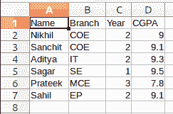
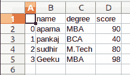
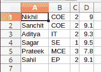

# Python–将列表保存到 CSV

> 原文:[https://www.geeksforgeeks.org/python-save-list-to-csv/](https://www.geeksforgeeks.org/python-save-list-to-csv/)

A **CSV(逗号分隔值)**是一种简单的文件格式，用于以表格格式存储数据。CSV 文件以纯文本形式存储表格数据(数字和文本)。文件的每一行都是数据记录。每条记录由一个或多个字段组成，用逗号分隔。使用逗号作为字段分隔符是这种文件格式的名称来源。

有多种方法可以将列表保存到 CSV，我们将在本文中看到。

**方法 1:使用 CSV 模块**

```py
import csv

# field names 
fields = ['Name', 'Branch', 'Year', 'CGPA'] 

# data rows of csv file 
rows = [ ['Nikhil', 'COE', '2', '9.0'], 
         ['Sanchit', 'COE', '2', '9.1'], 
         ['Aditya', 'IT', '2', '9.3'], 
         ['Sagar', 'SE', '1', '9.5'], 
         ['Prateek', 'MCE', '3', '7.8'], 
         ['Sahil', 'EP', '2', '9.1']] 

with open('GFG', 'w') as f:

    # using csv.writer method from CSV package
    write = csv.writer(f)

    write.writerow(fields)
    write.writerows(rows)
```

**输出:**



**方法二:使用熊猫**

```py
# importing pandas as pd  
import pandas as pd  

# list of name, degree, score 
nme = ["aparna", "pankaj", "sudhir", "Geeku"] 
deg = ["MBA", "BCA", "M.Tech", "MBA"] 
scr = [90, 40, 80, 98] 

# dictionary of lists  
dict = {'name': nme, 'degree': deg, 'score': scr}  

df = pd.DataFrame(dict) 

# saving the dataframe 
df.to_csv('GFG.csv') 
```

**输出:**



**方法三:使用 Numpy**

```py
import numpy as np

# data rows of csv file 
rows = [ ['Nikhil', 'COE', '2', '9.0'], 
         ['Sanchit', 'COE', '2', '9.1'], 
         ['Aditya', 'IT', '2', '9.3'], 
         ['Sagar', 'SE', '1', '9.5'], 
         ['Prateek', 'MCE', '3', '7.8'], 
         ['Sahil', 'EP', '2', '9.1']] 

# using the savetxt 
# from the numpy module
np.savetxt("GFG.csv", 
           rows,
           delimiter =", ", 
           fmt ='% s')
```

**输出:**

