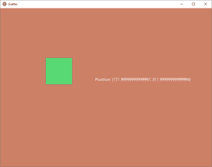

# Python | kivy 中的散点

> 原文:[https://www.geeksforgeeks.org/python-scatter-in-kivy/](https://www.geeksforgeeks.org/python-scatter-in-kivy/)

Kivy 是 Python 中独立于平台的 GUI 工具。因为它可以在安卓、IOS、linux 和 Windows 等平台上运行。它基本上是用来开发安卓应用程序的，但并不意味着它不能在桌面应用程序上使用。

> 👉🏽 [Kivy 教程–通过示例学习 Kivy](https://www.geeksforgeeks.org/kivy-tutorial/)。

### 分散

分散用于构建交互式小部件，可以在多点触控系统上用两个或多个手指进行平移、旋转和缩放。

它包含自己的矩阵变换。散点图类允许用户拖动、缩放和旋转在其控制下的任何小部件。

就像在 Relativelayout 中一样，孩子是相对于分散的。
所以拖动散点时，孩子的位置不变，只有散点的位置变。

分散大小对其子代的大小没有影响。如果您想要调整它的大小，您可以使用缩放，这将同时变换散布及其子对象，但不会改变大小。

```
Basic Approach:
1) import kivy
2) import kivyApp
3) import scatter
4) import Relativelayout
5) import widget
6) Set minimum version(optional)
7) create Widget class
8) create layout class
9) create App class
10) create the, kv file
11) return Layout/widget/Class(according to requirement)
12) Run an instance of the class

```

> **要使用散点，首先必须通过命令从 kivy.uix 导入散点:**

**#实施方法:**

**。py 文件**

```
# Program to explain how to use Scatter in kivy  

# import kivy module     
import kivy   

# base Class of your App inherits from the App class.     
# app:always refers to the instance of your application    
from kivy.app import App  

# this restrict the kivy version i.e   
# below this kivy version you cannot   
# use the app or software   
kivy.require('1.9.0')  

# Scatter is used to build interactive
# widgets that can be translated,
# rotated and scaled with two or
# more fingers on a multitouch system.
from kivy.uix.scatter import Scatter

# Widgets are elements of a
# graphical user interface that
# form part of the User Experience.
from kivy.uix.widget import Widget

# This layout allows you to set relative coordinates for children. 
from kivy.uix.relativelayout import RelativeLayout

# Creating widget class
class SquareWidget(Widget):
    pass

# Creating Scatter Class
class ScatterWidget(Scatter):
    pass

# Create the layout class
class Scatter_App(RelativeLayout):
    pass

class ScatterApp(App):
    def build(self):
        return Scatter_App()

if __name__=='__main__':
    ScatterApp().run()
```

**。kv 文件**

```
# .kv file implementation

# Create the square to show scatter
<SquareWidget>:
    size: 100, 100
    canvas:
        Color:
            rgb: [0.345, 0.85, 0.456]
        Rectangle:
            size: self.size
            pos: self.pos

# Create the scatter properties           
<Scatter_App>:

    canvas:
        Color:
            rgb: .8, .5, .4
        Rectangle:
            size: self.size
            pos: self.pos

    ScatterWidget:
        id: square_widget_id
        SquareWidget:

    # Showing the current position of the box
    Label:
        text: 'Position: ' + str(square_widget_id.pos)
        size_hint: .1, .1
        pos: 500, 300
```

**输出:**
