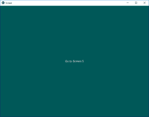
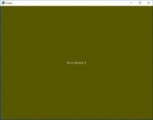
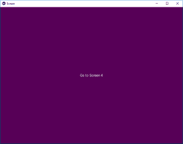

# Python | ScreenManager 在 Kivy 中使用。kv 文件

> 原文:[https://www . geesforgeks . org/python-screen manager-in-kivy-using-kv-file/](https://www.geeksforgeeks.org/python-screenmanager-in-kivy-using-kv-file/)

Kivy 是 Python 中独立于平台的 GUI 工具。因为它可以在安卓、IOS、linux 和 Windows 等平台上运行。它基本上是用来开发安卓应用程序的，但并不意味着它不能在桌面应用程序上使用。

## 屏幕管理器小部件:

屏幕管理器是一个小部件，用于管理应用程序的多个屏幕。默认的屏幕管理器一次只显示一个屏幕，并使用转换库从一个屏幕切换到另一个屏幕。支持多种过渡。

屏幕管理器和屏幕类被导入。屏幕管理器将用于根，如:

```
from kivy.uix.screenmanager import ScreenManager, Screen
```

**注意:**默认的 ScreenManager.transition 是一个带有方向和持续时间选项的 SlideTransition。

```
Basic Approach:
1) import kivy
2) import kivyApp
3) import Screen Manager, Screen, ""Transitions you want to use"" 
4) Set minimum version(optional)
5) Create Different Screen classes and pass them
6) Create features of Screen classes in .kv file 
       :: Add features in different screens
7) Create App class
8) return screen manager
9) Run an instance of the class
```

**下面是 `.py`文件中带有`.kv`文件的代码的实现。**

```
# Program to Show how to create a switch 
# import kivy module    
import kivy  

# base Class of your App inherits from the App class.    
# app:always refers to the instance of your application   
from kivy.app import App 

# this restrict the kivy version i.e  
# below this kivy version you cannot  
# use the app or software  
kivy.require('1.9.0')

# Builder is used when .kv file is
# to be used in .py file
from kivy.lang import Builder

# The screen manager is a widget
# dedicated to managing multiple screens for your application.
from kivy.uix.screenmanager import ScreenManager, Screen

# You can create your kv code in the Python file
Builder.load_string("""
<ScreenOne>:
    BoxLayout:
        Button:
            text: "Go to Screen 2"
            background_color : 0, 0, 1, 1
            on_press:
                # You can define the duration of the change
                # and the direction of the slide
                root.manager.transition.direction = 'left'
                root.manager.transition.duration = 1
                root.manager.current = 'screen_two'

<ScreenTwo>:
    BoxLayout:
        Button:
            text: "Go to Screen 3"
            background_color : 1, 1, 0, 1
            on_press:
                root.manager.transition.direction = 'left'
                root.manager.transition.duration = 1
                root.manager.current = 'screen_three'

<ScreenThree>:
    BoxLayout:
        Button:
            text: "Go to Screen 4"
            background_color : 1, 0, 1, 1
            on_press:
                root.manager.transition.direction = 'left'
                root.manager.transition.duration = 1
                root.manager.current = 'screen_four'

<ScreenFour>:
    BoxLayout:
        Button:
            text: "Go to Screen 5"
            background_color : 0, 1, 1, 1
            on_press:
                root.manager.transition.direction = 'left'
                root.manager.transition.duration = 1
                root.manager.current = 'screen_five'

<ScreenFive>:
    BoxLayout:
        Button:
            text: "Go to Screen 1"
            background_color : 1, 0, 0, 1
            on_press:
                root.manager.transition.direction = 'right'
                root.manager.current = 'screen_one'

""")

# Create a class for all screens in which you can include
# helpful methods specific to that screen
class ScreenOne(Screen):
    pass

class ScreenTwo(Screen):
    pass

class ScreenThree(Screen):
    pass

class ScreenFour(Screen):
    pass

class ScreenFive(Screen):
    pass

# The ScreenManager controls moving between screens
screen_manager = ScreenManager()

# Add the screens to the manager and then supply a name
# that is used to switch screens
screen_manager.add_widget(ScreenOne(name ="screen_one"))
screen_manager.add_widget(ScreenTwo(name ="screen_two"))
screen_manager.add_widget(ScreenThree(name ="screen_three"))
screen_manager.add_widget(ScreenFour(name ="screen_four"))
screen_manager.add_widget(ScreenFive(name ="screen_five"))

# Create the App class
class ScreenApp(App):
    def build(self):
        return screen_manager

# run the app 
sample_app = ScreenApp()
sample_app.run()
```

**输出:**






**改变过渡:**

> 默认情况下，您有多个过渡可用，例如:
> 
> *   **不切换**–立即切换屏幕，不显示动画
> *   **滑动过渡**–从任何方向滑入/滑出屏幕
> *   **卡片过渡**–根据模式，新屏幕在先前屏幕上滑动，或者旧屏幕在新屏幕上滑动
> *   **交换转换**–iOS 交换转换的实现
> *   **渐变过渡**–渐变屏幕的着色器
> *   **擦除过渡**–着色器从右向左擦除屏幕
> *   **FallOutTransition**–着色器，旧屏幕“落下”并变得透明，显示其后面的新屏幕。
> *   **RiseInTransition**–新屏幕从屏幕中心升起，同时从透明渐变为不透明的着色器。

您可以通过更改屏幕管理器轻松切换过渡。过渡属性:

```
sm = ScreenManager(transition=FadeTransition())
```

```
# Program to Show how to create a switch 
# import kivy module    
import kivy  

# base Class of your App inherits from the App class.    
# app:always refers to the instance of your application   
from kivy.app import App 

# this restrict the kivy version i.e  
# below this kivy version you cannot  
# use the app or software  
kivy.require('1.9.0')

# Builder is used when .kv file is
# to be used in .py file
from kivy.lang import Builder

# The screen manager is a widget
# dedicated to managing multiple screens for your application.
from kivy.uix.screenmanager import (ScreenManager, Screen, NoTransition,
SlideTransition, CardTransition, SwapTransition,
FadeTransition, WipeTransition, FallOutTransition, RiseInTransition) 

# You can create your kv code in the Python file
Builder.load_string("""
<ScreenOne>:
    BoxLayout:
        Button:
            text: "Go to Screen 2"
            background_color : 0, 0, 1, 1
            on_press:
                # You can define the duration of the change
                # and the direction of the slide
                root.manager.transition.direction = 'left'
                root.manager.transition.duration = 1
                root.manager.current = 'screen_two'

<ScreenTwo>:
    BoxLayout:
        Button:
            text: "Go to Screen 3"
            background_color : 1, 1, 0, 1
            on_press:
                root.manager.transition.direction = 'left'
                root.manager.transition.duration = 1
                root.manager.current = 'screen_three'

<ScreenThree>:
    BoxLayout:
        Button:
            text: "Go to Screen 4"
            background_color : 1, 0, 1, 1
            on_press:
                root.manager.transition.direction = 'left'
                root.manager.transition.duration = 1
                root.manager.current = 'screen_four'

<ScreenFour>:
    BoxLayout:
        Button:
            text: "Go to Screen 5"
            background_color : 0, 1, 1, 1
            on_press:
                root.manager.transition.direction = 'left'
                root.manager.transition.duration = 1
                root.manager.current = 'screen_five'

<ScreenFive>:
    BoxLayout:
        Button:
            text: "Go to Screen 1"
            background_color : 1, 0, 0, 1
            on_press:
                root.manager.transition.direction = 'right'
                root.manager.current = 'screen_one'

""")

# Create a class for all screens in which you can include
# helpful methods specific to that screen
class ScreenOne(Screen):
    pass

class ScreenTwo(Screen):
    pass

class ScreenThree(Screen):
    pass

class ScreenFour(Screen):
    pass

class ScreenFive(Screen):
    pass

# The ScreenManager controls moving between screens
# You can change the transitions accorsingly
screen_manager = ScreenManager(transition = RiseInTransition())

# Add the screens to the manager and then supply a name
# that is used to switch screens
screen_manager.add_widget(ScreenOne(name ="screen_one"))
screen_manager.add_widget(ScreenTwo(name ="screen_two"))
screen_manager.add_widget(ScreenThree(name ="screen_three"))
screen_manager.add_widget(ScreenFour(name ="screen_four"))
screen_manager.add_widget(ScreenFive(name ="screen_five"))

# Create the App class
class ScreenApp(App):
    def build(self):
        return screen_manager

# run the app 
sample_app = ScreenApp()
sample_app.run()
```

**注意:**代码相同代码中增加了一些点，不要混淆。

**输出不同过渡的视频–**

<video class="wp-video-shortcode" id="video-316208-1" width="665" height="374" preload="metadata" controls=""><source type="video/webm" src="https://media.geeksforgeeks.org/wp-content/uploads/20190624135725/Sm.webm?_=1">[https://media.geeksforgeeks.org/wp-content/uploads/20190624135725/Sm.webm](https://media.geeksforgeeks.org/wp-content/uploads/20190624135725/Sm.webm)</video>