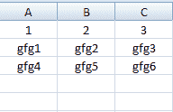
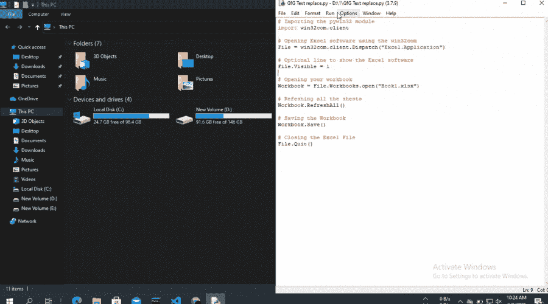

# 自动刷新 Excel 电子表格的 Python 脚本

> 原文:[https://www . geesforgeks . org/python-脚本到自动化-刷新-excel-电子表格/](https://www.geeksforgeeks.org/python-script-to-automate-refreshing-an-excel-spreadsheet/)

在本文中，我们将学习如何使用 Python 自动刷新 Excel 电子表格。

因此，为了打开 Excel 应用程序和工作簿，我们将使用 pywin32 模块。您可以使用以下代码安装该模块:

```
pip install pywin32
```

然后我们将使用 win32com.client.Dispatch()方法打开 Excel 应用程序，使用 Workbooks.open()方法打开工作簿。

> **语法:**文件。打开工作簿
> 
> **参数:**它会以 excel 文件的路径为参数。

然后使用 RefershAll()刷新文件:

> 工作簿。刷新所有()

对于本例，我们创建了一个名为“Book1”的 excel 文件，其内容如下:



**下面是实现:**

## 蟒蛇 3

```
# Importing the pywin32 module
import win32com.client

# Opening Excel software using the win32com
File = win32com.client.Dispatch("Excel.Application")

# Optional line to show the Excel software
File.Visible = 1

# Opening your workbook
Workbook = File.Workbooks.open("Book1.xlsx")

# Refeshing all the shests
Workbook.RefreshAll()

# Saving the Workbook
Workbook.Save()

# Closing the Excel File
File.Quit()
```

**输出:**

