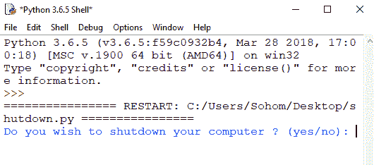

# 关闭电脑的 Python 脚本

> 原文:[https://www . geesforgeks . org/python-脚本到关机-计算机/](https://www.geeksforgeeks.org/python-script-to-shutdown-computer/)

众所周知，Python 是一种流行的脚本语言，因为它具有多种功能。在本文中，我们将编写一个 Python 脚本来关闭计算机。
要使用 Python 脚本关闭电脑/PC/笔记本电脑，必须使用代码为“`shutdown /s /t 1`”的 `os.system()`功能。

> **注意:**要使其工作，您必须在 ide 中导入 `os library`。如果没有，则通过命令提示符输入“`pip install os`”。
> 
> **原因:**请确保在 IDLE 上运行此代码之前保存并关闭所有程序，因为下面的程序会立即关闭您的计算机。

下面是 Python 实现–

```py
import os

shutdown = input("Do you wish to shutdown your computer ? (yes / no): ")

if shutdown == 'no':
    exit()
else:
    os.system("shutdown /s /t 1")
```

**输出:**


这里有一个 Python 程序，它会要求用户关闭计算机，并提供是或否的选项。此外，当您键入是然后按回车键时，系统会立即关闭。