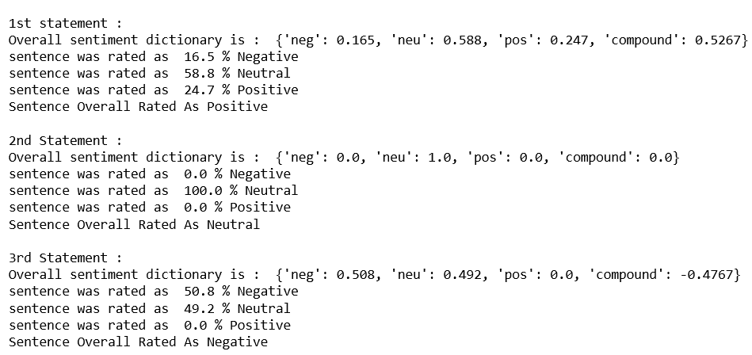

# Python |使用 VADER 的情感分析

> 原文:[https://www . geesforgeks . org/python-情绪-分析-使用-维德/](https://www.geeksforgeeks.org/python-sentiment-analysis-using-vader/)

**情绪分析**是“计算”确定一篇文章是正面、负面还是中性的过程。它也被称为**观点挖掘**，从说话者的观点或态度中获取信息。
**为什么要进行情绪分析？**

*   **商业:**在营销领域，公司用它来制定策略，了解客户对产品或品牌的感受，人们如何回应他们的活动或产品发布，以及消费者为什么不购买一些产品。

*   **政治:**在政治领域，用于跟踪政治观点，检测政府层面的言论和行动之间的一致性和不一致性。它也可以用来预测选举结果！。
*   **公众行动:**情绪分析还用于监控和分析社会现象，以发现潜在的危险情况，并确定博客圈的总体情绪。

命令安装**vadermoore**:

```py
pip install vaderSentiment
```

**【VADER 情绪分析:**
**【VADER(变价感知词典和情绪推理机)**是一个专门针对社交媒体中表达的情绪的基于词典和规则的情绪分析工具。 **VADER** 使用组合 A 情感词典是一个词汇特征(例如单词)的列表，这些特征通常根据它们的语义方向被标记为积极或消极。 **VADER** 不仅讲述了积极和消极的分数，还告诉我们一种情绪是积极的还是消极的。
下面是代码:

## 蟒蛇 3

```py
# import SentimentIntensityAnalyzer class
# from vaderSentiment.vaderSentiment module.
from vaderSentiment.vaderSentiment import SentimentIntensityAnalyzer

# function to print sentiments
# of the sentence.
def sentiment_scores(sentence):

    # Create a SentimentIntensityAnalyzer object.
    sid_obj = SentimentIntensityAnalyzer()

    # polarity_scores method of SentimentIntensityAnalyzer
    # object gives a sentiment dictionary.
    # which contains pos, neg, neu, and compound scores.
    sentiment_dict = sid_obj.polarity_scores(sentence)

    print("Overall sentiment dictionary is : ", sentiment_dict)
    print("sentence was rated as ", sentiment_dict['neg']*100, "% Negative")
    print("sentence was rated as ", sentiment_dict['neu']*100, "% Neutral")
    print("sentence was rated as ", sentiment_dict['pos']*100, "% Positive")

    print("Sentence Overall Rated As", end = " ")

    # decide sentiment as positive, negative and neutral
    if sentiment_dict['compound'] >= 0.05 :
        print("Positive")

    elif sentiment_dict['compound'] <= - 0.05 :
        print("Negative")

    else :
        print("Neutral")

# Driver code
if __name__ == "__main__" :

    print("\n1st statement :")
    sentence = "Geeks For Geeks is the best portal for \
                the computer science engineering students."

    # function calling
    sentiment_scores(sentence)

    print("\n2nd Statement :")
    sentence = "study is going on as usual"
    sentiment_scores(sentence)

    print("\n3rd Statement :")
    sentence = "I am very sad today."
    sentiment_scores(sentence)
```

**输出:**



复合评分是一种度量标准，用于计算在-1(最极端的负值)和+1(最极端的正值)之间标准化的所有词典评分的总和。
积极情绪:(复合评分> = 0.05)
中性情绪:(复合评分> -0.05)和(复合评分< 0.05)
消极情绪:(复合评分< = -0.05)