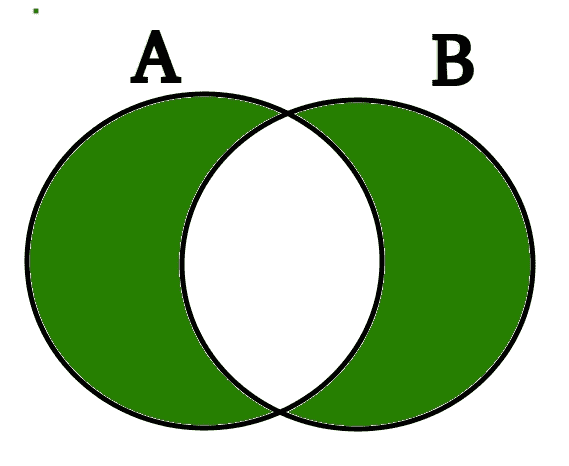

# Python 集|对称 _ 差异()

> 原文:[https://www . geesforgeks . org/python-set-symmetric _ difference-2/](https://www.geeksforgeeks.org/python-set-symmetric_difference-2/)

Python Set 的这个内置函数帮助我们得到两个集合之间的对称差，这个对称差等于两个集合中任何一个存在的**元素，但不是两个集合**所共有的。让我们看看两组对称差的文氏图。


<font color="Green">对称差用绿色标注</font>

如果有集合 A 和集合 B，那么它们之间的对称差将等于集合 A 和集合 B 的并集，两者之间没有交集。

```py
// Takes a single parameter that has to be 
// a set and returns a new set which is the 
// symmetric difference between the two sets.
set_A.symmetric_difference(set_B)
```

示例:

```py
Input: set_A = {1, 2, 3, 4, 5}
       set_B = {6, 7, 3, 9, 4}
Output :  {1, 2, 5, 6, 7, 9}
Explanation: The common elements {3, 4} 
are discarded from the output.

Input:
set_A = {"ram", "rahim", "ajay", "rishav", "aakash"}
set_B = {"aakash", "ajay", "shyam", "ram", "ravi"}
Output: {"rahim", "rishav", "shyam", "ravi"}

Explanation: The common elements {"ram", "ajay", 
"aakash"} are discarded from the final set
```

在本程序中，我们将尝试找出两组之间的对称差异:

```py
# Python code to find the symmetric_difference
# Use of symmetric_difference() method

set_A = {1, 2, 3, 4, 5}
set_B = {6, 7, 3, 9, 4}
print(set_A.symmetric_difference(set_B))
```

输出:

```py
{1, 2, 5, 6, 7, 9}
```

还有另一种方法，通过使用运算符“ **^** ”来获得两个集合之间的对称差。
例:

```py
# Python code to find the Symmetric difference
# using ^ operator.

# Driver Code
set_A = {"ram", "rahim", "ajay", "rishav", "aakash"}
set_B = {"aakash", "ajay", "shyam", "ram", "ravi"}
print(set_A ^ set_B)
```

输出:

```py
{'shyam', 'ravi', 'rahim', 'rishav'}
```

```py
# One more example Python code to find 
# the symmetric_difference use of 
# symmetric_difference() method

A = {'p', 'a', 'w', 'a', 'n'}
B = {'r', 'a', 'o', 'n', 'e'}
C = {}

print(A.symmetric_difference(B))
print(B.symmetric_difference(A))

print(A.symmetric_difference(C))
print(B.symmetric_difference(C))

# this example is contributed by sunny6041
```

**输出:**

```py
set(['e', 'o', 'p', 'r', 'w'])
set(['e', 'o', 'p', 'r', 'w'])
set(['a', 'p', 'w', 'n'])
set(['a', 'r', 'e', 'o', 'n'])

```