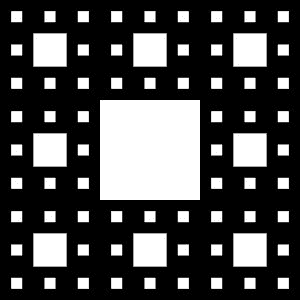
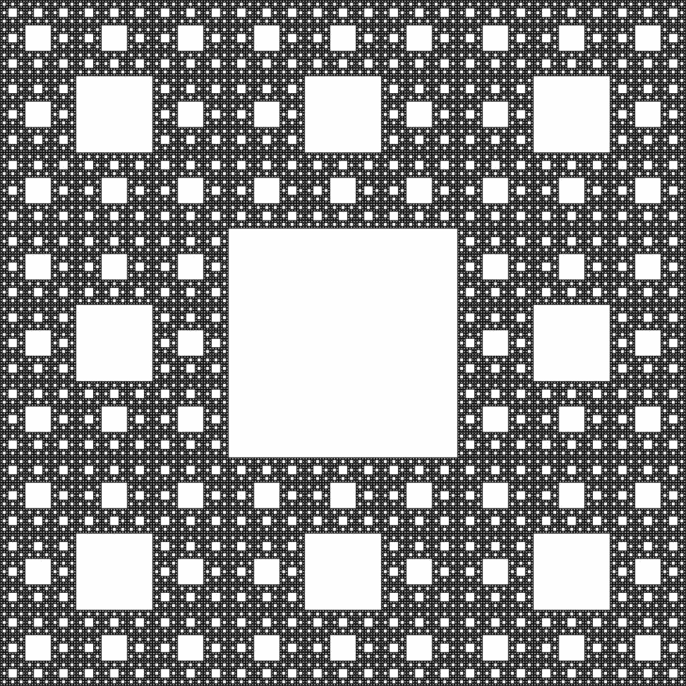

# Python | Sierpinski 地毯

> 原文:[https://www.geeksforgeeks.org/python-sierpinski-carpet/](https://www.geeksforgeeks.org/python-sierpinski-carpet/)

**Sierpinski 地毯**是平面分形曲线，即与平面的子空间同胚的曲线。1916 年瓦克劳·席尔平斯基首次描述了它。在这些类型的分形中，一个形状被分成一个更小的副本，去掉一些新的副本，剩下的副本按照特定的顺序形成新的分形形状。

**是如何构建的？**
希尔宾斯基地毯以一个正方形开始。这个正方形被分成九个相等的部分。最中心的小方块从原来的大方块中移除。剩下的方块再次被分成九个相等的部分，每个方块的最中间的方块被移除。在重复这个过程时，可以观察到美丽的席尔宾斯基地毯图案。

假设我们从一个黑色正方形开始。

我们把它分成 9 等份，去掉中心方块。

进一步重复这个过程，结果是这样的。
 
我们可以在这个[视频](https://www.youtube.com/watch?v=N_ar_IxWxU8)中详细的形象化这个现象。

让我们看看它的代码是什么样的:

```
# importing necessary modules
import numpy as np
from PIL import Image

# total number of times the process will be repeated
total = 7

# size of the image
size = 3**total

# creating an image
square = np.empty([size, size, 3], dtype = np.uint8)
color = np.array([255, 255, 255], dtype = np.uint8)

# filling it black
square.fill(0)

for i in range(0, total + 1):
    stepdown = 3**(total - i)
    for x in range(0, 3**i):

        # checking for the centremost square
        if x % 3 == 1:
            for y in range(0, 3**i):
                if y % 3 == 1:

                    # changing its color
                    square[y * stepdown:(y + 1)*stepdown, x * stepdown:(x + 1)*stepdown] = color

# saving the image produced
save_file = "sierpinski.jpg"
Image.fromarray(square).save(save_file)

# displaying it in console
i = Image.open("sierpinski.jpg")
i.show()
```

**输出:**


这是重复 7 次后的希尔平斯基地毯。您可以在 [rosettacode](https://rosettacode.org/wiki/Sierpinski_carpet) 上获取其其他语言的代码。