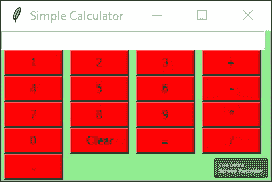

# Python |使用 Tkinter 的简单 GUI 计算器

> 原文:[https://www . geesforgeks . org/python-simple-GUI-calculator-using-tkinter/](https://www.geeksforgeeks.org/python-simple-gui-calculator-using-tkinter/)

先决条件: [Tkinter 简介](https://www.geeksforgeeks.org/python-gui-tkinter/)、[λ功能](https://www.geeksforgeeks.org/python-lambda-anonymous-functions-filter-map-reduce/)

Python 为开发图形用户界面提供了多种选择。在所有的 GUI 方法中，Tkinter 是最常用的方法。它是 Python 附带的 Tk 图形用户界面工具包的标准 Python 接口。Python 搭配 Tkinter 输出了创建 GUI 应用程序最快最简单的方法。使用 Tkinter 创建图形用户界面是一项简单的任务。

要创建 Tkinter :

1.  导入模块–tkinter
2.  创建主窗口(容器)
3.  向主窗口添加任意数量的小部件
4.  在小部件上应用事件触发器。

以下是图形用户界面的外观:



让我们使用 Python Tkinter 模块创建一个基于 GUI 的简单计算器，它可以执行基本的算术运算加法、减法、乘法和除法。

下面是实现:

## 蟒蛇 3

```
# Python program to create a simple GUI
# calculator using Tkinter

# import everything from tkinter module
from tkinter import *

# globally declare the expression variable
expression = ""

# Function to update expression
# in the text entry box
def press(num):
    # point out the global expression variable
    global expression

    # concatenation of string
    expression = expression + str(num)

    # update the expression by using set method
    equation.set(expression)

# Function to evaluate the final expression
def equalpress():
    # Try and except statement is used
    # for handling the errors like zero
    # division error etc.

    # Put that code inside the try block
    # which may generate the error
    try:

        global expression

        # eval function evaluate the expression
        # and str function convert the result
        # into string
        total = str(eval(expression))

        equation.set(total)

        # initialize the expression variable
        # by empty string
        expression = ""

    # if error is generate then handle
    # by the except block
    except:

        equation.set(" error ")
        expression = ""

# Function to clear the contents
# of text entry box
def clear():
    global expression
    expression = ""
    equation.set("")

# Driver code
if __name__ == "__main__":
    # create a GUI window
    gui = Tk()

    # set the background colour of GUI window
    gui.configure(background="light green")

    # set the title of GUI window
    gui.title("Simple Calculator")

    # set the configuration of GUI window
    gui.geometry("270x150")

    # StringVar() is the variable class
    # we create an instance of this class
    equation = StringVar()

    # create the text entry box for
    # showing the expression .
    expression_field = Entry(gui, textvariable=equation)

    # grid method is used for placing
    # the widgets at respective positions
    # in table like structure .
    expression_field.grid(columnspan=4, ipadx=70)

    # create a Buttons and place at a particular
    # location inside the root window .
    # when user press the button, the command or
    # function affiliated to that button is executed .
    button1 = Button(gui, text=' 1 ', fg='black', bg='red',
                    command=lambda: press(1), height=1, width=7)
    button1.grid(row=2, column=0)

    button2 = Button(gui, text=' 2 ', fg='black', bg='red',
                    command=lambda: press(2), height=1, width=7)
    button2.grid(row=2, column=1)

    button3 = Button(gui, text=' 3 ', fg='black', bg='red',
                    command=lambda: press(3), height=1, width=7)
    button3.grid(row=2, column=2)

    button4 = Button(gui, text=' 4 ', fg='black', bg='red',
                    command=lambda: press(4), height=1, width=7)
    button4.grid(row=3, column=0)

    button5 = Button(gui, text=' 5 ', fg='black', bg='red',
                    command=lambda: press(5), height=1, width=7)
    button5.grid(row=3, column=1)

    button6 = Button(gui, text=' 6 ', fg='black', bg='red',
                    command=lambda: press(6), height=1, width=7)
    button6.grid(row=3, column=2)

    button7 = Button(gui, text=' 7 ', fg='black', bg='red',
                    command=lambda: press(7), height=1, width=7)
    button7.grid(row=4, column=0)

    button8 = Button(gui, text=' 8 ', fg='black', bg='red',
                    command=lambda: press(8), height=1, width=7)
    button8.grid(row=4, column=1)

    button9 = Button(gui, text=' 9 ', fg='black', bg='red',
                    command=lambda: press(9), height=1, width=7)
    button9.grid(row=4, column=2)

    button0 = Button(gui, text=' 0 ', fg='black', bg='red',
                    command=lambda: press(0), height=1, width=7)
    button0.grid(row=5, column=0)

    plus = Button(gui, text=' + ', fg='black', bg='red',
                command=lambda: press("+"), height=1, width=7)
    plus.grid(row=2, column=3)

    minus = Button(gui, text=' - ', fg='black', bg='red',
                command=lambda: press("-"), height=1, width=7)
    minus.grid(row=3, column=3)

    multiply = Button(gui, text=' * ', fg='black', bg='red',
                    command=lambda: press("*"), height=1, width=7)
    multiply.grid(row=4, column=3)

    divide = Button(gui, text=' / ', fg='black', bg='red',
                    command=lambda: press("/"), height=1, width=7)
    divide.grid(row=5, column=3)

    equal = Button(gui, text=' = ', fg='black', bg='red',
                command=equalpress, height=1, width=7)
    equal.grid(row=5, column=2)

    clear = Button(gui, text='Clear', fg='black', bg='red',
                command=clear, height=1, width=7)
    clear.grid(row=5, column='1')

    Decimal= Button(gui, text='.', fg='black', bg='red',
                    command=lambda: press('.'), height=1, width=7)
    Decimal.grid(row=6, column=0)
    # start the GUI
    gui.mainloop()
```

**输出:**

<video class="wp-video-shortcode" id="video-205266-1" width="640" height="360" preload="metadata" controls=""><source type="video/mp4" src="https://media.geeksforgeeks.org/wp-content/uploads/20210114101728/FreeOnlineScreenRecorderProject1.mp4?_=1">[https://media.geeksforgeeks.org/wp-content/uploads/20210114101728/FreeOnlineScreenRecorderProject1.mp4](https://media.geeksforgeeks.org/wp-content/uploads/20210114101728/FreeOnlineScreenRecorderProject1.mp4)</video>