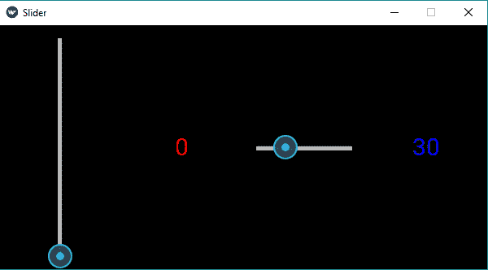

# Python |滑块小部件使用。kv 文件

> 原文:[https://www . geesforgeks . org/python-slider-widget-using-kv-file/](https://www.geeksforgeeks.org/python-slider-widget-using-kv-file/)

Kivy 是 Python 中独立于平台的 GUI 工具。因为它可以在安卓、IOS、linux 和 Windows 等平台上运行。它基本上是用来开发安卓应用程序的，但并不意味着它不能在桌面应用程序上使用。

> 👉🏽 [Kivy 教程–通过示例学习 Kivy](https://www.geeksforgeeks.org/kivy-tutorial/)。

**滑块:**
要使用滑块，首先必须导入包含滑块所有特征和功能的模块，即

```py
Module: kivy.uix.slider
```

创建滑块时要遵循的基本方法–

```py
1) import kivy
2) import kivyApp
3) import BoxLayout
4) set minimum version(optional)
5) Extend the class
6) set up .kv file (name same as the Slider.kv)
7) Run an instance of the class
```

**下面是用实现滑块的代码。kv 文件:**

```py
# main.py file of slider 

# base Class of your App inherits from the App class.  
# app:always refers to the instance of your application  
from kivy.app import App

# BoxLayout arranges children in a vertical or horizontal box. 
# or help to put the children at the desired location. 
from kivy.uix.boxlayout import BoxLayout 

# creating the root widget used in .kv file 
class SliderWidget(BoxLayout):
    pass

# class in which name .kv file must be named Slider.kv.
# or creating the App class
class Slider(App):
    def build(self):
        # returning the instance of SliderWidget class 
        return SliderWidget()

# run the app    
if __name__ == '__main__':
    Slider().run()
```

现在该。kv 档:**T0 档**

```py
<SliderWidget>:

    # creating the Slider
    Slider:

        # giving the orientation of Slider
        orientation: "vertical"
        min: 0  # minimum value of Slider
        max: 100 # maximum value of Slider
        value: 0  # initial value of Slider

        # when slider moves then to increase value
        on_value:label1.text = str(int(self.value))

    # Adding label
    Label:
        id: label1
        font_size: "30sp"
        text: "0"
        color: 1, 0, 0, 1

    Slider:
        orientation: "horizontal"
        min: 0
        max: 100
        value: 30
        on_value:label2.text = str(int(self.value))

    Label:
        id: label2
        font_size: "30sp"
        text: "30"
        color: 0, 0, 1, 1
```

**输出:**


**为滑块无。kv 文件，请参考–**[Python | Kivy 中的滑块小部件](https://www.geeksforgeeks.org/python-slider-widget-in-kivy/)