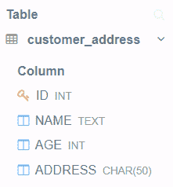
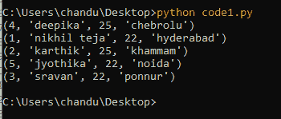
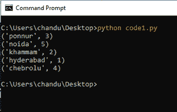
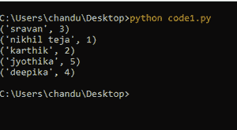

# Python SQlite–订单条款

> 原文:[https://www . geesforgeks . org/python-SQLite-order by 子句/](https://www.geeksforgeeks.org/python-sqlite-order-by-clause/)

在本文中，我们将使用 Python 讨论 SQLite 中的 **ORDER BY** 子句。ORDER BY 语句是一条 SQL 语句，用于根据一列或多列按升序或降序对数据进行排序。默认情况下，ORDER BY 按升序对数据进行排序。

*   **DESC** 用于对数据进行降序排序。
*   **ASC** 以升序排序。

> **语法:**选择列 1、列 2、。，第 n 列 FROM _ table _ name ORDER BY _ column _ name ASC | desc；

首先，让我们创建一个数据库。

## 蟒蛇 3

```py
# importing sqlite module
import sqlite3

# create connection to the database 
# geeks_database
connection = sqlite3.connect('geeks_database.db')

# create table named address of customers 
# with 4 columns id,name age and address
connection.execute('''CREATE TABLE customer_address
         (ID INT PRIMARY KEY     NOT NULL,
         NAME           TEXT    NOT NULL,
         AGE            INT     NOT NULL,
         ADDRESS        CHAR(50)); ''')

# close the connection
connection.close()
```

**输出:**



现在，在客户地址表中插入 5 条记录。

## 蟒蛇 3

```py
# importing sqlite module
import sqlite3

# create connection to the database 
# geeks_database
connection = sqlite3.connect('geeks_database.db')

# insert records into table
connection.execute(
    "INSERT INTO customer_address VALUES (1, 'nikhil teja', 22, 'hyderabad' )")
connection.execute(
    "INSERT INTO customer_address VALUES (2, 'karthik', 25, 'khammam')")
connection.execute(
    "INSERT INTO customer_address VALUES (3, 'sravan', 22, 'ponnur' )")
connection.execute(
    "INSERT INTO customer_address VALUES (4, 'deepika', 25, 'chebrolu' )")
connection.execute(
    "INSERT INTO customer_address VALUES (5, 'jyothika', 22, 'noida')")

# close the connection
connection.close()
```

**输出:**


在创建数据库并向其中添加数据之后，让我们看看 order by 子句的用法。

**示例 1:** 根据地址以升序(默认)显示表格中的所有详细信息。

## 蟒蛇 3

```py
# importing sqlite module
import sqlite3

# create connection to the database
# geeks_database
connection = sqlite3.connect('geeks_database.db')

# sql query to display all details from 
# table in ascending order based on address.
cursor = connection.execute(
    "SELECT ADDRESS,ID from customer_address ORDER BY address DESC")

# display data row by row
for i in cursor:
    print(i)

# close the connection
connection.close()
```

**输出:**



**例 2:** 按照地址降序显示地址和 id。

## 蟒蛇 3

```py
# importing sqlite module
import sqlite3

# create connection to the database 
# geeks_database
connection = sqlite3.connect('geeks_database.db')

# sql query to display address and id
# based on address in descending order
cursor = connection.execute(
    "SELECT ADDRESS,ID from customer_address ORDER BY address DESC")

# display data row by row
for i in cursor:
    print(i)

# close the connection
connection.close()
```

**输出:**



**示例 3:** 按名称降序显示名称和 id

## 蟒蛇 3

```py
# importing sqlite module
import sqlite3

# create connection to the database 
# geeks_database
connection = sqlite3.connect('geeks_database.db')

# sql query to display name and id based
# on name in descending order
cursor = connection.execute(
    "SELECT NAME,ID from customer_address ORDER BY NAME DESC")

# display data row by row
for i in cursor:
    print(i)

# close the connection
connection.close()
```

**输出:**

