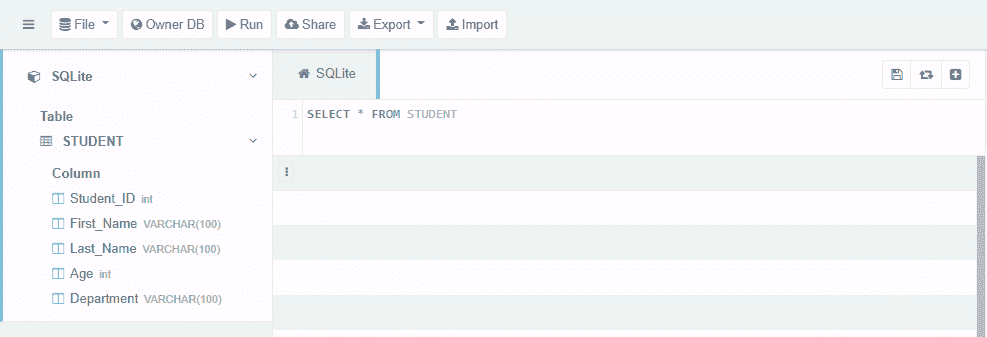
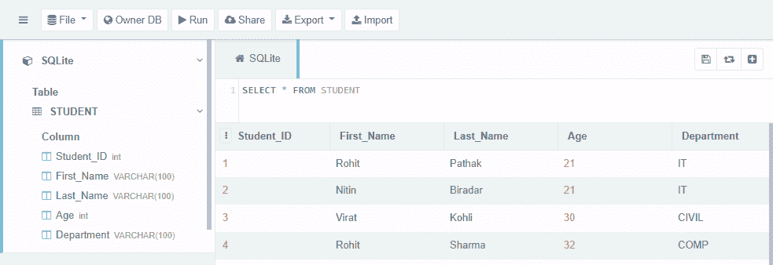
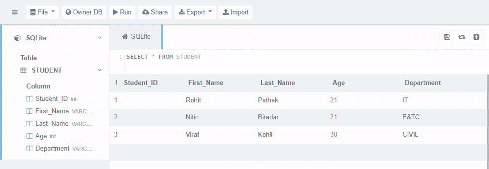

# Python SQlite–WHERE 子句

> 原文:[https://www.geeksforgeeks.org/python-sqlite-where-clause/](https://www.geeksforgeeks.org/python-sqlite-where-clause/)

使用 Where 子句是为了使我们的搜索结果更加具体，使用 SQL/SQLite 中的 where 子句，我们可以继续指定从数据库中检索数据时必须满足的特定条件。

如果我们想要检索、更新或删除一组特定的数据，我们可以使用 where 子句。如果您的数据库表中没有条件匹配值，我们可能不会返回任何内容。

**SQL 中的 WHERE 子句:**

> **语法:**
> 
> 选择列 _1，列 _2，…，列 _N
> 
> 从表名
> 
> [搜索条件]
> 
> 这里，在这个[search_condition]中，您可以使用比较或逻辑运算符来指定条件。
> 
> 例如:=，>，

### **使用 Python 在 SQLite 中的 WHERE 子句:**

Python 中的 SQLite Cursor 对象/类，它包含执行 SQL 查询以执行操作等的所有方法。游标是返回游标对象的连接类的方法。

因此，要在 python 中执行 SQLite 命令，我们需要做 3 件基本的事情

*   使用 connect()方法建立与数据库的连接。
*   使用 cursor()方法创建一个游标对象。
*   现在，可以使用 Cursor 类的 execute()方法来执行 SQLite 查询/语句。

我们将创建一个数据库来管理关于学生的数据。我们将存储每个学生的信息，然后我们还将使用 where 子句创建一种检索、更新和删除学生数据的方法。

**让我们创建一个数据库(geekforgeeks_student.db)和一个表(student)。**

## 蟒蛇 3

```py
# import the sqlite3 module
import sqlite3

# Define connection and cursor
connection = sqlite3.connect('geekforgeeks_student.db')
cursor = connection.cursor()

# create table
cursor.execute("DROP TABLE IF EXISTS STUDENT")
createTable = '''CREATE TABLE STUDENT(
   Student_ID int, First_Name VARCHAR(100),
   Last_Name VARCHAR(100), Age int,
   Department VARCHAR(100)
)'''
cursor.execute(createTable)

# check the database creation data
if cursor:
    print("Database Created Successfully !")
else:
    print("Database Creation Failed !")

# Commit the changes in database and Close the connection
connection.commit()
connection.close()
```

**输出:**

```py
Database Created Successfully!
```

上面的代码将在本地创建“geekforgeeks_student.db”文件。


要查看“geekforgeeks_student.db”的内容，我们可以使用[这个](https://sqliteonline.com/)并加载我们的。数据库文件如下所示–



在上图中，我们可以看到数据库中已经创建了表和表模式。

**现在我们将数据插入 STUDENT 表。**

## 蟒蛇 3

```py
# import the sqlite3 module
import sqlite3

# Define connection and cursor
connection = sqlite3.connect('geekforgeeks_student.db')
cursor = connection.cursor()

# Insert data into the table
cursor.execute("INSERT INTO STUDENT VALUES (1,'Rohit', 'Pathak', 21, 'IT')")
cursor.execute("INSERT INTO STUDENT VALUES (2,'Nitin', 'Biradar', 21, 'IT')")
cursor.execute("INSERT INTO STUDENT VALUES (3,'Virat', 'Kohli', 30, 'CIVIL')")
cursor.execute("INSERT INTO STUDENT VALUES (4,'Rohit', 'Sharma', 32, 'COMP')")

# printing the cursor data
if cursor:
    print("Data Inserted !")
else:
    print("Data Insertion Failed !")

# Commit the changes in database and Close the connection
connection.commit()
connection.close()
```

**输出:**

```py
Database Inserted!
```

上面的代码将数据插入到 STUDENT 表中



**以下代码显示了 Where 子句**的使用

**例 1:** 检索信息技术系学生的数据

## 蟒蛇 3

```py
import sqlite3

connection = sqlite3.connect('geekforgeeks_student.db')
cursor = connection.cursor()

# WHERE CLAUSE TO RETRIEVE DATA
cursor.execute("SELECT * FROM STUDENT WHERE Department = 'IT'")

# printing the cursor data
print(cursor.fetchall())

connection.commit()
connection.close()
```

**输出:**

> [(1，“Rohit”，“Pathak”，21，“it”)，(2，“Nitin”，“Biradar”，21，“IT”)]

我们在学生表中有 2 条信息技术部门的记录。

**例 2:** 检索名字以‘R’开头的学生的数据。我们也可以在 where 子句中使用**通配符**，如下所示

## 蟒蛇 3

```py
import sqlite3

connection = sqlite3.connect('geekforgeeks_student.db')
cursor = connection.cursor()

# WHERE CLAUSE TO RETRIEVE DATA
cursor.execute("SELECT * from STUDENT WHERE First_name Like'R%'")

# printing the cursor data
print(cursor.fetchall())

connection.commit()
connection.close()
```

**输出:**

> [(1，“Rohit”，“Pathak”，21，“it”)，(4，“Rohit”，“Sharma”，32，“COMP”)]

我们在学生表中有两条记录，它们的名字以字母“R”开头。

**例 3:** 更新学号为 4 的学生数据

## 蟒蛇 3

```py
import sqlite3

connection = sqlite3.connect('geekforgeeks_student.db')
cursor = connection.cursor()

# WHERE CLAUSE TO UPDATE DATA
cursor.execute("UPDATE STUDENT SET Department ='E&TC' WHERE Student_ID = 2")

# printing the cursor data
cursor.execute("SELECT * from STUDENT")
print(cursor.fetchall())

connection.commit()
connection.close()
```

**输出:**

> [(1，' Rohit '，' Pathak '，21，' it '，(2，' Nitin '，' Biradar '，21，' E&TC ')，
> 
> (3，“Virat”，“Kohli”，30，“CIVIL”)，(4，“Rohit”，“Sharma”，32，“COMP”)]

检查数据库内容


学生证 2 的部门已更新。

**例 4:** 删除学号为 30 的学生数据

## 蟒蛇 3

```py
import sqlite3

connection = sqlite3.connect('geekforgeeks_student.db')
cursor = connection.cursor()

# WHERE CLAUSE TO DELETE DATA
cursor.execute("DELETE from STUDENT WHERE Age = 32")

#printing the cursor data
cursor.execute("SELECT * from STUDENT")
print(cursor.fetchall())

connection.commit()
connection.close()
```

**输出:**

> [(1，“Rohit”，“Pathak”，21，“it”)，(2，“Nitin”，“Biradar”，21，“E&TC”)，(3，“Virat”，“Kohli”，30，“CIVIL”)]

检查数据库内容



年龄为 32 岁的学生数据已被删除。