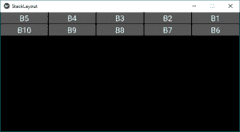
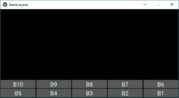
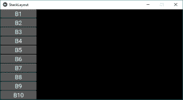
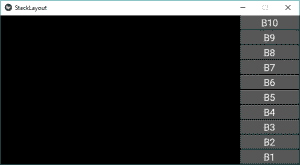

# Python | StackLayout 在 Kivy 中使用。kv 文件

> 原文:[https://www . geesforgeks . org/python-stacklayout-in-kivy-using-kv-file/](https://www.geeksforgeeks.org/python-stacklayout-in-kivy-using-kv-file/)

Kivy 是 Python 中独立于平台的 GUI 工具。因为它可以在安卓、IOS、linux 和 Windows 等平台上运行。它基本上是用来开发安卓应用程序的，但并不意味着它不能在桌面应用程序上使用。

> ？？？？？？？？ [Kivy 教程–通过示例学习 Kivy](https://www.geeksforgeeks.org/kivy-tutorial/)。

### StackLayout:

**要使用 StackLayout 首先通过下面的命令导入 StackLayout:**

```
from kivy.uix.stacklayout import StackLayout
```

**堆叠布局**垂直或水平排列孩子，尽可能多的布局可以适合。各个子部件的大小不必统一。有 4 个行方向和 4 个列方向。

```
StackLayout Orientation (2D):
 - right to left or left to right
 - top to bottom or bottom to top
 - 'rl-bt', 'rl-tb', lr-bt', 'lr-tb'(Row wise)
 - 'bt-rl', 'bt-lr', 'tb-rl', 'tb-lr'(Column wise)
```

```
Basic Approach to create Stack layout :

1) import kivy
2) import kivyApp
3) import Button
4) import Stacklayout
5) Set minimum version(optional)
6) Create the StackLayout class
7) Create the App class
8) Set up .kv file (name same as App class)
9) return StackLayout Class
10) Run an instance of the class
```

**下面是行方向和列方向的实现:**
**main.py 文件–**

## 蟒蛇 3

```
# code to show how to use StackLayout using .kv file

# base Class of your App inherits from the App class.
# app:always refers to the instance of your application
from kivy.app import App

# creates the button in kivy
# if not imported shows the error
from kivy.uix.button import Button

# The StackLayout arranges children vertically
# or horizontally, as many as the layout can fit.
from kivy.uix.stacklayout import StackLayout

# creating the root widget used in .kv file
class StackLayout(StackLayout):
    pass

# class in which name .kv file must be named Slider.kv.
# or creating the App class 
class StackApp(App):
    def build(self):
        # returning the instance of StackLayout class
        return StackLayout()

# run the app
if __name__=='__main__':
    StackApp().run()
```

[的名称。kv 文件](https://www.geeksforgeeks.org/python-kivy-kv-file/)必须与 App 类相同，即 Stack.kv
**。kv 文件–**

## 蟒蛇 3

```
<StackLayout>:

  # Different orientation
  # ['lr-tb', 'tb-lr', 'rl-tb', 'tb-rl', 'lr-bt', 'bt-lr', 'rl-bt', 'bt-rl']
  orientation: 'lr-tb'

  # Creating Multiple Buttons
  Button:
    text: 'B1'
    size_hint: [.2, .1]

  Button:
    text: 'B2'
    size_hint: [.2, .1]

  Button:
    text: 'B3'
    size_hint: [.2, .1]

  Button:
    text: 'B4'
    size_hint: [.2, .1]

  Button:
    text: 'B5'
    size_hint: [.2, .1]

  Button:
    text: 'B6'
    size_hint: [.2, .1]

  Button:
    text: 'B7'
    size_hint: [.2, .1]

  Button:
    text: 'B8'
    size_hint: [.2, .1]

  Button:
    text: 'B9'
    size_hint: [.2, .1]

  Button:
    text: 'B10'
    size_hint: [.2, .1]
```

**输出:**


这是为了“lr-tb”方向。首先从左到右添加小部件，然后从上到下添加。
**注意:**如果要改变方位，只需在的第 04 行改变方位即可。具有以下任何方向的 kv 文件–

```
For row wise orientation use:
  -'lr-tb'
  -'lr-bt'
  -'rl-tb'
  -'rl-bt'

For column wise orientation use:
  -'tb-lr'
  -'tb-rl'
  -'bt-lr'
  -'bt-rl'
```

**下面有图片输出上面所有的方位–**
**对于行方向使用:**

```
'lr-tb'
```

**输出:**


```
'lr-bt'
```

**输出:**


```
'rl-tb'
```

**输出:**



```
'rl-bt'
```

**输出:**



**列方向使用:**

```
'tb-lr'
```

**输出:**



```
'tb-rl'
```

**输出:**


```
'bt-lr'
```

**输出:**


```
'bt-rl'
```

**输出:**

