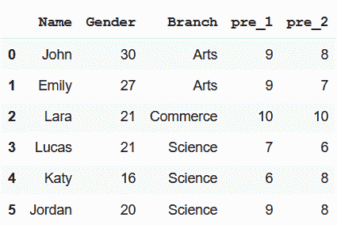

# Python–按列名子集数据框

> 原文:[https://www . geesforgeks . org/python-subset-data frame-by-column-name/](https://www.geeksforgeeks.org/python-subset-dataframe-by-column-name/)

使用熊猫库，我们可以对一个数据帧执行多个操作。我们甚至可以创建和访问多种格式的数据帧子集。这里的任务是按列名创建数据框子集。我们可以选择不同的方法来执行这项任务。以下是可能的方法–

在执行任何操作之前，我们需要编写几行代码来导入必要的库并创建一个数据框。

**创建数据框**

## 蟒蛇 3

```py
#import pandas
import pandas as pd

# create dataframe
data = {'Name': ['John', 'Emily', 'Lara', 'Lucas', 'Katy', 'Jordan'], 
        'Gender': [30, 27, 21, 21, 16, 20], 
        'Branch': ['Arts', 'Arts', 'Commerce', 'Science', 
                   'Science', 'Science'],
        'pre_1': [9, 9, 10, 7, 6, 9],
        'pre_2': [8, 7, 10, 6, 8, 8]}

df = pd.DataFrame(data)
df
```

**输出:**



**方法 1:** 使用 Python [iloc()](https://www.geeksforgeeks.org/python-extracting-rows-using-pandas-iloc/) 功能

这个函数允许我们通过基于索引从列中选择特定的值来创建子集。

**语法:**

```py
df_name.iloc[beg_index:end_index+1,beg_index:end_index+1]
```

**示例:**创建具有名称、性别和分支列的子集

## 蟒蛇 3

```py
# create a subset of all rows
# and Name, Gender and Branch column
df.iloc[:, 0:3]
```