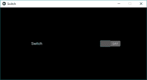
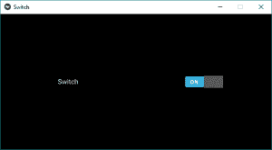
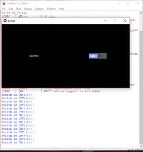

# Python | Kivy 中的 Switch 小部件

> 原文:[https://www.geeksforgeeks.org/python-switch-widget-in-kivy/](https://www.geeksforgeeks.org/python-switch-widget-in-kivy/)

Kivy 是 Python 中独立于平台的 GUI 工具。因为它可以在安卓、IOS、linux 和 Windows 等平台上运行。它基本上是用来开发安卓应用程序的，但并不意味着它不能在桌面应用程序上使用。

> ？？？？？？？？ [Kivy 教程–通过示例学习 Kivy](https://www.geeksforgeeks.org/kivy-tutorial/)。

### 开关小部件:

“开关”小部件处于活动或非活动状态，作为一个机械灯光开关。用户可以向左/向右滑动来激活/停用它。开关表示的值为真或假。也就是说，开关可以处于*开*位置或*关*位置。
要使用 Switch，您必须导入:

```
from kivy.uix.switch import Switch
```

**注意:**如果你想用单触而不是扫动来控制状态，可以用 ToggleButton 来代替。

```
Basic Approach:

1) import kivy
2) import kivyApp
3) import Switch
4) import Gridlayout
5) import Label
6) Set minimum version(optional)
7) create Layout class(In this you create a switch)
8) create App class
9) return Layout/widget/Class(according to requirement)
10) Run an instance of the class
```

**实施方法:**

## 蟒蛇 3

```
# Program to Show how to create a switch
# import kivy module  
import kivy

# base Class of your App inherits from the App class.  
# app:always refers to the instance of your application 
from kivy.app import App

# this restrict the kivy version i.e
# below this kivy version you cannot
# use the app or software
kivy.require('1.9.0')

# The Switch widget is active or inactive
# The state transition of a switch is from
# either on to off or off to on.
from kivy.uix.switch import Switch

# The GridLayout arranges children in a matrix.
# It takes the available space and
# divides it into columns and rows,
# then adds widgets to the resulting “cells”.
from kivy.uix.gridlayout import GridLayout

# The Label widget is for rendering text.
from kivy.uix.label import Label

# A Gridlayout with a label a switch
# A class which contains all stuff about the switch
class SimpleSwitch(GridLayout):

     # Defining __init__ constructor
     def __init__(self, **kwargs):

          # super function can be used to gain access
          # to inherited methods from a parent or sibling class
          # that has been overwritten in a class object.
          super(SimpleSwitch, self).__init__(**kwargs)

          # no of columns
          self.cols = 2

          # Adding label to the Switch
          self.add_widget(Label(text ="Switch"))

          # Initially switch is Off i.e active = False
          self.settings_sample = Switch(active = False)

          # Add widget
          self.add_widget(self.settings_sample)

# Defining the App Class
class SwitchApp(App):
     # define build function
     def build(self):
          # return the switch class
          return SimpleSwitch()

# Run the kivy app
if __name__ == '__main__':
     SwitchApp().run()
```

**输出:**





**将回拨连接到交换机:**

*   交换机可以通过回叫来检索交换机的值。
*   开关的状态转换是从开到关或从关到开。
*   当交换机进行任何转换时，回调被触发，新的状态可以被检索，即来了，并且可以根据该状态采取任何其他行动。
*   默认情况下，小部件的表示是静态的。所需的最小尺寸是 83*32 像素。
*   整个小部件都是活动的，而不仅仅是有图形的部分。只要你扫过小部件的边界框，它就会工作。

现在要附加一个回调函数，你必须定义一个回调函数并用开关绑定它。下面是如何附加回调的代码:

## 蟒蛇 3

```
# Program to Show how to attach a callback to switch

# import kivy module  
import kivy

# base Class of your App inherits from the App class.  
# app:always refers to the instance of your application 
from kivy.app import App

# this restrict the kivy version i.e
# below this kivy version you cannot
# use the app or software
kivy.require('1.9.0')

# The Switch widget is active or inactive
# The state transition of a switch is from
# either on to off or off to on.
from kivy.uix.switch import Switch

# The GridLayout arranges children in a matrix.
# It takes the available space and
# divides it into columns and rows,
# then adds widgets to the resulting “cells”.
from kivy.uix.gridlayout import GridLayout

# The Label widget is for rendering text.
from kivy.uix.label import Label

# A Gridlayout with a label a switch
# A class which contains all stuff about the switch
class SimpleSwitch(GridLayout):

     # Defining __init__ constructor
     def __init__(self, **kwargs):

          # super function can be used to gain access
          # to inherited methods from a parent or sibling class
          # that has been overwritten in a class object.
          super(SimpleSwitch, self).__init__(**kwargs)

          # no of columns
          self.cols = 2

          # Adding label to the Switch
          self.add_widget(Label(text ="Switch"))

          # Initially switch is Off i.e active = False
          self.settings_sample = Switch(active = False)

          # Add widget
          self.add_widget(self.settings_sample)

          # Arranging a callback to the switch
          # using bing function
          self.settings_sample.bind(active = switch_callback)      

# Callback for the switch state transition
# Defining a Callback function
# Contains Two parameter switchObject, switchValue
def switch_callback(switchObject, switchValue):

    # Switch value are True and False
    if(switchValue):
        print('Switch is ON:):):)')
    else:
        print('Switch is OFF:(:(:(')

# Defining the App Class
class SwitchApp(App):
     # define build function
     def build(self):
          # return the switch class
          return SimpleSwitch()

# Run the kivy app
if __name__ == '__main__':
     SwitchApp().run()
```

**输出:**

