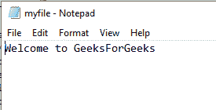

# Python tell()函数

> 原文:[https://www.geeksforgeeks.org/python-tell-function/](https://www.geeksforgeeks.org/python-tell-function/)

Python 也支持[文件处理](https://www.geeksforgeeks.org/file-handling-python/)，并提供创建、写入和读取文件的内置功能。python 中可以处理两种类型的文件，普通文本文件和二进制文件(用二进制语言编写，0 和 1)。

*   **文本文件:**在这种类型的文件中，每一行文本都以一个名为 EOL(行尾)的特殊字符结束，默认情况下，这是 python 中的新行字符(' \n ')。

*   **二进制文件:**在这种类型的文件中，一行没有终止符，数据在转换成机器可理解的二进制语言后存储。

> 参考下面的文章，了解文件处理的基础知识。
> 
> *   [文件处理基础知识](https://www.geeksforgeeks.org/file-handling-python/)
> *   [读写文件](https://www.geeksforgeeks.org/reading-writing-text-files-python/)
> *   [访问模式](https://www.geeksforgeeks.org/reading-writing-text-files-python/)

#### tell()方法:

[**访问模式**](https://www.geeksforgeeks.org/reading-writing-text-files-python/) 控制打开文件中可能的操作类型。它指的是文件打开后将如何使用。这些模式还定义了文件中**文件句柄**的位置。**文件句柄**就像一个光标，它定义了从哪里读取或写入文件中的数据。有时知道文件句柄的位置对我们来说变得很重要。方法可以用来获取文件句柄的位置。tell()方法返回文件对象的当前位置。此方法不接受任何参数，并返回一个整数值。最初，文件指针指向文件的开头(如果没有在追加模式下打开)。所以，tell()的初始值为零。
**语法:**

```
file_object.tell()
```

让我们假设名为“myfile”的文本文件如下所示:



**#例 1:** 读写文件前文件句柄的位置。

## 蟒蛇 3

```
# Python program to demonstrate
# tell() method

# Open the file in read mode
fp = open("myfile.txt", "r")

# Print the position of handle
print(fp.tell())

#Closing file
fp.close()
```

**输出:**

```
0
```

**#例 2:** 从文件中读取数据后文件句柄的位置。

## 蟒蛇 3

```
# Python program to demonstrate
# tell() method

# Opening file
fp = open("sample.txt", "r")
fp.read(8)

# Print the position of handle
print(fp.tell())

# Closing file
fp.close()
```

**输出:**

```
8
```

**#例 3:** 为二进制文件。让我们创建一个二进制文件，在写入二进制文件之前和之后，我们会注意到句柄的位置。

## 蟒蛇 3

```
# Python program to demonstrate
# tell() method

# for reading binary file we
# have to use "wb" in file mode.
fp = open("sample2.txt", "wb")
print(fp.tell())

# Writing to file
fp.write(b'1010101')

print(fp.tell())

# Closing file
fp.close()
```

**输出:**

```
0
7
```