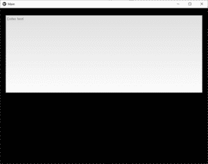
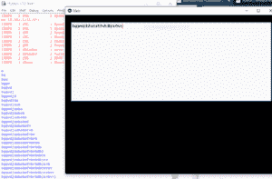

# Python | TextInput in kivy 使用。kv 文件

> 原文:[https://www . geesforgeks . org/python-textinput-in-kivy-using-kv-file/](https://www.geeksforgeeks.org/python-textinput-in-kivy-using-kv-file/)

Kivy 是 Python 中独立于平台的 GUI 工具。因为它可以在安卓、IOS、linux 和 Windows 等平台上运行。它基本上是用来开发安卓应用程序的，但并不意味着它不能在桌面应用程序上使用。

> 👉🏽 [Kivy 教程–通过示例学习 Kivy](https://www.geeksforgeeks.org/kivy-tutorial/)。

### TextInput 组件:

文本输入小部件为可编辑的纯文本提供了一个框。支持 Unicode、多行、光标导航、选择和剪贴板功能。

文本输入使用两种不同的坐标系:

*   (x，y)–以像素为单位的坐标，主要用于屏幕渲染。
*   (行、列)–以字符/行为单位的光标索引，用于选择和光标移动。

```py
Basic Approach:

1) import kivy
2) import kivyApp
3) import widger
4) import Relativelayout
5) import textinput
6) Set minimum version(optional)
7) Create Widget class
8) Create App class
9) create .kv file (name same as the app class):
        1) create textinput
10) return Layout/widget/Class(according to requirement)
11) Run an instance of the class
```

**实施方法**

**# main.py 文件**

```py
# Program to Show how to use textinput 
# (UX widget) in kivy using .kv file

# import kivy module    
import kivy  

# base Class of your App inherits from the App class.    
# app:always refers to the instance of your application   
from kivy.app import App 

# this restrict the kivy version i.e  
# below this kivy version you cannot  
# use the app or software  
kivy.require('1.9.0')

# Widgets are elements
# of a graphical user interface
# that form part of the User Experience.
from kivy.uix.widget import Widget

# The TextInput widget provides a
# box for editable plain text
from kivy.uix.textinput import TextInput

# This layout allows you to set relative coordinates for children. 
from kivy.uix.relativelayout import RelativeLayout

# Create the widget class
class textinp(Widget):
    pass

# Create the app class
class MainApp(App):

    # Building text input
    def build(self):
        return textinp()

    # Arranging that what you write will be shown to you
    # in IDLE
    def process(self):
        text = self.root.ids.input.text
        print(text)

# Run the App
if __name__ == "__main__":
    MainApp().run()
```

**# main.kv 文件**

```py
# .kv file implementation of the code

<textinp>:
    title: 'InputDialog'
    auto_dismiss: False
    id: test1

    # Using relative layout to arrange properly
    RelativeLayout:
        orientation: 'vertical'
        pos: self.pos
        size: root.size
        id: test2

        # Defining text input in .kv
        # And giving it the look . pos and features
        TextInput:
            id: input
            hint_text:'Enter text'
            pos_hint: {'center_x': 0.5, 'center_y': 0.705}
            size_hint: 0.95, 0.5
            on_text: app.process()
```

**输出:**

当你运行应用程序时，你会看到:


经过一些输入后你会看到:
