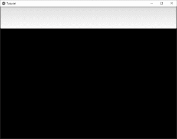
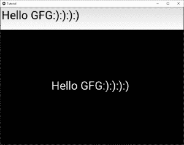

# 视图中的 python \ textinput 小部件

> 哎哎哎:# t0]https://www . geeksforgeeks . org/python-textinput 小部件-in-kivy/

Kivy 是 Python 中独立于平台的 GUI 工具。因为它可以在安卓、IOS、linux 和 Windows 等平台上运行。它基本上是用来开发安卓应用程序的，但并不意味着它不能在桌面应用程序上使用。

> 👉🏽 [Kivy 教程–通过示例学习 Kivy](https://www.geeksforgeeks.org/kivy-tutorial/)。

### TextInput 组件:

文本输入小部件为可编辑的纯文本提供了一个框。支持 Unicode、多行、光标导航、选择和剪贴板功能。

要创建多行文本输入(输入键增加一行)。
要创建单行文本输入，请将 TextInput.multiline 属性设置为 False。

```py
TextInput(text='Hello world', multiline=False)
```

> 要使用文本输入，您必须通过命令–
> 
> 从 kiva . uix . textinput 汇入 textinput

```py
Basic Approach:
1) import kivy
2) import kivyApp
3) import Label
4) import Scatter
5) import Floatlayout
6) import Textinput
7) import BoxLayout
8) Set minimum version(optional)
9) create App class
10) return Layout/widget/Class(according to requirement)
11) Run an instance of the class

```

**现在实施的办法:**

```py
# Program to Show how to use textinput (UX widget) in kivy 

# import kivy module    
import kivy  

# base Class of your App inherits from the App class.    
# app:always refers to the instance of your application   
from kivy.app import App 

# this restrict the kivy version i.e  
# below this kivy version you cannot  
# use the app or software  
kivy.require('1.9.0') 

# The Label widget is for rendering text.  
from kivy.uix.label import Label 

# module consist the floatlayout  
# to work with FloatLayout first  
# you have to import it  
from kivy.uix.floatlayout import FloatLayout 

# Scatter is used to build interactive
# widgets that can be translated,
# rotated and scaled with two or more
# fingers on a multitouch system.
from kivy.uix.scatter import Scatter

# The TextInput widget provides a
# box for editable plain text
from kivy.uix.textinput import TextInput

# BoxLayout arranges widgets in either
# in vertical fashion that
# is one on top of another or in
# horizontal fashion that is one after another.
from kivy.uix.boxlayout import BoxLayout

# Create the App class
class TutorialApp(App):

    def build(self):

        b = BoxLayout(orientation ='vertical')

        # Adding the text input
        t = TextInput(font_size = 50,
                      size_hint_y = None,
                      height = 100)

        f = FloatLayout()

        # By this you are able to move the
        # Text on the screen to anywhere you want
        s = Scatter()

        l = Label(text ="Hello !",
                  font_size = 50)

        f.add_widget(s)
        s.add_widget(l)

        b.add_widget(t)
        b.add_widget(f)

        # Binding it with the label
        t.bind(text = l.setter('text'))

        return b

# Run the App
if __name__ == "__main__":
    TutorialApp().run()
```

**输出:**


经过一些输入–
