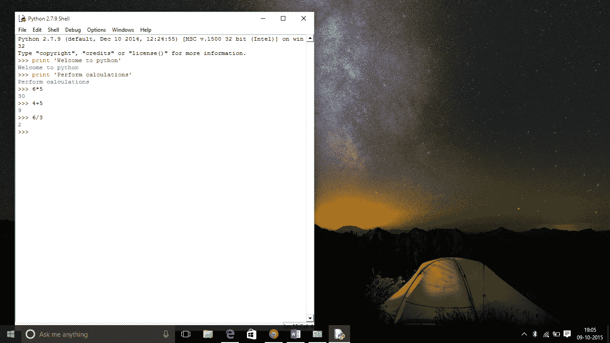
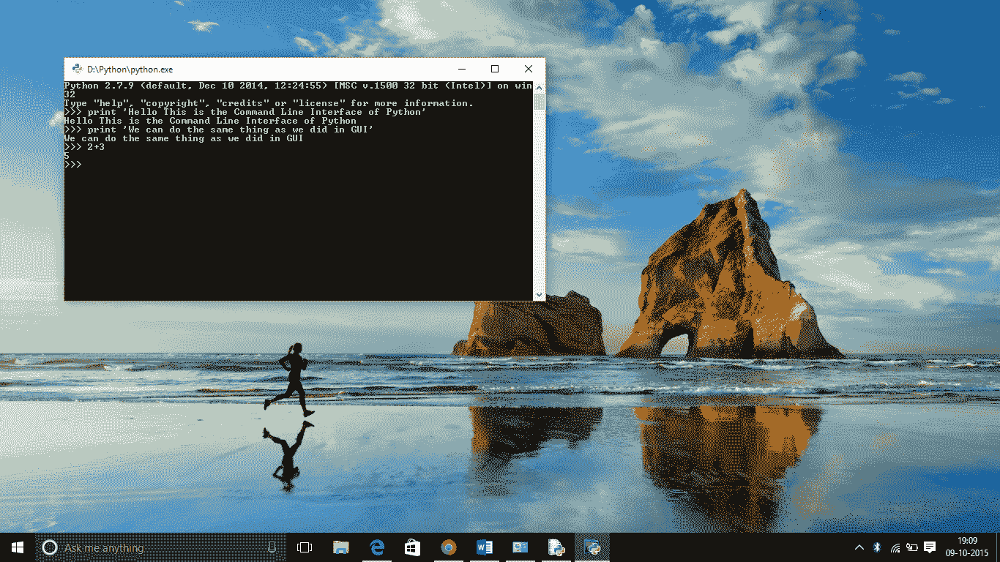

# Python——新一代语言

> 原文:[https://www . geesforgeks . org/python-新一代语言/](https://www.geeksforgeeks.org/python-the-new-generation-language/)

由[吉多·范·罗苏姆](https://en.wikipedia.org/wiki/Guido_van_Rossum)在 [CWI](https://en.wikipedia.org/wiki/Centrum_Wiskunde_%26_Informatica) 设计的 Python 已经成为一种广泛使用的通用高级编程语言。

**先决条件:**

任何编程语言的知识都可以。

**人气上升原因**

1.  强调**代码的可读性，较短的代码**，易于编写
2.  与 C++或 Java 等语言相比，程序员可以用更少的代码行来表达逻辑概念。
3.  Python 支持**多种**编程范式，如面向对象、命令式和函数式编程或过程式编程。
4.  几乎所有常用的概念都有内置函数。
5.  哲学是“简单是最好的”。

**语言特征**

*   **解释**
    *   没有像 C 和 C++那样单独的编译和执行步骤。
    *   直接*从源代码运行*程序。
    *   在内部，Python 将源代码转换成称为字节码的中间形式，然后将其翻译成特定计算机的本地语言来运行它。
    *   无需担心与库的链接和加载等。
*   **平台独立**
    *   Python 程序可以在多个操作系统平台上开发和执行。
    *   Python 可以用在 Linux、Windows、Macintosh、Solaris 等很多平台上。
*   **免费开源；**可再分配
*   **高级语言**
    *   在 Python 中，不需要关心低级细节，比如管理程序使用的内存。
*   **简单**
    *   更接近英语；易于学习
    *   更强调问题的解决方案，而不是语法
*   **可嵌入**
    *   Python 可以在 C/C++程序中使用，为程序的用户提供脚本功能。
*   **稳健**:
    *   出色的处理功能
    *   内置内存管理技术
*   **丰富的库支持**
    *   Python 标准库非常庞大。
    *   被誉为**“电池收录”**哲学的巨蟒；它可以帮助做各种事情，包括正则表达式、文档生成、单元测试、线程、数据库、网络浏览器、CGI、电子邮件、XML、HTML、WAV 文件、密码学、GUI 等等。
    *   除了标准库，还有各种其他高质量的库，例如 [Python 图像库](http://www.pythonware.org/)，这是一个非常简单的图像操作库。

**Python vs JAVA**

| **蟒蛇** | **Java** |
| **动态类型化** 1。不需要申报任何东西。赋值语句将一个名称绑定到一个对象，该对象可以是任何类型。 *2。*使用容器物件时不需要型铸 | **静态类型化** 1。必须显式声明所有变量名(及其类型)。试图将错误类型的对象分配给变量名会触发类型异常。 *2。*使用容器物件时，需要类型铸造。 |
| **简洁** 用有限的语言表达很多 | **冗长**包含更多的单词 |
| **紧凑型** | **不太紧凑** |
| **使用缩进来构造代码** | **使用大括号构造代码** |

经典的 **Hello World 程序**展示了一个 Java 程序和 Python 程序
**Java 代码**的**相对冗长度**

```
public class HelloWorld
{
   public static void main (String[] args)
   {
      System.out.println("Hello, world!");
   }
}
```

**Python 代码**

```
print("Hello, world!")
```

**与 Java 的相似度**

*   在您的系统上需要某种形式的运行时(JVM/Python 运行时)
*   可能在没有运行时的情况下被编译成可执行文件(这是根据情况而定的，它们都不是这样设计的)

**巨蟒的观感**

**图形界面**



**命令行界面**



**使用 Python 的软件**

作为一种脚本语言，Python 已经成功地嵌入到许多软件产品中。

1.  [GNU 调试器](https://en.wikipedia.org/wiki/GNU_Debugger)使用 Python 作为**漂亮的打印机**来显示复杂的结构，比如 C++容器。
2.  Python 也被用于人工智能
3.  Python 常用于**自然语言处理**任务。

**Python 的当前应用**

1.  许多 Linux 发行版使用 Python 编写的安装程序。在 Ubuntu 中，我们有**无处不在的**
2.  Python 在**信息安全行业**中有着广泛的应用，包括在漏洞利用开发中。
3.  覆盆子 Pi——单板计算机使用 Python 作为其主要的用户编程语言。
4.  Python 现在也被用于**游戏开发**领域。

**优点:**

1.  易用性
2.  多范式方法

cons:t1]

1.  与 C、C++相比，执行速度较慢
2.  缺少移动计算和浏览器
3.  对于 C 来说，C++程序员转而使用 python 可能会令人恼火，因为这种语言需要对代码进行适当的缩进。某些常用的变量名，如 sum，是 python 中的函数。所以 C，C++程序员要注意这些。

**工业重要性**

大多数公司现在都在寻找了解 Python 编程的候选人。了解 python 的人可能更有机会给面试小组留下深刻印象。所以我建议初学者应该开始学习 python，并在这方面出类拔萃。

**GeeksforGeeks 也将很快引入 Python 编程。**

如果你发现任何不正确的地方，或者你想分享更多关于上面讨论的话题的信息，请写评论。

文章作者**穆迪特·马赫什瓦里:**

韦洛是 VIT 大学信息技术专业的三年级学生，对编码、学习新技术和开发软件有着浓厚的兴趣。除了热爱编码，他还热爱弹吉他和唱歌。目前住在钦奈。你可以在 mudit94@gmail.com 找到他。

如果你也想在这里展示你的博客，请查看 [GBlog](http://geeksquiz.com/gblog/) 在 GeeksforGeeks 上的客座博文。