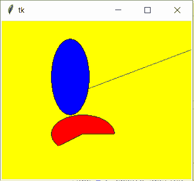
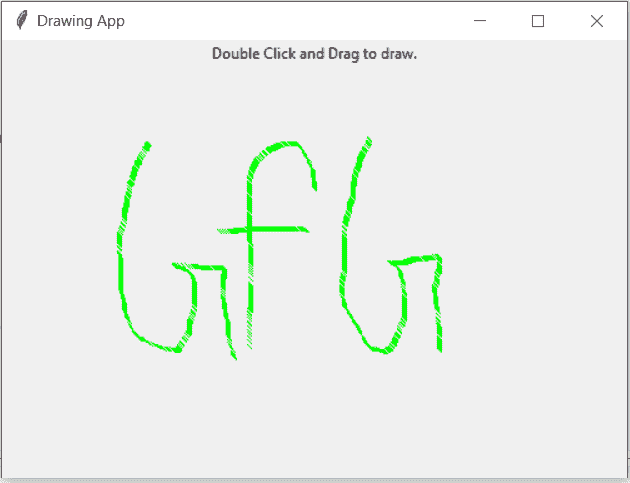

# python tkinter─canvas widget

> 哎哎哎:# t0]https://www . geeksforgeeks . org/python-tkinter-canvas widget/

Tkinter 是 python 中使用的一个 GUI 工具包，用于制作用户友好的 GUI。Tkinter 是 python 中最常用也是最基本的 GUI 框架。Tkinter 使用面向对象的方法来制作图形用户界面。
**注:**更多信息请参考[Python GUI–tkinter](https://www.geeksforgeeks.org/python-gui-tkinter/)

## 画布小部件

画布小部件让我们可以在应用程序上显示各种图形。它可以用来把简单的图形绘制成复杂的图形。我们还可以根据需要显示各种定制的小部件。

**语法:**

```
C = Canvas(root, height, width, bd, bg, ..)
```

**可选参数:**

*   **根** =根窗。
*   **高度** =画布小部件的高度。
*   **宽度** =画布小部件的宽度。
*   **bg** =画布的背景颜色。
*   **bd** =画布窗口的边框。
*   **滚动区域** (w，n，e，s)元组定义为向左、上、下、右滚动的区域。
*   **高亮颜色**聚焦高亮显示的颜色。
*   **光标**可以定义为画布上的光标，可以是圆形、do、箭头等。
*   **限制**决定是否可以在滚动区域外访问画布。
*   **浮雕**类型的边框，可以是凹陷的、凸起的、凹槽的和脊形的。

### **一些常见的绘图方法**:

*   **创建椭圆形**

```
 oval = C.create_oval(x0, y0, x1, y1, options)
```

*   **创建弧线**

```
 arc = C.create_arc(20, 50, 190, 240, start=0, extent=110, fill="red")
```

*   **创建一条线**

```
 line = C.create_line(x0, y0, x1, y1, ..., xn, yn, options)
```

*   **创建多边形**

```
 oval = C.create_polygon(x0, y0, x1, y1, ...xn, yn, options)
```

**示例 1:** 简单形状绘制

## 蟒蛇 3

```
from tkinter import *

root = Tk()

C = Canvas(root, bg="yellow",
           height=250, width=300)

line = C.create_line(108, 120,
                     320, 40,
                     fill="green")

arc = C.create_arc(180, 150, 80,
                   210, start=0,
                   extent=220,
                   fill="red")

oval = C.create_oval(80, 30, 140,
                     150,
                     fill="blue")

C.pack()
mainloop()
```

**输出:**



**示例 2:** 简单油漆应用

## 蟒蛇 3

```
from tkinter import *

root = Tk()

# Create Title
root.title(  "Paint App ")

# specify size
root.geometry("500x350")

# define function when 
# mouse double click is enabled
def paint( event ):

    # Co-ordinates.
    x1, y1, x2, y2 = ( event.x - 3 ),( event.y - 3 ), ( event.x + 3 ),( event.y + 3 )

    # Colour
    Colour = "#000fff000"

    # specify type of display
    w.create_line( x1, y1, x2,
                  y2, fill = Colour )

# create canvas widget.
w = Canvas(root, width = 400, height = 250)

# call function when double
# click is enabled.
w.bind( "<B1-Motion>", paint )

# create label.
l = Label( root, text = "Double Click and Drag to draw." )
l.pack()
w.pack()

mainloop()
```

**输出:**

