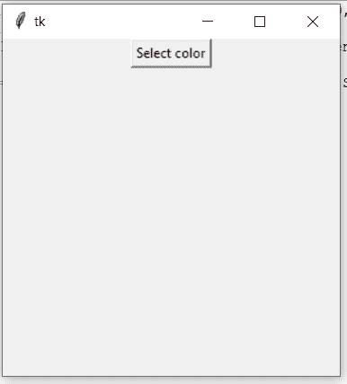
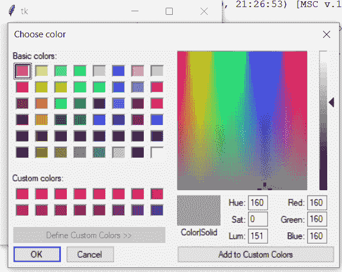

# Python–Tkinter 选择颜色对话框

> 原文:[https://www . geesforgeks . org/python-tkinter-choose-color-dialog/](https://www.geeksforgeeks.org/python-tkinter-choose-color-dialog/)

[Python](https://www.geeksforgeeks.org/python-programming-language/) 为 GUI(图形用户界面)开发提供了很多选项。 [tkinter](https://www.geeksforgeeks.org/python-gui-tkinter/) 是除了所有其他可用替代方法之外最常用的方法选项。这是使用 Tk 图形用户界面工具包开发图形用户界面应用程序的标准方法。

开发基本 Tkinter 应用程序的步骤包括:

1.  正在导入 Tkit 模块。
2.  创建主窗口或容器。
3.  向主窗口插入任意多的小部件。
4.  在所有小部件上应用事件触发器。

导入 Tkinter 模块的过程与导入 Python 中的任何其他模块相同。

```py
import tkinter
```

## 使用 Tkinter 创建选择颜色对话框

Tkit 模块中有一个名为**颜色选择器**的包。这个 Tkinter 模块包有助于开发颜色选择器对话框。这个包有一个名为 **askcolor()** 的功能，发挥了主要作用。

### askcolor()

该功能属于 Tkinter 模块的*颜色选择器*包。该功能有助于创建颜色选择器对话框。该函数一被调用，就会弹出颜色选择器对话框。该函数返回用户选择的颜色的十六进制代码。
**语法:**

```py
colorchooser.askcolor()
```

**例:**

## 蟒蛇 3

```py
# Python program to create color chooser dialog box

# importing tkinter module
from tkinter import *

# importing the choosecolor package
from tkinter import colorchooser

# Function that will be invoked when the
# button will be clicked in the main window
def choose_color():

    # variable to store hexadecimal code of color
    color_code = colorchooser.askcolor(title ="Choose color")
    print(color_code)

root = Tk()
button = Button(root, text = "Select color",
                   command = choose_color)
button.pack()
root.geometry("300x300")
root.mainloop()
```

**输出:**





**注意:**颜色选择器对话框可能因不同操作系统而异。