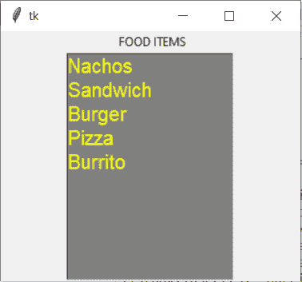
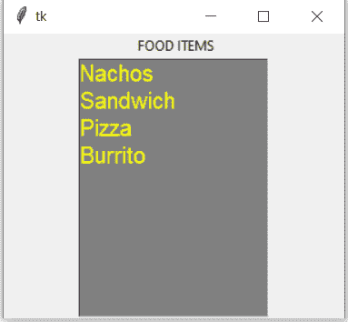

# python tkinter–list box widget

> 哎哎哎:# t0]https://www . geeksforgeeks . org/python-tkinter-listbox widget/

Tkinter 是 python 中使用的一个 GUI 工具包，用于制作用户友好的 GUI。Tkinter 是 python 中最常用也是最基本的 GUI 框架。Tkinter 使用面向对象的方法来制作图形用户界面。

**注意:**更多信息请参考[Python GUI–tkinter](https://www.geeksforgeeks.org/python-gui-tkinter/)

## 列表框小部件

列表框小部件用于显示不同类型的项目。这些项目必须具有相同类型的字体和相同的字体颜色。项目也必须是文本类型。用户可以根据需要从给定列表中选择一个或多个项目。

**语法:**

```
listbox = Listbox(root, bg, fg, bd, height, width, font, ..) 

```

**可选参数**

*   **根**–根窗。
*   **BG**–背景颜色
*   **fg**–前景色
*   **BD**–边框
*   **高度**–小部件的高度。
*   **宽度**–小部件的宽度。
*   **字体**–文本的字体类型。
*   **高亮颜色**–聚焦时列表项的颜色。
*   **y scroll command**–用于垂直滚动。
*   **xscroll command**–用于水平滚动。
*   **光标**–小部件上的光标，可以是箭头、点等。

**常用方法**

*   **yview**–允许小部件垂直滚动。
*   **xview**–允许小部件水平滚动。
*   **get()**–获取给定范围内的列表项。
*   **激活(索引)**–选择具有指定索引的行。
*   **size()**–返回存在的行数。
*   **删除(开始，最后)**–删除指定范围内的行。
*   **最近(y)**–返回最近一行的索引。
*   **curses selection()**–返回正在选择的所有行号的元组。

**例 1:**

```
from tkinter import *

# create a root window.
top = Tk()

# create listbox object
listbox = Listbox(top, height = 10, 
                  width = 15, 
                  bg = "grey",
                  activestyle = 'dotbox', 
                  font = "Helvetica",
                  fg = "yellow")

# Define the size of the window.
top.geometry("300x250")  

# Define a label for the list.  
label = Label(top, text = " FOOD ITEMS") 

# insert elements by their
# index and names.
listbox.insert(1, "Nachos")
listbox.insert(2, "Sandwich")
listbox.insert(3, "Burger")
listbox.insert(4, "Pizza")
listbox.insert(5, "Burrito")

# pack the widgets
label.pack()
listbox.pack()

# Display untill User 
# exits themselves.
top.mainloop()
```

**输出**

示例 2:让我们从上面创建的列表框中删除元素

```
# Delete Items from the list
#  by specifying the index.
listbox.delete(2)
```

**输出**
