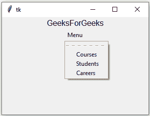

# python tkinter–menu button widget

> 哎哎哎:# t0]https://www . geeksforgeeks . org/python-tkinter-menu button widget/

Python 为开发图形用户界面提供了多个选项。在所有的 GUI 方法中，tkinter 是最常用的方法。它是 Python 附带的 Tk 图形用户界面工具包的标准 Python 接口。Python 和 tkinter 是创建图形用户界面应用程序最快最简单的方法。使用 tkinter 创建图形用户界面是一项简单的任务。

**注意:**更多信息请参考[Python GUI–tkinter](https://www.geeksforgeeks.org/python-gui-tkinter/)

## 菜单按钮小部件

菜单按钮部件可以定义为一直向用户显示的下拉菜单。Menubutton 用于在 python 应用程序中实现各种类型的菜单。

**语法:**

```
w = Menubutton ( master, options )
```

**参数:**

*   **主**:此参数用于表示父窗口。
*   **选项**:有很多可用的选项，可以作为键值对使用，用逗号分隔。

**选项:**
以下是常用选项，可用于此小部件:-

*   **活动背景:**此选项用于表示菜单按钮位于光标下方时的背景颜色。
*   **活动前景:**该选项用于表示菜单按钮位于光标下方时的前景色。
*   **bg:** 此选项用于表示标签和指示器后面显示的正常背景颜色。
*   **位图:**该选项用于在按钮上显示单色图像。
*   **bd:** 该选项用于表示指标周围边框的大小，默认值为 2 像素。
*   **锚点:**当小部件被分配了比需要更多的空间时，该选项指定小部件内容的确切位置。
*   **光标:**通过使用该选项，当鼠标光标在菜单按钮上时，它将变为该模式。
*   **禁用的前景:**用于渲染禁用的菜单按钮的文本的前景颜色。默认为默认前景色的点画版本。
*   **方向:**可以指定方向，这样菜单就可以显示到按钮的指定方向。
*   **fg:** 此选项用于表示渲染文本所用的颜色。
*   **高度:**该选项用于表示菜单按钮上的文本行数，默认值为 1。
*   **高亮颜色:**该选项用于表示菜单按钮有焦点时焦点高亮的颜色。
*   **图像:**该选项用于在按钮上显示图形图像。
*   **对齐:**此选项用于控制文本的对齐方式:居中、向左或向右。
*   **菜单:**代表菜单按钮指定的菜单。
*   **padx:** 该选项用于表示菜单按钮和文本的左右留出多少空间。它的默认值是 1 像素。
*   **pady:** 这个选项用来表示在菜单按钮和文本的上方和下方留出多少空间。它的默认值是 1 像素。
*   **浮雕:**菜单按钮的边框类型。它的默认值设置为“平面”。
*   **状态:**代表菜单按钮的状态。默认情况下，它设置为正常。我们可以将其更改为禁用，以使菜单按钮无响应。当菜单按钮处于焦点下时，其状态为激活。
*   **文本:**此选项用于使用换行符(" \n ")显示多行文本。
*   **下划线:**此选项用于表示文本中要加下划线的字符的索引。文本中的索引从零开始。
*   **文本变量:**该选项用于表示跟踪菜单按钮状态的相关变量。
*   **宽度:**该选项用于表示菜单按钮的宽度。并且还以文本形式表示的字符数量来表示。
*   **包裹长度:**该选项将文本分成若干段。

**示例:**

```
from tkinter import *

root = Tk()
root.geometry("300x200")

w = Label(root, text ='GeeksForGeeks', font = "50") 
w.pack()

menubutton = Menubutton(root, text = "Menu")   

menubutton.menu = Menu(menubutton)  
menubutton["menu"]= menubutton.menu  

var1 = IntVar()
var2 = IntVar()
var3 = IntVar()

menubutton.menu.add_checkbutton(label = "Courses",
                                variable = var1)  
menubutton.menu.add_checkbutton(label = "Students",
                                variable = var2)
menubutton.menu.add_checkbutton(label = "Careers",
                                variable = var3)

menubutton.pack()  
root.mainloop()
```

**输出:**
