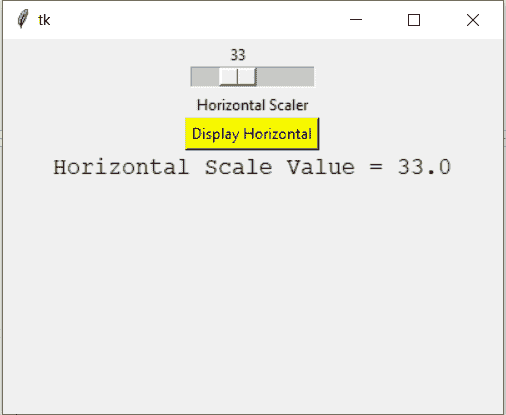
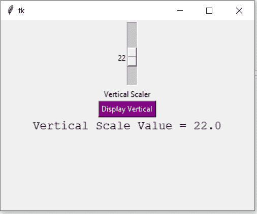

# Python Tkinter–缩放小部件

> 原文:[https://www.geeksforgeeks.org/python-tkinter-scale-widget/](https://www.geeksforgeeks.org/python-tkinter-scale-widget/)

Tkinter 是 python 中使用的一个 GUI 工具包，用于制作用户友好的 GUI。Tkinter 是 python 中最常用也是最基本的 GUI 框架。Tkinter 使用面向对象的方法来制作图形用户界面。

**注意:**更多信息请参考[Python GUI–tkinter](https://www.geeksforgeeks.org/python-gui-tkinter/)

## 缩放小部件

每当我们想要从一系列值中选择一个特定值时，都会使用“缩放”小部件。它提供了一个滑动条，通过它我们可以根据滑动条的方向从左到右或从上到下滑动来选择值。

**语法:**

```
S = Scale(root, bg, fg, bd, command, orient, from_, to, ..) 

```

**可选参数**

*   **根**–根窗。
*   **BG**–背景颜色
*   **fg**–前景色
*   **BD**–边框
*   **定向**–定向(垂直或水平)
*   **从 _**–起始值
*   **至**–结束值
*   **槽色**–设定槽色。
*   **状态**–决定小部件是响应还是无响应。
*   **滑块长度**–决定滑块的长度。
*   **标签**–在小部件中显示标签。
*   **highlight background**–小部件未聚焦时焦点的颜色。
*   **光标**–小部件上的光标可以是箭头、圆圈、圆点等。

**方法**

*   **设置(值)**–设置刻度值。
*   **get()**–获取刻度值。

**示例 1:** 创建水平条

```
# Python program to demonstrate
# scale widget

from tkinter import * 

root = Tk()  
root.geometry("400x300") 

v1 = DoubleVar()

def show1():  

    sel = "Horizontal Scale Value = " + str(v1.get())
    l1.config(text = sel, font =("Courier", 14))  

s1 = Scale( root, variable = v1, 
           from_ = 1, to = 100, 
           orient = HORIZONTAL)   

l3 = Label(root, text = "Horizontal Scaler")

b1 = Button(root, text ="Display Horizontal", 
            command = show1, 
            bg = "yellow")  

l1 = Label(root)

s1.pack(anchor = CENTER) 
l3.pack()
b1.pack(anchor = CENTER)
l1.pack() 

root.mainloop()
```

**输出:**



**示例 2:** 创建垂直滑块

```
from tkinter import *

root = Tk()  
root.geometry("400x300") 
v2 = DoubleVar()

def show2():

    sel = "Vertical Scale Value = " + str(v2.get()) 
    l2.config(text = sel, font =("Courier", 14))

s2 = Scale( root, variable = v2,
           from_ = 50, to = 1,
           orient = VERTICAL) 

l4 = Label(root, text = "Vertical Scaler")

b2 = Button(root, text ="Display Vertical",
            command = show2,
            bg = "purple", 
            fg = "white")

l2 = Label(root)

s2.pack(anchor = CENTER) 
l4.pack()
b2.pack()
l2.pack()

root.mainloop()
```

**输出:**

