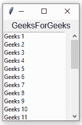

# python-tkinter scroll

> 哎哎哎:# t0]https://www . geeksforgeeks . org/python-tkinter-scroll bar/

Python 为开发图形用户界面提供了多种选择。在所有的 GUI 方法中，Tkinter 是最常用的方法。它是 Python 附带的 Tk 图形用户界面工具包的标准 Python 接口。Python 搭配 Tkinter 是创建 GUI 应用程序最快最简单的方法。使用 Tkinter 创建图形用户界面是一项简单的任务。

**注意:**更多信息请参考[Python GUI–tkinter](https://www.geeksforgeeks.org/python-gui-tkinter/)

## 滚动条小部件

滚动条小部件用于向下滚动内容。我们还可以为入口小部件创建水平滚动条。

**语法:**
使用滚动条小部件的语法如下。

```
w = Scrollbar(master, options) 
```

**参数:**

*   **主**:此参数用于表示父窗口。
*   **选项**:有很多可用的选项，可以作为键值对使用，用逗号分隔。

**选项:**
以下是常用选项，可用于此小部件:-

*   **活动背景**:该选项用于表示小部件有焦点时的背景颜色。
*   **bg** :此选项用于表示小部件的背景颜色。
*   **bd** :此选项用于表示小部件的边框宽度。
*   **命令**:该选项可以设置为与列表相关联的程序，每次移动滚动条时都可以调用该程序。
*   **光标**:在该选项中，鼠标指针变为该选项设置的光标类型，可以是箭头、点等。
*   **elementborderwidth** :此选项用于表示箭头和滑块周围的边框宽度。默认值为-1。
*   **Highlightbackground** :该选项用于当小部件没有焦点时聚焦高亮度。
*   **高亮颜色**:该选项用于当小部件有焦点时聚焦高亮颜色。
*   **高光厚度**:该选项用于表示焦点高光的厚度。
*   **跳转**:该选项用于控制滚动跳转的行为。如果设置为 1，则当用户释放鼠标按钮时，调用回调。
*   **定向**:根据滚动条的方向，该选项可以设置为水平或垂直。
*   **重复延迟**:该选项告知在滑块开始向该方向重复移动之前，按钮将被按下的持续时间。默认值为 300 ms。
*   **重复服务器**:重复间隔的默认值为 100。
*   **获取焦点**:你可以通过滚动条控件来定位焦点
*   **槽色**:此选项用于表示槽的颜色。
*   **宽度**:该选项用于表示滚动条的宽度。

**方法:**
本小工具使用的方法如下:

*   **get()** :这个方法用来返回代表滚动条当前位置的两个数字 a 和 b。
*   **设置(第一个，最后一个)**:此方法用于将滚动条连接到另一个小部件 w .另一个小部件的 yscrollcommand 或 xscrollcommand 连接到此方法。

**示例:**

```
from tkinter import *

root = Tk()
root.geometry("150x200")

w = Label(root, text ='GeeksForGeeks',
          font = "50") 

w.pack()

scroll_bar = Scrollbar(root)

scroll_bar.pack( side = RIGHT,
                fill = Y )

mylist = Listbox(root, 
                 yscrollcommand = scroll_bar.set )

for line in range(1, 26):
    mylist.insert(END, "Geeks " + str(line))

mylist.pack( side = LEFT, fill = BOTH )

scroll_bar.config( command = mylist.yview )

root.mainloop()
```

**输出:**
