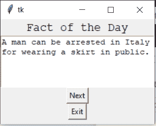
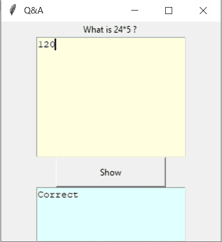

# python tkinter─文字元件

> 哎哎哎:# t0]https://www . geeksforgeeks . org/python-tkinter-text widget/

Tkinter 是 python 中使用的一个 GUI 工具包，用于制作用户友好的 GUI。Tkinter 是 python 中最常用也是最基本的 GUI 框架。Tkinter 使用面向对象的方法来制作图形用户界面。
**注:**更多信息请参考[Python GUI–tkinter](https://www.geeksforgeeks.org/python-gui-tkinter/)

## 文本微件

文本小部件用于用户想要插入多行文本字段的地方。这个小部件可以用于各种需要多行文本的应用程序，例如消息传递、发送信息或显示信息以及许多其他任务。我们也可以在文本小部件中插入媒体文件，如图像和链接。
**语法:**

```py
T = Text(root, bg, fg, bd, height, width, font, ..)
```

**可选参数**

*   **根**–根窗。

*   **BG**–背景色

*   **fg**–前景色

*   **BD**–小部件的边框。

*   **高度**–小部件的高度。

*   **宽度**–小部件的宽度。

*   **字体**–文本的字体类型。

*   **光标**–要使用的光标类型。

*   **in stoftime**–光标闪烁关闭的时间，单位为毫秒。

*   **插入时间**–光标闪烁开启的时间，单位为毫秒。

*   **padx**–水平填充。

*   **pady**–垂直填充。

*   **状态**–定义小部件是否响应鼠标或键盘的移动。

*   **高度厚度**–定义聚焦高光的厚度。

*   **插入宽度**–定义插入字符的宽度。

*   **浮雕**–边框类型，可以是凹陷、凸起、凹槽和脊形。

*   **yscroll command**–使小部件可垂直滚动。

*   **xscroll command**–使小部件可水平滚动。

**一些常用方法**

*   **索引(index)**–获取指定的索引。

*   **插入(索引)**–在指定索引处插入字符串。

*   **参见(索引)**–检查字符串在给定索引处是否可见。

*   **get(startindex，endindex)**–获取给定范围内的字符。

*   **删除(startindex，endindex)**–删除指定范围内的字符。

**标签处理方法**

*   **标记 _ 删除(标记名)**–删除给定的标记。

*   **tag_add(标记名，开始索引，结束索引)**–标记指定范围内的字符串

*   **tag_remove(标记名，startindex，endindex)**–从指定范围删除标记

**标记处理方法**

*   **mark _ name()**–获取给定范围内的所有标记。

*   **索引(标记)**–获取标记的索引。

*   **mark_gravity()** – to get the gravity of a given mark.

**例 1:**

## 蟒蛇 3

```py
import tkinter as tk

root = Tk()

# specify size of window.
root.geometry("250x170")

# Create text widget and specify size.
T = Text(root, height = 5, width = 52)

# Create label
l = Label(root, text = "Fact of the Day")
l.config(font =("Courier", 14))

Fact = """A man can be arrested in
Italy for wearing a skirt in public."""

# Create button for next text.
b1 = Button(root, text = "Next", )

# Create an Exit button.
b2 = Button(root, text = "Exit",
            command = root.destroy)

l.pack()
T.pack()
b1.pack()
b2.pack()

# Insert The Fact.
T.insert(tk.END, Fact)

tk.mainloop()
```

**输出**T2】



**示例 2:** 保存文本并执行操作

## 蟒蛇 3

```py
from tkinter import *

root = Tk()
root.geometry("300x300")
root.title(" Q&A ")

def Take_input():
    INPUT = inputtxt.get("1.0", "end-1c")
    print(INPUT)
    if(INPUT == "120"):
        Output.insert(END, 'Correct')
    else:
        Output.insert(END, "Wrong answer")

l = Label(text = "What is 24 * 5 ? ")
inputtxt = Text(root, height = 10,
                width = 25,
                bg = "light yellow")

Output = Text(root, height = 5,
              width = 25,
              bg = "light cyan")

Display = Button(root, height = 2,
                 width = 20,
                 text ="Show",
                 command = lambda:Take_input())

l.pack()
inputtxt.pack()
Display.pack()
Output.pack()

mainloop()
```

**输出**T2】

