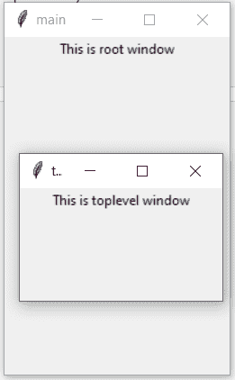
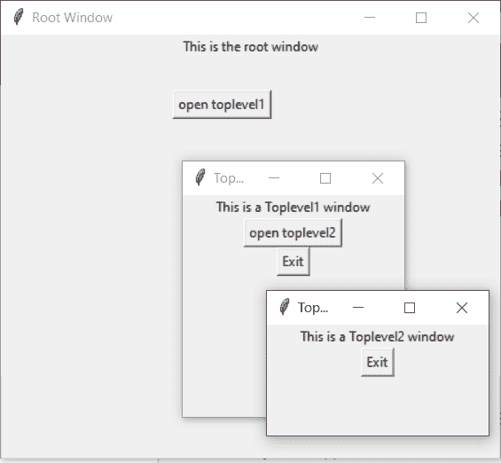

# python tkinter–顶级 Widget

> 哎哎哎:# t0]https://www . geeksforgeeks . org/python-tkinter-top level widget/

Tkinter 是 python 中使用的一个 GUI 工具包，用于制作用户友好的 GUI。Tkinter 是 Python 中最常用也是最基本的 GUI 框架。Tkinter 使用面向对象的方法来制作图形用户界面。

**注意:**更多信息请参考[Python GUI–tkinter](https://www.geeksforgeeks.org/python-gui-tkinter/)

## 顶级小部件

顶层小部件用于在所有其他窗口之上创建一个窗口。顶层小部件用于向用户提供一些额外的信息，当我们的程序处理多个应用程序时也是如此。这些窗口由窗口管理器直接组织和管理，不需要每次都有任何父窗口与之相关联。

**语法:**

```py
toplevel = Toplevel(root, bg, fg, bd, height, width, font, ..)
```

**可选参数**

*   **根** =根窗口(可选)
*   **bg** =背景颜色
*   **fg** =前景色
*   **bd** =边框
*   **高度** =小部件的高度。
*   **宽度** =小部件的宽度。
*   **字体** =文本的字体类型。
*   **光标** =出现在小部件上的光标，可以是箭头、点等。

**常用方法**

*   **图标化**将窗口变为图标。
*   **神化**将图标转回窗口。
*   **状态**返回窗口当前状态。
*   **退出**从屏幕上移除窗口。
*   **标题**定义窗口的标题。
*   **帧**返回系统特定的窗口标识符。

**例 1:**

## 蟒蛇 3

```py
from tkinter import *

root = Tk()
root.geometry("200x300")
root.title("main")

l = Label(root, text = "This is root window")

top = Toplevel()
top.geometry("180x100")
top.title("toplevel")
l2 = Label(top, text = "This is toplevel window")

l.pack()
l2.pack()

top.mainloop()
```

**输出**



**示例 2:** 在彼此之上创建多个顶层

## 蟒蛇 3

```py
from tkinter import *

# Create the root window
# with specified size and title
root = Tk() 
root.title("Root Window") 
root.geometry("450x300") 

# Create label for root window
label1 = Label(root, text = "This is the root window")

# define a function for 2nd toplevel
# window which is not associated with
# any parent window
def open_Toplevel2(): 

    # Create widget
    top2 = Toplevel()

    # define title for window
    top2.title("Toplevel2")

    # specify size
    top2.geometry("200x100")

    # Create label
    label = Label(top2,
                  text = "This is a Toplevel2 window")

    # Create exit button.
    button = Button(top2, text = "Exit",
                    command = top2.destroy)

    label.pack()
    button.pack()

    # Display until closed manually.
    top2.mainloop()

# define a function for 1st toplevel
# which is associated with root window.
def open_Toplevel1(): 

    # Create widget
    top1 = Toplevel(root)

    # Define title for window
    top1.title("Toplevel1")

    # specify size
    top1.geometry("200x200")

    # Create label
    label = Label(top1,
                  text = "This is a Toplevel1 window")

    # Create Exit button
    button1 = Button(top1, text = "Exit",
                     command = top1.destroy)

    # create button to open toplevel2
    button2 = Button(top1, text = "open toplevel2",
                     command = open_Toplevel2)

    label.pack()
    button2.pack()
    button1.pack()

    # Display until closed manually
    top1.mainloop()

# Create button to open toplevel1
button = Button(root, text = "open toplevel1",
                command = open_Toplevel1)
label1.pack()

# position the button
button.place(x = 155, y = 50)

# Display until closed manually
root.mainloop()
```

**输出**

