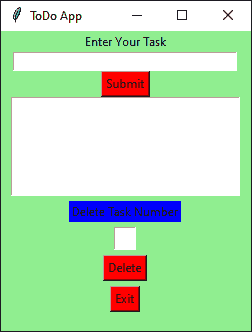

# Python | ToDo 使用 Tkinter 的 GUI 应用程序

> 原文:[https://www . geesforgeks . org/python-todo-GUI-application-using-tkinter/](https://www.geeksforgeeks.org/python-todo-gui-application-using-tkinter/)

**先决条件:**[tkinter 简介](https://www.geeksforgeeks.org/python-gui-tkinter/)

Python 为开发图形用户界面提供了多个选项。在所有的 GUI 方法中，Tkinter 是最常用的方法。在本文中，我们将学习如何使用 Tkinter 创建一个 ToDo GUI 应用程序，并提供一个分步指南。

**创建 tkinter :**

*   导入模块–tkinter
*   创建主窗口(容器)
*   向主窗口添加任意数量的小部件。
*   在小部件上应用事件触发器。

图形用户界面如下所示:



让我们创建一个基于图形用户界面的简单待办事项应用程序，您可以在其中添加和删除任务。

**下面是实现:**

## 蟒蛇 3

```
# import all functions from the tkinter  
from tkinter import *

# import messagebox class from tkinter
from tkinter import messagebox

# global list is declare for storing all the task
tasks_list = []

# global variable is declare for counting the task
counter = 1

# Function for checking input error when
# empty input is given in task field
def inputError() :

    # check for enter task field is empty or not
    if enterTaskField.get() == "" :

        # show the error message
        messagebox.showerror("Input Error")

        return 0

    return 1

# Function for clearing the contents
# of task number text field
def clear_taskNumberField() :

    # clear the content of task number text field
    taskNumberField.delete(0.0, END)

# Function for clearing the contents
# of task entry field  
def clear_taskField() :

    # clear the content of task field entry box
    enterTaskField.delete(0, END)

# Function for inserting the contents
# from the task entry field to the text area
def insertTask():

    global counter

    # check for error
    value = inputError()

    # if error occur then return
    if value == 0 :
        return

    # get the task string concatenating
    # with new line character
    content = enterTaskField.get() + "\n"

    # store task in the list
    tasks_list.append(content)

    # insert content of task entry field to the text area
    # add task one by one in below one by one
    TextArea.insert('end -1 chars', "[ " + str(counter) + " ] " + content)

    # incremented
    counter += 1

    # function calling for deleting the content of task field
    clear_taskField()

# function for deleting the specified task
def delete() :

    global counter

    # handling the empty task error
    if len(tasks_list) == 0 :
        messagebox.showerror("No task")
        return

    # get the task number, which is required to delete
    number = taskNumberField.get(1.0, END)

    # checking for input error when
    # empty input in task number field
    if number == "\n" :
        messagebox.showerror("input error")
        return

    else :
        task_no = int(number)

    # function calling for deleting the
    # content of task number field
    clear_taskNumberField()

    # deleted specified task from the list
    tasks_list.pop(task_no - 1)

    # decremented
    counter -= 1

    # whole content of text area widget is deleted
    TextArea.delete(1.0, END)

    # rewriting the task after deleting one task at a time
    for i in range(len(tasks_list)) :
        TextArea.insert('end -1 chars', "[ " + str(i + 1) + " ] " + tasks_list[i])

# Driver code
if __name__ == "__main__" :

    # create a GUI window
    gui = Tk()

    # set the background colour of GUI window
    gui.configure(background = "light green")

    # set the title of GUI window
    gui.title("ToDo App")

    # set the configuration of GUI window
    gui.geometry("250x300")

    # create a label : Enter Your Task
    enterTask = Label(gui, text = "Enter Your Task", bg = "light green")

    # create a text entry box
    # for typing the task
    enterTaskField = Entry(gui)

    # create a Submit Button and place into the root window
    # when user press the button, the command or
    # function affiliated to that button is executed
    Submit = Button(gui, text = "Submit", fg = "Black", bg = "Red", command = insertTask)

    # create a text area for the root
    # with lunida 13 font
    # text area is for writing the content
    TextArea = Text(gui, height = 5, width = 25, font = "lucida 13")

    # create a label : Delete Task Number
    taskNumber = Label(gui, text = "Delete Task Number", bg = "blue")

    taskNumberField = Text(gui, height = 1, width = 2, font = "lucida 13")

    # create a Delete Button and place into the root window
    # when user press the button, the command or
    # function affiliated to that button is executed .
    delete = Button(gui, text = "Delete", fg = "Black", bg = "Red", command = delete)

    # create a Exit Button and place into the root window
    # when user press the button, the command or
    # function affiliated to that button is executed .
    Exit = Button(gui, text = "Exit", fg = "Black", bg = "Red", command = exit)

    # grid method is used for placing
    # the widgets at respective positions
    # in table like structure.
    enterTask.grid(row = 0, column = 2)

    # ipadx attributed set the entry box horizontal size              
    enterTaskField.grid(row = 1, column = 2, ipadx = 50)

    Submit.grid(row = 2, column = 2)

    # padx attributed provide x-axis margin
    # from the root window to the widget.
    TextArea.grid(row = 3, column = 2, padx = 10, sticky = W)

    taskNumber.grid(row = 4, column = 2, pady = 5)

    taskNumberField.grid(row = 5, column = 2)

    # pady attributed provide y-axis
    # margin from the widget.                 
    delete.grid(row = 6, column = 2, pady = 5)

    Exit.grid(row = 7, column = 2)

    # start the GUI
    gui.mainloop()
```

**输出:**

<video class="wp-video-shortcode" id="video-377554-1" width="640" height="360" preload="metadata" controls=""><source type="video/mp4" src="https://media.geeksforgeeks.org/wp-content/uploads/20210116121207/FreeOnlineScreenRecorderProject1.mp4?_=1">[https://media.geeksforgeeks.org/wp-content/uploads/20210116121207/FreeOnlineScreenRecorderProject1.mp4](https://media.geeksforgeeks.org/wp-content/uploads/20210116121207/FreeOnlineScreenRecorderProject1.mp4)</video>