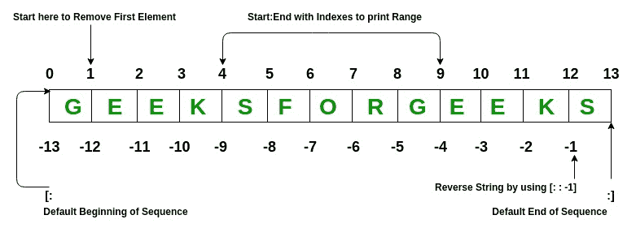

# Python 元组

> 哎哎哎:# t0]https://www . geeksforgeeks . org/python 元组/

**Tuple** 是 Python 对象的集合，很像一个列表。存储在元组中的值序列可以是任何类型，并且它们由整数索引。

元组的值在语法上用“逗号”分隔。虽然这不是必需的，但是通过在括号中结束值序列来定义元组更常见。这有助于更容易地理解 Python 元组。

## 创建元组

在 Python 中，元组是通过放置由“逗号”分隔的值序列来创建的，使用或不使用括号来对数据序列进行分组。

**注:**不使用括号创建 Python 元组称为元组打包。

#### 演示在元组中添加元素的 Python 程序。

## 蟒蛇 3

```
#Creating an empty Tuple
Tuple1 = ()
print("Initial empty Tuple: ")
print (Tuple1)

#Creating a Tuple
#with the use of string
Tuple1 = ('Geeks', 'For')
print("\nTuple with the use of String: ")
print(Tuple1)

# Creating a Tuple with
# the use of list
list1 = [1, 2, 4, 5, 6]
print("\nTuple using List: ")
print(tuple(list1))

#Creating a Tuple
#with the use of built-in function
Tuple1 = tuple('Geeks')
print("\nTuple with the use of function: ")
print(Tuple1)
```

**输出:**

```
Initial empty Tuple: 
()

Tuple with the use of String: 
('Geeks', 'For')

Tuple using List: 
(1, 2, 4, 5, 6)

Tuple with the use of function: 
('G', 'e', 'e', 'k', 's')
```

#### 使用混合数据类型创建元组。

**元组**可以包含任意数量的元素和任意数据类型(如字符串、整数、列表等)。).元组也可以用单个元素创建，但是有点棘手。括号中有一个元素是不够的，必须有一个尾随的“逗号”才能使它成为元组。

## 蟒蛇 3

```
#Creating a Tuple
#with Mixed Datatype
Tuple1 = (5, 'Welcome', 7, 'Geeks')
print("\nTuple with Mixed Datatypes: ")
print(Tuple1)

#Creating a Tuple
#with nested tuples
Tuple1 = (0, 1, 2, 3)
Tuple2 = ('python', 'geek')
Tuple3 = (Tuple1, Tuple2)
print("\nTuple with nested tuples: ")
print(Tuple3)

#Creating a Tuple
#with repetition
Tuple1 = ('Geeks',) * 3
print("\nTuple with repetition: ")
print(Tuple1)

#Creating a Tuple
#with the use of loop
Tuple1 = ('Geeks')
n = 5
print("\nTuple with a loop")
for i in range(int(n)):
    Tuple1 = (Tuple1,)
    print(Tuple1)
```

**输出:**

```
Tuple with Mixed Datatypes: 
(5, 'Welcome', 7, 'Geeks')

Tuple with nested tuples: 
((0, 1, 2, 3), ('python', 'geek'))

Tuple with repetition: 
('Geeks', 'Geeks', 'Geeks')

Tuple with a loop
('Geeks',)
(('Geeks',),)
((('Geeks',),),)
(((('Geeks',),),),)
((((('Geeks',),),),),)
```

## 元组的访问

**元组**是不可变的，通常，它们包含一系列异构元素，通过[解包](https://www.geeksforgeeks.org/unpacking-a-tuple-in-python/)或索引(在命名元组的情况下，甚至通过属性)来访问这些元素。列表是可变的，它们的元素通常是同类的，可以通过遍历列表来访问。

**注意:**在解包元组时，左侧的变量数应该等于给定元组 a 中的值数。

## 蟒蛇 3

```
#Accessing Tuple
#with Indexing
Tuple1 = tuple("Geeks")
print("\nFirst element of Tuple: ")
print(Tuple1[1])

#Tuple unpacking
Tuple1 = ("Geeks", "For", "Geeks")

#This line unpack
#values of Tuple1
a, b, c = Tuple1
print("\nValues after unpacking: ")
print(a)
print(b)
print(c)
```

**输出:**

```
First element of Tuple:
e

Values after unpacking:
Geeks
For
Geeks
```

## 元组的连接

元组的连接是连接两个或多个元组的过程。连接是通过使用“+”运算符完成的。元组的连接总是从原始元组的末尾开始。其他算术运算不适用于元组。
**注意-** 只有相同的数据类型可以用串联组合，如果列表和元组组合在一起会出现错误。


## 蟒蛇 3

```
# Concatenation of tuples
Tuple1 = (0, 1, 2, 3)
Tuple2 = ('Geeks', 'For', 'Geeks')

Tuple3 = Tuple1 + Tuple2

# Printing first Tuple
print("Tuple 1: ")
print(Tuple1)

# Printing Second Tuple
print("\nTuple2: ")
print(Tuple2)

# Printing Final Tuple
print("\nTuples after Concatenation: ")
print(Tuple3)
```

**输出:**

```
Tuple 1: 
(0, 1, 2, 3)

Tuple2: 
('Geeks', 'For', 'Geeks')

Tuples after Concatenation: 
(0, 1, 2, 3, 'Geeks', 'For', 'Geeks')
```

## 元组的切片

对元组进行切片是为了从元组中获取特定范围或切片的子元素。也可以对列表和数组进行切片。列表中的索引导致获取单个元素，而切片允许获取一组元素。
**注意-** 负增量值也可以用来反转元组的顺序



## 蟒蛇 3

```
# Slicing of a Tuple

# Slicing of a Tuple
# with Numbers
Tuple1 = tuple('GEEKSFORGEEKS')

# Removing First element
print("Removal of First Element: ")
print(Tuple1[1:])

# Reversing the Tuple
print("\nTuple after sequence of Element is reversed: ")
print(Tuple1[::-1])

# Printing elements of a Range
print("\nPrinting elements between Range 4-9: ")
print(Tuple1[4:9])
```

**输出:**

```
Removal of First Element: 
('E', 'E', 'K', 'S', 'F', 'O', 'R', 'G', 'E', 'E', 'K', 'S')

Tuple after sequence of Element is reversed: 
('S', 'K', 'E', 'E', 'G', 'R', 'O', 'F', 'S', 'K', 'E', 'E', 'G')

Printing elements between Range 4-9: 
('S', 'F', 'O', 'R', 'G')
```

## 删除元组

元组是不可变的，因此它们不允许删除其中的一部分。使用 del()方法可以删除整个元组。

**注意-** 删除后打印元组会导致错误。

## 计算机编程语言

```
# Deleting a Tuple

Tuple1 = (0, 1, 2, 3, 4)
del Tuple1

print(Tuple1)
```

> 回溯(最近一次调用的最后一次):
> 打印(Tuple1)
> 中的文件/home/EFA 50 FD 0709 dec 08434191 f 32275928 a . py "，第 7 行名称错误:未定义名称“Tuple1”

#### 内置方法

<figure class="table">

| **内置方法** | **描述** |
| **指数()** | **在元组中查找并返回给定值的索引(如果可用的话)** |
| **计数()** | **返回指定值的出现频率** |

</figure>

#### 内置函数

<figure class="table">

| 内置函数 | 描述 |
| 全部() | 如果所有元素都为真或元组为空，则返回真 |
| 任何() | 如果元组的任何元素为真，则返回 true。如果元组为空，则返回 false |
| len() | 返回元组的长度或元组的大小 |
| 枚举() | 返回元组的枚举对象 |
| 最大值() | 返回给定元组的最大元素 |
| 最小值() | 返回给定元组的最小元素 |
| [sum()](https://www.geeksforgeeks.org/sum-function-python/) | 合计元组中的数字 |
| [已排序()](https://www.geeksforgeeks.org/sorted-function-python/) | 输入元组中的元素，并返回一个新的排序列表 |
| [**元组()**](https://www.geeksforgeeks.org/python-tuple-function/) | 将可迭代转换为元组。 |

</figure>

### [元组近期文章](https://www.geeksforgeeks.org/tag/python-tuple/)

**元组程序**

*   [打印给定布尔字符串中的唯一行](https://www.geeksforgeeks.org/python-print-unique-rows-given-boolean-matrix-using-set-tuples/)
*   [根据给定字符串生成所有可能的有效 IP 地址的程序](https://www.geeksforgeeks.org/program-generate-possible-valid-ip-addresses-given-string/)
*   [Python 字典查找字符串中的镜像字符](https://www.geeksforgeeks.org/python-dictionary-find-mirror-characters-string/)
*   [根据 Python 中输入字符串中出现的字符生成两个输出字符串](https://www.geeksforgeeks.org/generate-two-output-strings-depending-upon-occurrence-character-input-string-python/)
*   [Python groupby 方法删除所有连续的重复项](https://www.geeksforgeeks.org/python-groupby-method-remove-consecutive-duplicates/)
*   [将字符列表转换成字符串](https://www.geeksforgeeks.org/python-convert-list-characters-string/)
*   [从列表中删除空元组](https://www.geeksforgeeks.org/python-remove-empty-tuples-list/)
*   [反转元组](https://www.geeksforgeeks.org/python-reversing-tuple/)
*   [Python 集对称 _ 差异()](https://www.geeksforgeeks.org/python-modf-function/)
*   [将元组列表转换成字典](https://www.geeksforgeeks.org/python-convert-list-tuples-dictionary/)
*   [根据元组的浮点元素对元组进行排序](https://www.geeksforgeeks.org/python-sort-tuple-float-element/)
*   [计算元组中元素的出现次数](https://www.geeksforgeeks.org/python-count-occurrences-element-tuple/)
*   [对列表中的元素进行计数，直到一个元素成为元组](https://www.geeksforgeeks.org/python-count-elements-list-element-tuple/)
*   [按任意键对元组进行递增排序](https://www.geeksforgeeks.org/python-sort-tuples-increasing-order-key/)
*   [Python 中命名为“T2”](https://www.geeksforgeeks.org/namedtuple-in-python/)

**有用链接:**

*   [Python 程序的输出](https://www.geeksforgeeks.org/output-python-programs-set-20-tuples/)
*   [Python 元组近期文章](https://www.geeksforgeeks.org/tag/python-tuple/)
*   [选择题–Python](https://www.geeksforgeeks.org/python-multiple-choice-questions/)
*   [Python 类别的所有文章](https://www.geeksforgeeks.org/category/python/)