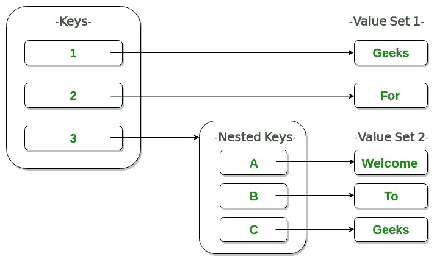

# Python:更新嵌套字典

> 原文:[https://www . geesforgeks . org/python-update-nested-dictionary/](https://www.geeksforgeeks.org/python-update-nested-dictionary/)

Python 中的一个[字典](https://www.geeksforgeeks.org/python-dictionary/)的工作原理类似于现实世界中的字典。字典的键必须是唯一的，并且是不可变的数据类型，例如字符串、整数和元组，但是键值可以重复，并且可以是任何类型。

> **参考下面的文章，获得关于字典的想法:**
> 
> *   [Python 词典](https://www.geeksforgeeks.org/python-dictionary/)

**嵌套字典:**Python 中的嵌套字典只不过是字典中的字典。



考虑下面给出的员工记录:

```
Employees
emp1:
     name:Lisa
     age:29
     designation:Programmer
emp2:
     name:Steve
     age:45
     designation:HR

```

在这里， ***员工*** 就是外字典。 ***emp1、emp2*** 是以另一个字典作为值的键。上述信息的字典结构如下所示:

```
employees:
{
 emp1:
    {
     'name':'Lisa',
     'age':29,
     'designation':'Programmer'
    },
emp2:
    {
     'name':'Steve',
     'age':45,
     'designation':'HR'
    }
}

```

考虑一下像 **`d={'a':1, 'b':2, 'c':3}`** 这样的简单字典。如果要将 **'b'** 的值更新为 **7** ，可以写成`**d['b']=7**`。然而，同样的方法不能应用于嵌套的方法。这将创建一个新的关键字，因为外部字典中的关键字只会在您尝试更新时被搜索。例如，请参见下面的代码:

```
# an employee record
Employee = { 
    'emp1': {
        'name': 'Lisa', 
        'age': '29',
        'Designation':'Programmer'
            }, 
    'emp2': {
             'name': 'Steve',
             'age': '45',
             'Designation':'HR'
             }
} 

# updating in the way similar to
# simple dictionary
Employee['name']='Kate'

print(Employee)
```

**Output:**

> {'name': 'Kate '，' EMP 1 ':{ ' Designation ':' Programmer '，' name': 'Lisa '，' age': '29'}，' EMP 2 ':{ ' Designation ':' HR '，' name': 'Steve '，' age': '45'}}

在输出外观中，添加了“name”:“Kate”作为新的键值对，这不是我们想要的输出。让我们考虑一下，我们需要将第一个员工的姓名更新为“凯特”。让我们把字典看作一个 2D 数组。这将有助于我们轻松更新信息。上述字典的 2D 数组视图如下所示:

```
*Employee*     name        age      Designation
emp1         Lisa         29       Programmer
emp2         Steve        45       HR

```

现在我们必须将第一个员工的名字更新为“凯特”。因此，我们必须更新员工[' EMP 1 ']['姓名']。修改后的代码如下:

```
# an employee record
Employee = { 
    'emp1': {
        'name': 'Lisa', 
        'age': '29',
        'Designation':'Programmer'
            }, 
         'emp2': {
             'name': 'Steve',
             'age': '25',
             'Designation':'HR'
                 }
             } 

# updating in the way similar to simple dictionary
Employee['emp1']['name']='Kate'

print(Employee)
```

**Output:**

> { ' EMP 2 ':{ ' Designation ':' HR '，' age': '25 '，' name': 'Steve'}，' EMP 1 ':{ ' Designation ':' Programmer '，' age': '29 '，' name': 'Kate'}}

如果字典中有所提及的关键字，上述方法会更新该关键字的值。否则，它会创建一个新条目。例如，如果您想为第一个员工添加一个新的属性**‘薪资’**，那么您可以将上面的代码写成:

```
# an employee record
Employee = { 
    'emp1': {
        'name': 'Lisa', 
        'age': '29',
        'Designation':'Programmer'
            }, 
         'emp2': {
             'name': 'Steve',
             'age': '25',
             'Designation':'HR'
                 }
             } 

# updating in the way similar to 
# simple dictionary
Employee['emp1']['name']='Kate'

# adding new key-value pair to first 
# employee record
Employee['emp1']['salary']= 56000

print(Employee)
```

**Output:**

> { ' EMP 1 ':{ '指定': '程序员'，'工资':56000，'姓名':' Kate '，'年龄':' 29'}，' EMP 2 ':{ '指定':' HR '，'姓名':' Steve '，'年龄':' 25'}}

以上方法都是静态的。现在，为了让它与用户交互，我们可以稍微修改下面给出的代码:

```
# an employee record
Employee = { 
    'emp1': {
        'name': 'Lisa', 
        'age': '29',
        'Designation':'Programmer'
            }, 
         'emp2': {
             'name': 'Steve',
             'age': '25',
             'Designation':'HR'
                 }
             } 

# to make the updation dynamic

# Get input from the user for which 
# employee he needs to update
empid = input("Employee id :")

# which attribute / key to update
attribute = input("Attribute to be updated :")

# what value to update
new_value = input("New value :")

# updation of the dictionary
Employee[empid][attribute]= new_value

print(Employee)
```

**Input:**

```
Employee id :emp1
Attribute to be updated :name
New value :Kate

```

**Output:**

> { ' EMP 1 ':{ ' age ':' 29 '，' Designation': 'Programmer '，' name': 'Kate'}，' EMP 2 ':{ ' age ':' 25 '，' Designation': 'HR '，' name': 'Steve'}}

让我们试着更专业一点！！

**另一种方法**

这个想法是先展平嵌套字典，然后更新它，再取消它。为了使它更清楚，考虑下面的字典作为一个例子:

```
dict1={
       'a':{
            'b':1
           },
        'c':{
            'd':2,
            'e':5
             }
       }

```

展平嵌套字典只不过是使用适当的分隔符将父键附加到实键上。分隔符可以是任何符号。它可以是逗号(，)、连字符(-)、下划线(_)或句点(。)，甚至只是一个空格()。在这里，用下划线作为分隔符进行展平后，本词典将如下所示:

```
dict1={'a_b':1, 'c_d':2, 'c_e':5}

```

使用 Python 中**包`flatten-dict`** 提供的内置方法可以轻松完成展平。它提供了展平字典类对象和取消它们的方法。使用 pip 命令安装软件包，如下所示:

```
pip install flatten-dict
```

**`flatten()`法:**

扁平化方法有各种各样的参数，以一种理想的、可读的和可理解的方式来格式化它。其中最重要的两个论点是:

1.  **字典**:需要转换的扁平字典
2.  **减速器**:指定父键如何与子键连接。可能的值有元组、路径、下划线或用户定义的函数名。
    *   tuple:创建一个父键和子键的元组作为键，并为其赋值。
    *   路径:在父项和子项之间追加“/”。
    *   下划线:在父项和子项之间追加“_”。
    *   用户定义的函数:父键和子键应该作为参数传递给函数。函数应该以字符串的形式返回它们，并用所需的符号分隔

其他参数枚举类型、保留空类型是可选的

***法:***

*此方法取消扁平字典的标记，并将其转换为嵌套字典。可能需要三个参数:*

1.  ***字典**:需要还原的扁平字典*
2.  ***拆分器**:需要拆分拼合词典的符号。像展平方法一样，这也占用了值元组、路径、下划线或用户定义的函数。*
3.  ***反转**:取一个布尔值，表示键和值是否需要反转。这是可选的。*

*让我们考虑我们在上面尝试的同一个员工示例。代码如下:*

```
*from flatten_dict import flatten
from flatten_dict import unflatten

# an employee record
Employee = { 
    'emp1': {
        'name': 'Lisa', 
        'age': '29',
        'Designation':'Programmer'
            }, 
         'emp2': {
             'name': 'Steve',
             'age': '25',
             'Designation':'HR'
                 }
             } 

# flattening the dictionary, default 
# reducer is 'tuple'
dict3 = flatten(Employee)

print("Flattened dictionary :", dict3)

# adding new key-value pair to second 
# employee's record
dict3[('emp2', 'salary')]= 34000

print(dict3)

# unflattening the dictionary, default 
# splitter is 'tuple'
Employee = unflatten(dict3)

print("\nUnflattened and updated dictionary :", Employee)*
```

***输出:***

> *展平字典:{(“EMP 1’，‘name’):‘Lisa’，(“EMP 1’，‘age’):‘29’，(‘EMP 1’，‘Designation’):‘Programmer’，(‘EMP 2’，‘name’):‘Steve’，(‘EMP 2’，‘age’):‘25’，(‘EMP 2’，‘Designation’:‘HR’}
> {(‘EMP 1’，‘name’):‘Lisa’，(‘EMP 1’，‘age’):‘29’，(‘EMP*
> 
> *未标记和更新的字典:{ ' EMP 1 ':{ ' name ':' Lisa '，' age': '29 '，' Designation': 'Programmer'}，' EMP 2 ':{ ' name ':' Steve '，' age': '25 '，' Designation': 'HR '，' salary': 34000}}*