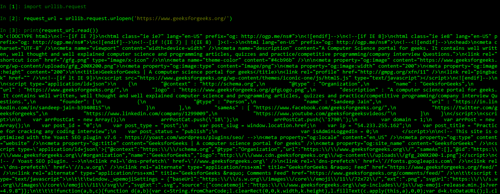

# Python Urllib 模块

> 哎哎哎:# t0]https://www . geeksforgeeks . org/python-URL lib-module/

Urllib 包是 python 的 URL 处理模块。它用于获取网址(统一资源定位符)。它使用 *urlopen* 功能，能够使用各种不同的协议获取 URL。

Urllib 是一个包，它收集了几个用于处理 URL 的模块，例如:

*   请求打开和读取。
*   urllib.parse 用于解析 URL
*   引发的异常的 urllib.error
*   用于解析 robot.txt 文件的 urllib.robotparser

如果 urllib 不在您的环境中，请执行下面的代码来安装它。

```py
pip install urllib

```

让我们详细看看这些。

**urllib.request**

这个模块帮助定义函数和类来打开网址(大部分是 HTTP)。打开此类 url 最简单的方法之一是:
*URL lib . request . URL open(URL)*
我们可以在一个示例中看到这一点:

```py
import urllib.request
request_url = urllib.request.urlopen('https://www.geeksforgeeks.org/')
print(request_url.read())
```

```py
The source code of the URL i.e. Geeksforgeeks.

```



**urllib.parse**

这个模块有助于定义函数来操作网址及其组成部分，建立或破坏它们。它通常侧重于将一个网址拆分成小组件；或者将不同的网址组件连接到网址字符串中。
我们可以从下面的代码中看到这一点:

```py
from urllib.parse import * parse_url = urlparse('https://www.geeksforgeeks.org / python-langtons-ant/')
print(parse_url)
print("\n")
unparse_url = urlunparse(parse_url)
print(unparse_url)
```

```py
ParseResult(scheme='https', netloc='www.geeksforgeeks.org', path='/python-langtons-ant/', params='', query='', fragment='')

https://www.geeksforgeeks.org/python-langtons-ant/

```

*注意:-一个 URL 的不同组成部分被分开并再次连接。尝试使用一些其他的网址，以便更好地理解。*

urllib.parse 的其他不同功能有:

| 功能 | 使用 |
| --- | --- |
| **尖叫 lib.parse .尖叫** | 分隔网址的不同组成部分 |
| **URL lib . parse . URL unpaired** | 加入网址的不同组成部分 |
| **urllib.parse.urlsplit** | 它类似于 urlparse()，但不拆分参数 |
| **URL lib . parse . URL unslit** | 将 urlsplit()返回的元组元素组合成 URL |
| **urllib.parse.urldeflag** | 如果网址包含片段，那么它返回一个删除片段的网址。 |

**urllib.error**
这个模块定义了 urllib.request 引发异常的类，每当获取 URL 时出现错误，这个模块都会帮助引发异常。以下是引发的异常:

*   URL error–它是针对 URL 中的错误而引发的，或者是由于连接性而在获取 URL 时出现的错误，它有一个“原因”属性，告诉用户错误的原因。
*   HTTP error–针对特殊的 HTTP 错误引发，例如身份验证请求错误。它是一个子类或 URLError。典型的错误包括“404”(找不到页面)、“403”(禁止请求)、
    和“401”(需要身份验证)。

我们可以在以下示例中看到这一点:

```py
# URL Error

import urllib.request
import urllib.parse

# trying to read the URL but with no internet connectivity
try:
    x = urllib.request.urlopen('https://www.google.com')
    print(x.read())

# Catching the exception generated     
except Exception as e :
    print(str(e))
```

```py
URL Error: urlopen error [Errno 11001] getaddrinfo failed

```

```py
# HTTP Error

import urllib.request
import urllib.parse

# trying to read the URL
try:
    x = urllib.request.urlopen('https://www.google.com / search?q = test')
    print(x.read())

# Catching the exception generated    
except Exception as e :
    print(str(e))
```

```py
HTTP Error 403: Forbidden

```

**urllib.robotparser**
这个模块包含一个单独的类，RobotFileParser。这个类回答了特定用户是否可以获取发布 robot.txt 文件的 URL 的问题。 *Robots.txt 是站长创建的一个文本文件，用来指导网络机器人如何在自己的网站上抓取页面。*robot . txt 文件告诉网页抓取器不应该访问服务器的哪些部分。
例如:

```py
# importing robot parser class
import urllib.robotparser as rb

bot = rb.RobotFileParser()

# checks where the website's robot.txt file reside
x = bot.set_url('https://www.geeksforgeeks.org / robot.txt')
print(x)

# reads the files
y = bot.read()
print(y)

# we can crawl the main site
z = bot.can_fetch('*', 'https://www.geeksforgeeks.org/')
print(z)

# but can not crawl the disallowed url
w = bot.can_fetch('*', 'https://www.geeksforgeeks.org / wp-admin/')
print(w)
```

```py
None
None
True
False

```