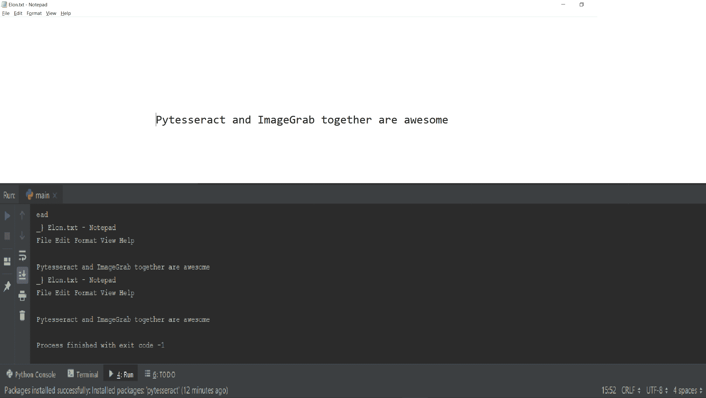

# Python |使用 PIL ImageGrab 和 pytesserract

> 原文:[https://www . geesforgeks . org/python-using-pil-image grab-and-pytesseract/](https://www.geeksforgeeks.org/python-using-pil-imagegrab-and-pytesseract/)

## ImageGrab 和 PyTesseract

[ImageGrab](https://www.geeksforgeeks.org/pyhton-pil-imagegrab-grab-method/) 是一个 Python 模块，有助于捕捉屏幕内容。[Python](https://pypi.org/project/pytesseract/)是一个用于 Python 的**光学字符识别(OCR)** 工具。它们可以一起用来读取屏幕某一部分的内容。

**安装–**

> 枕头(PIL 的新版本)
> 
> ```
> pip install Pillow
> ```
> 
> pytesserract
> 
> ```
> pip install pytesseract
> ```
> 
> 除此之外，还需要安装一个[宇宙魔方可执行文件](https://github.com/tesseract-ocr/tesseract/wiki/Downloads)。

## 代码的实现

代码中主要使用了以下功能–

> **pytesserract . image _ to _ string(image，lang = * * lang * *)–**获取图像并在其文本中搜索该语言的单词。
> 
> **cv2.cvtColor(图像，**色彩转换* *)–**用于使图像单色(使用 cv2。COLOR_BGR2GRAY)。
> 
> **image grab . grab(bbox = * *要捕捉的屏幕区域的坐标* *)–**用于重复(使用循环)捕捉屏幕的特定部分。

**代码的目标是:**

1.  使用循环重复捕捉屏幕的一部分。
2.  将捕获的图像转换为灰度。
3.  使用 PyTesseract 阅读其中的文本。

**代码:使用 ImageGrab 和 PyTesseract 的 Python 代码**

```
# cv2.cvtColor takes a numpy ndarray as an argument
import numpy as nm

import pytesseract

# importing OpenCV
import cv2

from PIL import ImageGrab

def imToString():

    # Path of tesseract executable
    pytesseract.pytesseract.tesseract_cmd ='**Path to tesseract executable**'
    while(True):

        # ImageGrab-To capture the screen image in a loop. 
        # Bbox used to capture a specific area.
        cap = ImageGrab.grab(bbox =(700, 300, 1400, 900))

        # Converted the image to monochrome for it to be easily 
        # read by the OCR and obtained the output String.
        tesstr = pytesseract.image_to_string(
                cv2.cvtColor(nm.array(cap), cv2.COLOR_BGR2GRAY), 
                lang ='eng')
        print(tesstr)

# Calling the function
imToString()
```

## 输出



上面的代码可以用来捕捉屏幕的某个部分，并读取其中的文本内容。

## 阅读代码中使用的其他库

[num py](https://www.geeksforgeeks.org/python-numpy/)
[opencv(cv 2)](https://www.geeksforgeeks.org/reading-image-opencv-using-python/)