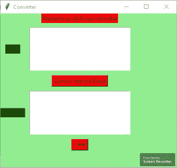

# Python–UwU 文本转换器图形用户界面使用 Tinter

> 原文:[https://www . geesforgeks . org/python-uwu-text-converter-GUI-using-tkinter/](https://www.geeksforgeeks.org/python-uwu-text-convertor-gui-using-tkinter/)

**先决条件:**[tkinter 简介](https://www.geeksforgeeks.org/python-gui-tkinter/) | [UwU 文本转换器](https://www.geeksforgeeks.org/uwu-text-convertor-in-python/)

Python 为开发图形用户界面提供了多种选择。在所有的 GUI 方法中，Tkinter 是最常用的方法。它是 Python 附带的 Tk 图形用户界面工具包的标准 Python 接口。Python 搭配 Tkinter 输出了创建 GUI 应用程序最快最简单的方法。现在，这取决于开发人员的想象力或必要性，他/她想使用这个工具包开发什么。

要创建 Tkinter:

*   导入模块–tkinter
*   创建主窗口(容器)
*   向主窗口添加任意数量的小部件。
*   在小部件上应用事件触发器。

以下是图形用户界面的外观:



让我们创建一个基于图形用户界面的 uwu 文本转换器应用程序，它可以将用户输入的文本转换成 uwu 文本。

**下面是实现:**

## 蟒蛇 3

```py
# import all functions from the tkinter 
from tkinter import *

# Function to clear both the text areas
def clearAll() :
    # whole content of text area  is deleted
    text1_field.delete(1.0, END)
    text2_field.delete(1.0, END)

# Function to convert into UwU text
def convert() :

    # get a whole input content from text box
    # ignoring \n from the text box content
    input_text = text1_field.get("1.0", "end")[:-1]

    # the length of the input text
    length = len(input_text)

    # variable declaration for the output text
    output_text = ''

    # check the cases for every individual character
    for i in range(length):

        # initialize the variables
        current_char = input_text[i]
        previous_char = None

        # assign the value of previous_char
        if i > 0:
            previous_char = input_text[i - 1]

        # change 'L' and 'R' to 'W'
        if current_char == 'L' or current_char == 'R':
            output_text += 'W'

        # change 'l' and 'r' to 'w'
        elif current_char == 'l' or current_char == 'r':
            output_text += 'w'

        # if the current character is 'o' or 'O'
        # also check the previous character
        elif current_char == 'O' or current_char == 'o':
            if previous_char == 'N' or previous_char == 'n' or previous_char == 'M' or previous_char == 'm':
                output_text += "yo"
            else:
                output_text += current_char

        # if no case match, write it as it is
        else:
            output_text += current_char

    text2_field.insert('end -1 chars', output_text)

# Driver code
if __name__ == "__main__" :

    # Create a GUI window
    root = Tk()

    # Set the background colour of GUI window 
    root.configure(background = 'light green') 

    # Set the configuration of GUI window (WidthxHeight)
    root.geometry("400x350") 

    # set the name of tkinter GUI window 
    root.title("Converter")

    # Create Welcome to Morse Code Translator label 
    headlabel = Label(root, text = 'Welcome to UwU text converter', 
                      fg = 'black', bg = "red") 

    # Create a "Text " label 
    label1 = Label(root, text = " Text ",
                 fg = 'black', bg = 'dark green')

    # Create a "UwU Text " label 
    label2 = Label(root, text = "UwU Text", 
                   fg = 'black', bg = 'dark green') 

    # grid method is used for placing 
    # the widgets at respective positions 
    # in table like structure .  
    headlabel.grid(row = 0, column = 1) 
    label1.grid(row = 1, column = 0) 
    label2.grid(row = 3, column = 0)

    # Create a text area box 
    # for filling or typing the information. 
    text1_field = Text(root, height = 5, width = 25, font = "lucida 13")
    text2_field = Text(root, height = 5, width = 25, font = "lucida 13")

    # padx keyword argument used to set padding along x-axis .
    # pady keyword argument used to set padding along y-axis . 
    text1_field.grid(row = 1, column = 1, padx = 10, pady = 10) 
    text2_field.grid(row = 3, column = 1, padx = 10, pady = 10)

    # Create a Convert Button and attached 
    # with convert function 
    button1 = Button(root, text = "Convert into UwU text", bg = "red", fg = "black",
                                command = convert)

    button1.grid(row = 2, column = 1)

    # Create a Clear Button and attached 
    # with clearAll function 
    button2 = Button(root, text = "Clear", bg = "red", 
                     fg = "black", command = clearAll)

    button2.grid(row = 4, column = 1)

    # Start the GUI 
    root.mainloop() 
```

**输出:**

<video class="wp-video-shortcode" id="video-418441-1" width="640" height="360" preload="metadata" controls=""><source type="video/mp4" src="https://media.geeksforgeeks.org/wp-content/uploads/20210114115007/FreeOnlineScreenRecorderProject5.mp4?_=1">[https://media.geeksforgeeks.org/wp-content/uploads/20210114115007/FreeOnlineScreenRecorderProject5.mp4](https://media.geeksforgeeks.org/wp-content/uploads/20210114115007/FreeOnlineScreenRecorderProject5.mp4)</video>