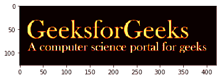
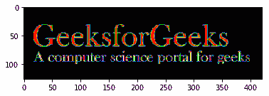

# Python |在不同颜色空间中可视化图像

> 原文:[https://www . geesforgeks . org/python-visualization-image-in-异色空间/](https://www.geeksforgeeks.org/python-visualizing-image-in-different-color-spaces/)

OpenCV(开放源代码计算机视觉)是一个计算机视觉库，包含对图片或视频执行操作的各种功能。它最初由英特尔开发，但后来由 Willow Garage 维护，现在由 Itseez 维护。这个库是跨平台的，因为它可以在多种编程语言上使用，比如 Python、C++等。

让我们讨论可视化图像的不同方法，其中我们将以不同的格式表示图像，如灰度、RGB 比例、Hot_map、边缘图、光谱图等。

#### RGB 图像:

RGB 图像由 R(红色)、G(绿色)和 B(蓝色)三个不同通道的线性组合来表示。对于单通道，该颜色空间中的像素强度由范围从 0 到 255 的值表示。因此，一个像素所代表的一种颜色的可能性大约为 1600 万[255×255×255]。

```py
# Python program to read image as RGB

# Importing cv2 and matplotlib module
import cv2
import matplotlib.pyplot as plt

# reads image as RGB
img = cv2.imread('g4g.png')

# shows the image
plt.imshow(img)
```

**输出:**


#### 灰度图像:

灰度图像仅包含单通道。该颜色空间中的像素强度由范围从 0 到 255 的值表示。因此，像素所代表的一种颜色的可能性为 256。

```py
# Python program to read image as GrayScale

# Importing cv2 module
import cv2

# Reads image as gray scale
img = cv2.imread('g4g.png', 0) 

# We can alternatively convert
# image by using cv2color
img = cv2.cvtColor(img, cv2.COLOR_BGR2GRAY)

# Shows the image
cv2.imshow('image', img) 

cv2.waitKey(0)         
cv2.destroyAllWindows()
```

**输出:**


#### YCrCb 色彩空间:

y 代表亮度或明度分量，Cb 和 Cr 是色度分量。Cb 表示蓝色差异(蓝色分量和亮度分量的差异)。Cr 表示红色差异(红色分量和亮度分量的差异)。

```py
# Python program to read image
# as YCrCb color space

# Import cv2 module
import cv2

# Reads the image
img = cv2.imread('g4g.png')

# Convert to YCrCb color space
img = cv2.cvtColor(img, cv2.COLOR_BGR2YCrCb)

# Shows the image
cv2.imshow('image', img) 

cv2.waitKey(0)         
cv2.destroyAllWindows()
```

**输出:**


#### HSV 色彩空间:

**H :** 色相代表主波长。
**S :** 饱和度代表颜色的深浅。
**V :** 值代表强度。

```py
# Python program to read image
# as HSV color space

# Importing cv2 module
import cv2

# Reads the image
img = cv2.imread('g4g.png')

# Converts to HSV color space
img = cv2.cvtColor(img, cv2.COLOR_BGR2HSV)

# Shows the image
cv2.imshow('image', img) 

cv2.waitKey(0)         
cv2.destroyAllWindows()
```

**输出:**


#### 实验室颜色空间:

**L–**代表明度。
**A–**颜色成分范围从绿色到洋红色。
**B–**颜色成分范围从蓝色到黄色。

```py
# Python program to read image
# as LAB color space

# Importing cv2 module
import cv2

# Reads the image
img = cv2.imread('g4g.png')

# Converts to LAB color space
img = cv2.cvtColor(img, cv2.COLOR_BGR2LAB)

# Shows the image
cv2.imshow('image', img) 

cv2.waitKey(0)         
cv2.destroyAllWindows()
```

**输出:**


#### 图像的边缘图:

边缘图可以通过拉普拉斯、[索贝尔](https://www.geeksforgeeks.org/python-program-to-detect-the-edges-of-an-image-using-opencv-sobel-edge-detection/)等各种滤波器获得。这里，我们使用拉普拉斯算子生成边缘图。

```py
# Python program to read image
# as EdgeMap

# Importing cv2 module
import cv2

# Reads the image
img = cv2.imread('g4g.png')

laplacian = cv2.Laplacian(img, cv2.CV_64F)
cv2.imshow('EdgeMap', laplacian) 

cv2.waitKey(0)         
cv2.destroyAllWindows()
```

**输出:**


#### 图像热图:

在热图表示中，矩阵中包含的单个值表示为颜色。

```py
# Python program to visualize 
# Heat map of image

# Importing matplotlib and cv2
import matplotlib.pyplot as plt
import cv2

# reads the image
img = cv2.imread('g4g.png')

# plot heat map image
plt.imshow(img, cmap ='hot') 
```

**输出:**


#### 光谱图像图:

光谱图像图获取场景图像中每个像素的光谱。

```py
# Python program to visualize 
# Spectral map of image

# Importing matplotlib and cv2
import matplotlib.pyplot as plt
import cv2

img = cv2.imread('g4g.png')
plt.imshow(img, cmap ='nipy_spectral') 
```

**输出:**
